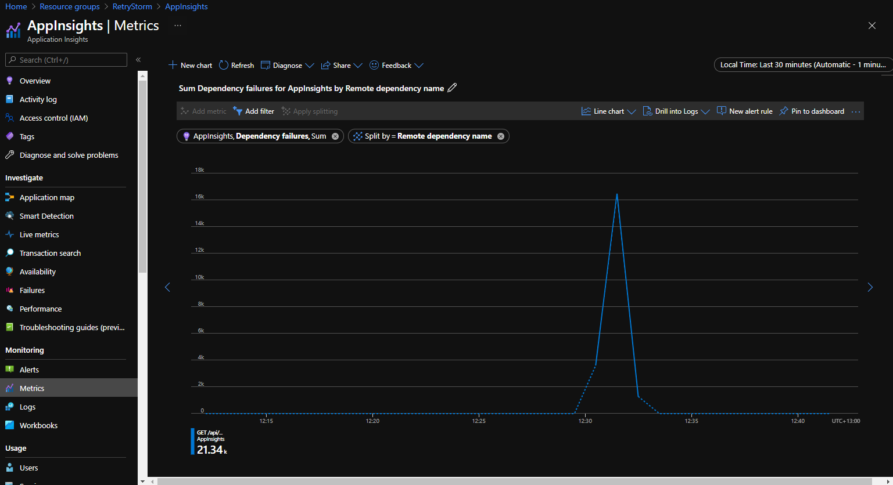
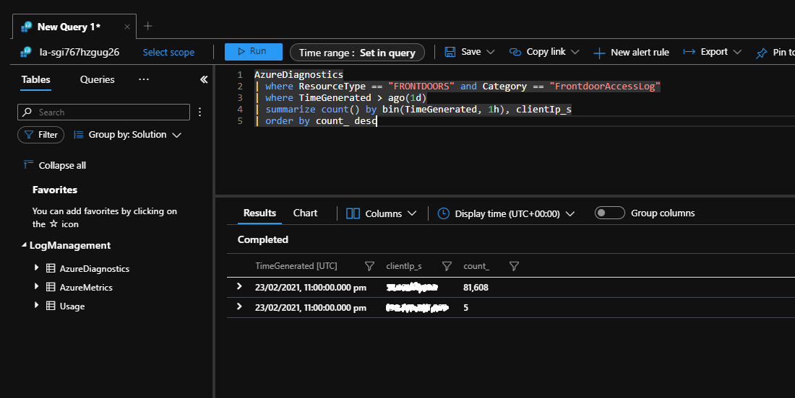

# Retry Storm antipattern

When a service is unavailable or busy, having clients retry their connections too frequently can cause the service to struggle to recover, and can make the problem worse. It also doesn't make sense to retry forever, since requests are typically only valid for a defined period of time.

## Problem description

In the cloud, services sometimes experience problems and become unavailable to clients, or have to throttle or rate limit their clients. While it's a good practice for clients to retry failed connections to services, it's important they do not retry too frequently or for too long. Retries within a short period of time are unlikely to succeed since the services likely will not have recovered. Also, services can be put under even more stress when lots of connection attempts are made while they're trying to recover, and repeated connection attempts may even overwhelm the service and make the underlying problem worse.

The following example illustrates a scenario where a client connects to a server-based API. If the request doesn't succeed, then the client retries immediately, and keeps retrying forever. Often this sort of behavior is more subtle than in this example, but the same principle applies.

```csharp
public async Task<string> GetDataFromServer()
{
    while(true)
    {
        var result = await httpClient.GetAsync(string.Format("http://{0}:8080/api/...", hostName));
        if (result.IsSuccessStatusCode) break;
    }

    // ... Process result.
}
```

## How to fix the problem

Client applications should follow some best practices to avoid causing a retry storm.

- Cap the number of retry attempts, and don't keep retrying for a long period of time. While it might seem easy to write a `while(true)` loop, you almost certainly don't want to actually retry for a long period of time, since the situation that led to the request being initiated has probably changed. In most applications, retrying for a few seconds or minutes is sufficient.
- Pause between retry attempts. If a service is unavailable, retrying immediately is unlikely to succeed. Gradually increase the amount of time you wait between attempts, for example by using an exponential backoff strategy.
- Gracefully handle errors. If the service isn't responding, consider whether it makes sense to abort the attempt and return an error back to the user or caller of your component. Consider these failure scenarios when designing your application.
- Consider using the [Circuit Breaker pattern](../../patterns/circuit-breaker.md), which is designed specifically to help avoid retry storms.
- If the server provides a `retry-after` response header, make sure you don't attempt to retry until the specified time period has elapsed.
- Use official SDKs when communicating to Azure services. These SDKs generally have built-in retry policies and protections against causing or contributing to retry storms. If you're communicating with a service that doesn't have an SDK, or where the SDK doesn't handle retry logic correctly, consider using a library like [Polly](https://github.com/App-vNext/Polly) (for .NET) or [retry](https://www.npmjs.com/package/retry) (for JavaScript) to handle your retry logic correctly and avoid writing the code yourself.
- If you're running in an environment that supports it, use a service mesh (or another abstraction layer) to send outbound calls. Typically these tools, such as [Dapr](https://docs.dapr.io/developing-applications/building-blocks/service-invocation/service-invocation-overview/#retries), support retry policies and automatically follow best practices, like backing off after repeated attempts. This approach means you don't have to write retry code yourself.
- Consider batching requests and using request pooling where available. Many SDKs handle request batching and connection pooling on your behalf, which will reduce the total number of outbound connection attempts your application makes, although you still need to be careful not to retry these connections too frequently.

Services should also protect themselves against retry storms.

- Add a gateway layer so you can shut off connections during an incident. This is an example of the [Bulkhead pattern](../../patterns/bulkhead.yml). Azure provides many different gateway services for different types of solutions including [Front Door](https://azure.microsoft.com/services/frontdoor/), [Application Gateway](https://azure.microsoft.com/services/application-gateway/), and [API Management](https://azure.microsoft.com/services/api-management/).
- Throttle requests at your gateway, which ensures you won't accept so many requests that your back-end components can't continue to operate.
- If you're throttling, send back a `retry-after` header to help clients understand when to reattempt their connections.

## Considerations

- Clients should consider the type of error returned. Some error types don't indicate a failure of the service, but instead indicate that the client sent an invalid request. For example, if a client application receives a `400 Bad Request` error response, retrying the same request probably is not going to help since the server is telling you that your request is not valid.
- Clients should consider the length of time that makes sense to reattempt connections. The length of time you should retry for will be driven by your business requirements and whether you can reasonably propagate an error back to a user or caller. In most applications, retrying for a few seconds or minutes is sufficient.

## How to detect the problem

From a client's perspective, symptoms of this problem could include very long response or processing times, along with telemetry that indicates repeated attempts to retry the connection.

From a service's perspective, symptoms of this problem could include a large number of requests from one client within a short period of time, or a large number of requests from a single client while recovering from outages. Symptoms could also include difficulty when recovering the service, or ongoing cascading failures of the service right after a fault has been repaired.

## Example diagnosis

The following sections illustrate one approach to detecting a potential retry storm, both on the client side and the service side.

### Identifying from client telemetry

[Azure Application Insights](/azure/azure-monitor/app/app-insights-overview) records telemetry from applications and makes the data available for querying and visualization. Outbound connections are tracked as dependencies, and information about them can be accessed and charted to identify when a client is making a large number of outbound requests to the same service.

The following graph was taken from the Metrics tab within the Application Insights portal, and displaying the *Dependency failures* metric split by *Remote dependency name*. This illustrates a scenario where there were a large number (over 21,000) of failed connection attempts to a dependency within a short time.



### Identifying from server telemetry

Server applications may be able to detect large numbers of connections from a single client. In the following example, Azure Front Door acts as a gateway for an application, and [has been configured to log](/azure/frontdoor/front-door-diagnostics#diagnostic-logging) all requests to a Log Analytics workspace.

The following Kusto query can be executed against Log Analytics. It will identify client IP addresses that have sent large numbers of requests to the application within the last day.

```kusto
AzureDiagnostics
| where ResourceType == "FRONTDOORS" and Category == "FrontdoorAccessLog"
| where TimeGenerated > ago(1d)
| summarize count() by bin(TimeGenerated, 1h), clientIp_s
| order by count_ desc
```

Executing this query during a retry storm shows a large number of connection attempts from a single IP address.



## Related resources

- [Retry pattern](../../patterns/retry.yml)
- [Circuit Breaker pattern](../../patterns/circuit-breaker.md)
- [Transient fault handling best practices](../../best-practices/transient-faults.md)
