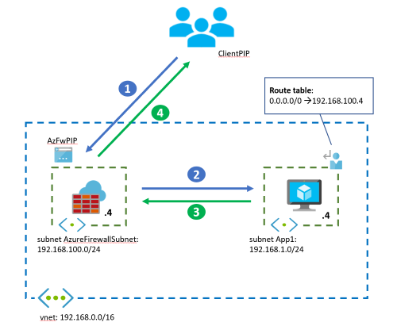
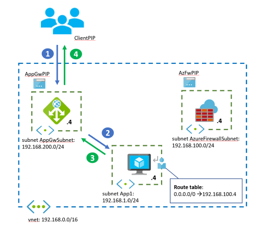
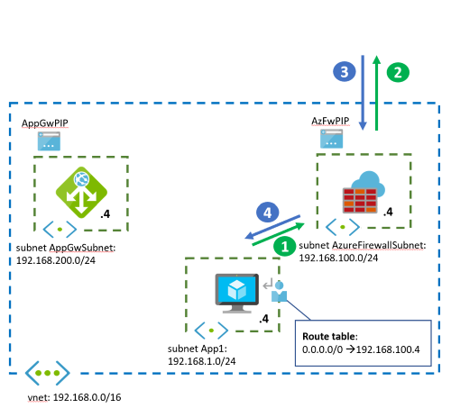
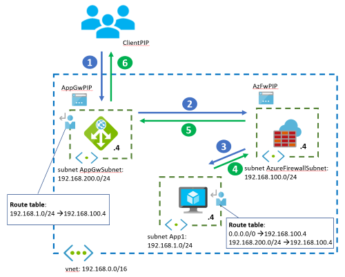
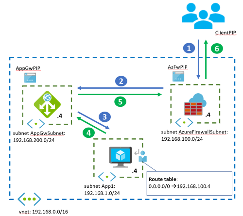
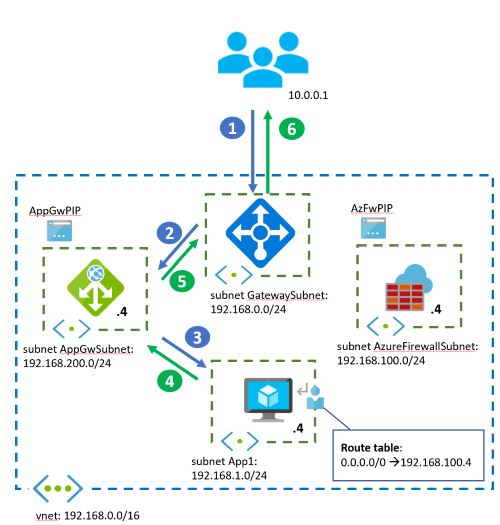
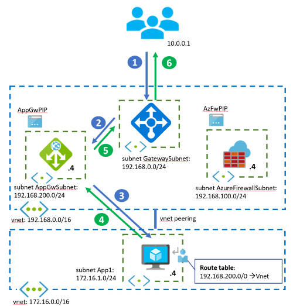

# Using Azure Application Gateway and Azure Firewall in your Virtual Network

Making sure that the application and the data is secure is of paramount importance when deploying application workloads into Azure. Multiple mechanisms exist that can protect your application and your data, depending on the technology that you choose to support your application: you can implement protective measures in the application itself such as authentication or encryption, and you can introduce additional layers of security in the network that contains the workload to further reduce the attack surface. This document focuses on the latter, that is, network security controls that you can implement in a Virtual Network where you have deployed an application, for example on Azure Virtual Machines, Virtual Machine Scale Sets or Azure Kubernetes Services.

Regarding network security, your first choice will be whether to implement generic security valid for all workloads like the functionality that the Azure Firewall provides, or mechanisms such as the Azure Web Application Firewall (a service that can be deployed on the Azure Application Gateway) that address attacks exploiting application-specific vulnerabilities:

* The [Azure Firewall][azfw-overview] is a managed next-generation firewall that offers Network Address Translation (NAT) functionality as well as packet filtering capabilities based on Layer 4 packet attributes (IP addresses and TCP/UDP ports) or application-based attributes for HTTP(S) or SQL. Additionally, the Azure Firewall leverages Microsoft threat intelligence to more effectively identify malicious IP addresses. For more details please refer to the [Azure Firewal Documentation][azfw-docs].
* The [Azure Application Gateway][appgw-overview] is a managed HTTP(S) full reverse proxy that can be used for offloading SSL encryption and decryption or to inspect web payloads to detect attacks at the HTTP layer with its Web Application Firewall capabilities. For more details please refer to the [Application Gateway Documentation][appgw-docs] and the [Web Application Firewall Documentation][waf-docs].

Both Azure services are often complementary to each other, so it can be difficult choosing the best for your workloads, or in case you need both (as it is typically the case), how to integrate them in the same Virtual Network to achieve an optimal protection against attacks at both the network and the application layer. This document will explain when to use each component and when to use the different design options that combine both. Here a quick summary of the different designs that will be discussed:

* **Azure Firewall only**: this design is often used when there are no web applications in the Virtual Network
* **Application Gateway only**: this design is appropriate when there are only web applications in the Virtual Network and Network Security Groups are enough for egress filtering
* **Azure Firewall and Application Gateway in parallel**: this is the most frequent design, where the Azure Application Gateway protects HTTP(S) applications from web attacks and the Azure Firewall protects all other workloads, plus filters outbound traffic
* **Application Gateway in front of Azure Firewall**: this design is used by customers that want a firewall to inspect both inbound and outbound traffic, but still have the Application Gateway protect web workloads
* **Azure Firewall in front of Application Gateway**: similar to the previous design, but the Azure Firewall inspects traffic before it arrives to the Application Gateway. This design provides a unique public address for inbound and outbound traffic. A downside of this design is that the application will not see the original source IP address of the web traffic.

There are many variations to the previous basic designs: whether the application clients are coming from the public Internet or from on-premises, whether the hub and spoke network design is used, specific details for integration with [Azure Kubernetes Service][aks-overview], adding additional services such as the [API Management][apim-overview] Gateway, and finally, the possibility of replacing the Azure resources described in this article with Network Virtual Appliances of Microsoft partners. These variations will be discussed in the second half of this article.

## Design Option 1: Azure Firewall only

This design option is to be used if there are no web-based workloads deployed in the Azure Virtual Network that can benefit from the extra protection of the Azure Web Application Firewall, and hence there is no need to deploy an Azure Application Gateway in the Virtual Network. The design in this case is relatively simple, but going over the different packets will help understand more complex designs.

This packet walk example corresponds to a user accessing the application hosted in virtual machines from the public Internet. Note that the diagram includes only one virtual machine for simplicity, but typically you would have multiple application instances behind a load balancer for a higher availability and scalability.

1. The application client will initiate the connection to the public IP address of the Azure Firewall:
   * Source IP address: ClientPIP
   * Destination IP address: AzFwPIP
2. The Azure Firewall will have a [Destination NAT rule][azfw-dnat] that will translate the destination IP address to the IP address of the application inside of the Virtual Network. Additionally, the Azure Firewall will Source NAT the packet under certain circunstances. As a consequences, these are the IP addresses that the Virtual Machine will see in the incoming packet:
   * Source IP address: 192.168.100.7 (the Azure Firewall always SNAT if DNAT is performed, see [Azure Firewall Known Issues][azfw-issues])
   * Destination IP address: 192.168.1.4
3. The Virtual Machine will answer the application request reverting source and destination IP addresses. While for this inbound flow, a User-Defined Route (UDR) is not required given that the source ip visible to the application is that of the Azure Firewall, one will want to establish a UDR for outbound connections from the application, making sure packets to the public Internet do not bypass the Azure Firewall.
   * Source IP address: 192.168.1.4
   * Destination IP address: 192.168.100.7
4. Finally, the Azure Firewall will undo the NAT operations (SNAT and DNAT) and deliver the response to the client:
   * Source IP address: AzFwPIP
   * Destination IP address: ClientPIP

> [!NOTE]
> The IP address 192.168.100.7 in this example corresponds to one of the instances deployed under the covers as part of the Azure Firewall service, here with the frontend IP address 192.168.100.4. These individual instances are normally invisible to the Azure administrator, but in some cases it is useful noticing the difference, such as when troubleshooting network issues.

Note that in this design the Azure Firewall not only inspects incoming connections from the public Internet, but outbound connections from the Azure virtual machine in the application subnet too (because of the User-Defined Route).

If traffic is coming not from the public Internet but from a VPN or ExpressRoute Virtual Network Gateway, one difference is that the client will initiate the connection to the IP address to the application (the Virtual Machine in this example), and not to the firewall.

## Design Option 2: Application Gateway only

The opposite case to the previous use case is when only web applications exist in the Virtual Network, and inspecting outbound traffic with Network Security Groups is enough protection (hence there is no need for the Azure Firewall). The main difference to the previous design is that the Application Gateway does not act as a routing device with Network Address Translation, but it behaves as a full reverse application proxy. In other words, on one side it terminates the web session from the client, and on the other it establishes a separate session with one of its backend servers:

Here again this packet walk example corresponds to a user accessing a web application hosted in virtual machines from the public Internet. However, the situation if the client is coming from an on-premises network over a VPN or an ExpressRoute gateway is very similar, with the only difference that the client would access the private IP address of the Application Gateway instead of the public one.

1. The application client will initiate the connection to the public IP address of the Azure Application Gateway:
   * Source IP address: ClientPIP
   * Destination IP address: AppGwPIP
2. The Application Gateway instance that receives the request will terminate the connection from the client, and it establishes a new connection with one of the backends. As a consequence, the backend will see as source IP the address of the specific Application Gateway instance handling the traffic. The Application Gateway will insert the X-Forwarded-For HTTP header with the original IP address of the client, in case this IP address is relevant for the application:
   * Source IP address: 192.168.200.7 (the private IP address of the Application Gateway instance that happens to handle this specific request)
   * Destination IP address: 192.168.1.4
   * X-Forwarded-For header: ClientPIP
3. The Virtual Machine will answer the application request reverting source and destination IP addresses. Note that no User-Defined Route is required in this case, since the virtual machine already knows how to reach the application gateway.
   * Source IP address: 192.168.1.4
   * Destination IP address: 192.168.200.7
4. Finally, the Application Gateway instance will answer to the client:
   * Source IP address: AppGwPIP
   * Destination IP address: ClientPIP

> [!NOTE]
> The IP address 192.168.200.7 in this example corresponds to one of the instances deployed under the covers as part of the Azure Application Gateway service, here with the frontend IP address 192.168.200.4. These individual instances are normally invisible to the Azure administrator, but in some cases it is useful noticing the difference, such as when troubleshooting network issues.

## Design Option 3: Application Gateway and Azure Firewall in parallel

In some situations filtering outbound connections from the Virtual Machines with Network Security Groups might be very complex to implement or even impossible. For example, if you want to allow connectivity to a specific Azure Storage Account but not to others, this is only possible with FQDN-based filters. Hence this design is often used where FQDN-based filtering for egress traffic is required. As an example, this is exactly the situation when [limiting egress traffic from an Azure Kubernetes Services cluster][aks-egress].

Another reason for implementing this design is because there is a mix of web and non-web workloads in the Virtual Network. The Web Application Firewall will protect inbound traffic to the web workloads, and the Azure Firewall will inspect inbound traffic for the rest of the applications.

> [!NOTE]
> Due to its simplicity and flexibility this is the recommended design for most scenarios.

The following two diagrams illustrate the traffic flows for both types of traffic: inbound connections initiated by an application user outside of the Virtual network, and outbound connections to the public Internet initiated for the Virtual Machines, for example to connect to backend systems or get operating system updates:

This document will not go in detail over the packet walks of these flows, since they are exactly the same as for design options 1 and 2.

## Design Option 4: Application Gateway in front of Azure Firewall

Some organizations have as requirement having all traffic go both trough a Web Application Firewall and through a Firewall. The WAF would provide protection against attacks at the application layer, and the firewall can be used as a central logging and control point. In this case the Application Gateway and the Azure Firewall are not sitting in parallel, but one after the other.

> [!WARNING]
> One important remark of this design is that the value added by the Azure Firewall for inbound web traffic is limited, since it is only inspecting legitimate traffic from the application gateway to the web application. However, it will introduce additional pressure on the Firewall due to the need to inspect web traffic as well.

In this design, the Web Application Firewall is facing the public Internet. Azure WAF running on top of the Application Gateway is a security-hardened device designed to operate facing directly the public Internet, since it offers a very limited attack surface and it has been designed explicitly for that purpose. Being the first line of defense against attacks, the WAF will set the source IP address of the client in the X-Forwarded-For header, making the original IP address of the client visible to the web server.

Here the packet walk for inbound traffic from the public Internet:

1. The application client will initiate the connection to the public IP address of the Azure Application Gateway:
   * Source IP address: ClientPIP
   * Destination IP address: AppGwPIP
2. The Application Gateway instance that receives the request will terminate the connection from the client, and establish a new connection with one of the backends. The Application Gateway will insert the X-Forwarded-For HTTP header with the original IP address of the client, in case this IP address is relevant for the application. The User-Defined Route to `192.168.1.0/24` in the subnet of the Application Gateway will forward the packet to the Azure Firewall, yet preserving the destination ip towards the web app:
   * Source IP address: 192.168.200.7 (the private IP address of the Application Gateway instance that happens to handle this specific request)
   * Destination IP address: 192.168.1.4
   * X-Forwarded-For header: ClientPIP
3. The Azure Firewall will not Source NAT the traffic, since it is going to a private IP address (see [Azure Firewall SNAT][azfw-snat]), and will forward it to the application VM if rules allow it.
   * Source IP address: 192.168.200.7 (the private IP address of the Application Gateway instance that happens to handle this specific request)
   * Destination IP address: 192.168.1.4
   * X-Forwarded-For header: ClientPIP
4. The Virtual Machine will answer the request reverting source and destination IP addresses. The User-Defined Route to `192.168.200.0/24` will capture the packet sent back to the application gateway and redirect it to the Azure Firewall, yet by preserving the destination ip towards the application gateway
   * Source IP address: 192.168.1.4
   * Destination IP address: 192.168.200.7
5. Here again the Azure Firewall will not Source NAT the traffic, since it is going to a private IP address and it will forward it to the Application Gateway.
   * Source IP address: 192.168.1.4
   * Destination IP address: 192.168.200.7
6. Finally, the Application Gateway instance will answer to the client:
   * Source IP address: AppGwPIP
   * Destination IP address: ClientPIP

Note that outbound flows from the Virtual Machine to the public Internet will go through the Azure Firewall, as defined by the User-Defined Route to `0.0.0.0/0`.

## Design Option 5: Application Gateway behind the Azure Firewall

This design is mainly motivated by the desire of having the Azure Firewall filtering packets before they reach the Application Gateway, hence discarding malicious packets before they even hit the Application Gateway. Another benefit of this design is that the application will get the same public IP address both for ingress and egress connections to the Internet, in case that is a requirement.

> [!WARNING]
> A significant drawback of this design is that the application gateway or the application servers will not see the original source IP address of the client, since the Azure Firewall will Source-NAT the packets as they come into the Virtual Network.

Here the packet walk for inbound traffic from the public Internet:

1. The application client will initiate the connection to the public IP address of the Azure Firewall:
   * Source IP address: ClientPIP
   * Destination IP address: AzFWPIP
2. The Azure Firewall will have a Destination NAT rule mapping the web ports (typically TCP 443) to the private IP address of the Application Gateway. Remember that the Azure Firewall also SNATs when doing DNAT (see [Azure Firewall Known Issues][azfw-issues] for more details on this):
   * Source IP address: 192.168.100.7 (the private IP address of the Azure Firewall instance that happens to handle this specific request)
   * Destination IP address: 192.168.200.4
3. The Application Gateway will establish a new session between the specific instance handling the connection and one of the backend servers. Note that the original IP address of the client is not present in the packet:
   * Source IP address: 192.168.200.7 (the private IP address of the Application Gateway instance that happens to handle this specific request)
   * Destination IP address: 192.168.1.4
   * X-Forwarded-For header: ClientPIP
4. The Virtual Machine will answer to the Application Gateway reverting source and destination IP addresses.
   * Source IP address: 192.168.1.4
   * Destination IP address: 192.168.200.7
5. The Application Gateway will reply to the SNAT source IP address of the Azure Firewall instance that processed the request. Note that even if the connection is coming from a specific Application Gateway instance (.7), the Azure Firewall will see as source IP the internal IP address of the Application Gateway (.4):
   * Source IP address: 192.168.200.4
   * Destination IP address: 192.168.100.7
6. Finally, the Azure Firewall will undo SNAT and DNAT and it will answer to the client:
   * Source IP address: AzFwPIP
   * Destination IP address: ClientPIP

Note that even if there are no listeners configured in the Application Gateway for applications, it will still need a public IP address. The main reason is that the Application Gateway needs this IP address so that it can be managed by Microsoft.

## Clients coming from on-premises

The previous designs have all shown examples where the application clients were coming from the public Internet. However, many applications are accessed from on-premises as well. Most of the information details and packet walks described above will not change, but there are some notable differences:

* A VPN Gateway or an ExpressRoute Gateway is deployed in front of the Azure Firewall and the Application Gateway (depending on the chosen topology).
* The private IP address of the Application Gateway will be used when the Web Application Firewall is leveraged.
* The Azure Firewall does not support Destination NAT (DNAT) at this time for private IP addresses. Hence, if ingress traffic is to be sent to the Azure Firewall from the VPN or ExpressRoute Gateways, User-Defined Routes are to be used.
* You need to be very careful id advertising a default route (0.0.0.0/0) from the on-premises network (this is typically called forced tunneling), since for the Azure Application Gateway the default route needs to point to the public Internet

The following diagram exemplifies the recommended design (Azure Application Gateway and Azure Firewall in parallel) when application clients are coming from an on-premises network connected to Azure over site-to-site VPN or ExpressRoute:

Note that even if all clients are located on-premises or in Azure, both the Azure Application Gateway and the Azure Firewall will require to keep their public IP addresses, so that Microsoft can manage the services.

## Design in a Hub and Spoke topology

If using a hub and spoke topology where shared resources are deployed in a central Virtual Network (usually called hub), and applications in separate Virtual Networks (spokes) connected to the hub via Virtual Network Peerings, the designs described in this document are still applicable. Some considerations to be taken are the following:

* Typically all network components described in this article would go to the hub Virtual Network, such as the Azure Firewall, the Application Gateway and the API Management Gateway (see later on for the latter).
* Note that having the Azure Application Gateway in a spoke will be difficult in some designs, since you cannot have a default route (0.0.0.0/0) in the Application Gateway subnet with a next hop being anything other than Internet.
* You can still define backend servers in the Application Gateway even if they are located in a peered Virtual Network

> [!WARNING]
> Special attention needs to be put on User-Defined Routes in the spokes: traffic coming from a specific instance of the Azure Firewall (the .7 address in the previous examples) should not be sent back to the main IP address of the Azure Firewall (the .4 address in the previous examples). In other words, routing in the application subnet should send traffic addressed to the AzureFirewallSubnet to a next hop of type Virtual Network (and not Virtual Network Appliance). Otherwise asymmetric routing will break communication. This situation can easily happen if other resources such as Domain Controllers or File Servers exist in the hub vnet, and you configure a route in the the spoke vnets to send all hub traffic to the Azure Firewall's IP address.

The previous document does not imply that the route table is always needed, only that you need to verify that the next hop for the Azure Application Gateway subnet and the Azure Firewall subnet is the virtual network.

## Integration with API Management Gateway

Additional reverse proxy application services can be integrated in the previous designs, such as the API Management Gateway to provide additional functionality such as API throttling or authentication proxy (see the application pattern for [API Gateways for Microservices][app-gws] for more details). The designs described above are not greatly altered, only with the main difference that instead of a single reverse proxy (the Application Gateway) there are two reverse proxies chained behind each other (the Application Gateway and the API Management Gateway in this case).

Please refer to the [Design Guide to integrate API Management and Application Gateway in a Virtual Network][appgw_apim] for more information about proven practices for combining both services together.

## Integration with Azure Kubernetes Service

When applying the concepts in this article to workloads running on an Azure Kubernetes Service (AKS) cluster, you have two options regarding the Azure Application Gateway: you can deploy it independently of the AKS cluster, or you can integrate it with the AKS cluster using the [Azure Application Gateway Ingress Controller][agic_overview]. The benefit of this integration is that when configuring certain objects at the Kubernetes levels such as services and ingresses, the Application Gateway will automatically adapt without the need of additional manual steps.

Additionally, the Azure Firewall plays an important role in AKS cluster security, since it offers the required functionality to filter egress traffic from the AKS cluster based on Fully Qualified Domain Names (FQDN) and not only IP address, as documented in [Limiting egress traffic from an AKS cluster][aks-egress].

When using the Application and Azure Firewall together to protect workloads running in an AKS cluster, the recommendation is using the design option with both appliances in parallel: the Application Gateway (with Web Application Firewall) will process inbound connection requests to web applications in the cluster, and the Azure Firewall will only allow outbound connections if explicitly allowed.

## Azure Front Door

Azure Front Door is a service that provides functionality partially overlapping with the Azure Application Gateway: for example, both services offer Web Application Firewalling, SSL offload and URL-based routing. One main difference is that while Azure Application Gateway is deployed inside of a Virtual Network, Azure Front Door is a global, decentralized service.

This document is not going to delve into the differences between those two services, or when to use which one. Those topics are discussed in the [Frequently Asked Questions section for Azure Front Door][afd-vs-appgw]. Suffice to say that in some situations you have the option to simplify the design inside of the Virtual Network by replacing the Azure Application Gateway with a decentralized Azure Front Door. Note that even in that case most of the designs described in this document are valid, except the option of placing the Azure Firewall in front of Azure Front Door.

## Network Virtual Appliances

Lastly, Microsoft products are not the only choice to implement Web Application Firewall or Next-Generation Firewall functionality in Azure, but a wide range of Microsoft partners provide products in this space. The concepts and designs explained in this document essentially remain the same, but there might be some important aspects to consider:

* Microsoft's partners Network Virtual Appliances for Next-Generation Firewalling often offer more control and flexibility regarding NAT configuration, hence those might be an interesting choice if the use case demands a NAT scenario not supported by the Azure Firewall (such as DNAT from on-premises, or DNAT from Internet without SNAT)
* Azure managed appliances such as the Application Gateway and the Azure Firewall significantly reduce complexity, as compared to designs with Network Virtual Appliances where the user needs to take care of scalability and resiliency across multiple individual virtual appliances
* One aspect to highlight here is that when using Network Virtual Appliances in Azure, active/active and autoscaling setups are recommended so that these appliance do not become a bottleneck for the applications running in the Virtual Network.

## Conclusion

This document has analyzed different approaches for integrating the Azure Application Gateway and the Azure Firewall in the same Virtual Network, where the most common approach is having those two services in parallel to provide an optimal protection for web and non-web workloads running in Azure, both for inbound and outbound traffic.

[azfw-overview]: https://docs.microsoft.com/azure/firewall/overview
[azfw-docs]: https://docs.microsoft.com/azure/firewall/
[azfw-dnat]: https://docs.microsoft.com/azure/firewall/tutorial-firewall-dnat
[azfw-snat]: https://docs.microsoft.com/azure/firewall/snat-private-range
[azfw-issues]: https://docs.microsoft.com/azure/firewall/overview#known-issues
[appgw-overview]: https://docs.microsoft.com/azure/application-gateway/overview
[appgw-docs]: https://docs.microsoft.com/azure/application-gateway/
[waf-docs]: https://docs.microsoft.com/azure/web-application-firewall/
[appgw_apim]: https://docs.microsoft.com/azure/api-management/api-management-howto-integrate-internal-vnet-appgateway
[api_gws]: [https://docs.microsoft.com/azure/architecture/microservices/design/gateway]
[agic_overview]: https://docs.microsoft.com/azure/application-gateway/ingress-controller-overview
[apim-overview]: https://docs.microsoft.com/azure/api-management/api-management-key-concepts
[aks-overview]: https://docs.microsoft.com/azure/aks/intro-kubernetes
[aks-egress]: https://docs.microsoft.com/azure/aks/limit-egress-traffic
[afd-overview]: https://docs.microsoft.com/azure/frontdoor/front-door-overview
[afd-vs-appgw]: https://docs.microsoft.com/azure/frontdoor/front-door-faq#what-is-the-difference-between-azure-front-door-and-azure-application-gateway
