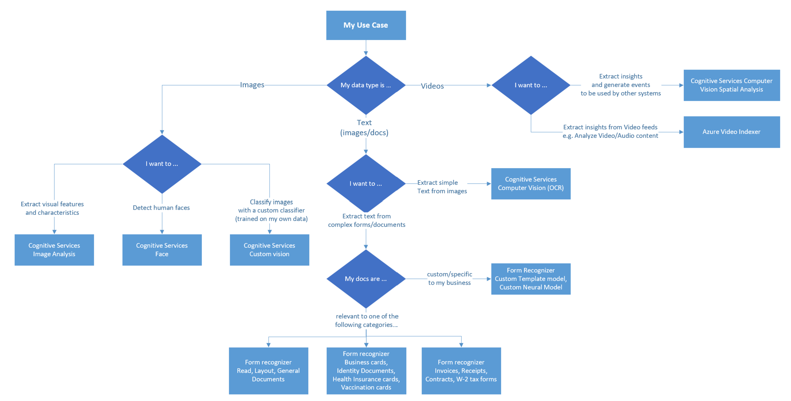

# Different Types of Vision API Services

Azure Cognitive Service for Vision is one of the broadest categories under Cognitive Services. The APIs allow you to incorporate vision features such as analyzing images, face detection, spatial analysis, and optical character recognition (OCR) to your applications with no machine learning knowledge.

## Service categories

At a high Level Vision API's are categorized as follows

- [Computer Vision](/azure/cognitive-services/computer-vision/overview) - With this API you can access advanced algorithms that process images and return information based on the visual features you're interested in. It provides 4 major services namely Optical Character Recognition(OCR), Face, Image Analysis and Spatial Analysis. Form recognizer is an advanced version of OCR.
- [Custom Vision](/azure/cognitive-services/Custom-Vision-Service/overview) - Azure Custom Vision is an image recognition service that lets you build, deploy, and improve your own image identifier models
- [Face Service](/azure/cognitive-services/computer-vision/overview-identity) - This provides AI algorithms that detect, recognize, and analyze human faces in images.

## Key considerations

- **Type of Data:** Images/Text/Videos
- **What is the operation you are performing:** Extracting/Detecting/Classifying

The following flow chart helps you how to go about choosing the Vision service based on your processing needs

### Common Use Cases

1. **Computer Vision**
   - **Describing an image** -to analyze an image, evaluate the objects that are detected, and generate a human-readable phrase or sentence that can describe what was detected in the image.
   - **Tagging visual features** -The image descriptions generated by Computer Vision are based on a set of thousands of recognizable objects, which can be used to suggest tags for the image.
   - **Categorizing an image** - Computer Vision can categorize images based on their contents
   - Optical character recognition - to detect printed and handwritten text in images.
   - **Detect image types** - for example, identifying clip art images or line drawings.
   - **Detect image color schemes** - specifically, identifying the dominant foreground, background, and overall colors in an image.
   - **Generate thumbnails** - creating small versions of images.
   - **Moderate content** - detecting images that contain adult content or depict violent, gory scenes.
   - **Detecting domain-specific content** : When categorizing an image, the Computer Vision service supports two specialized domain models: 
      - **Celebrities** - The service includes a model that has been trained to identify thousands of well-known celebrities from the worlds of sports, entertainment, and business.
      - **Landmarks** - The service can identify famous landmarks, such as the Taj Mahal and the Statue of Liberty.
   - **Detecting objects** - similar to tagging, in that the service can identify common objects; but rather than tagging, or providing tags for the recognized objects only, this service can also return what is known as bounding box coordinates.
   - **Detecting brands** - The service has an existing database of thousands of globally recognized logos from commercial brands of products.When you call the service and pass it an image, it performs a detection task and determine if any of the identified objects in the image are recognized brands.
   - **Detecting faces** -  service can detect and analyze human faces in an image, including the ability to determine age and a bounding box rectangle for the location of the face(s). The facial analysis capabilities of the Computer Vision service are a subset of those provided by the dedicated Face Service.

2. **Custom Vision**
    - **Classification of images** -To predict which category, or class based on set of inputs, which we call features, to calculate a probability score for each possible class and predict a label that indicates the most likely class that an object belongs to. To create an image classification model, you need data that consists of features and their labels.
    - **Detecting objects** - Similar to classification of images however this predicts the coordinates in the image where the applied label(s) can be found. To create an image detection model, you need data that consists of features and their labels.

3. **Face Services**
    - **Face Detection** - identifying regions of an image that contain a human face, typically by returning bounding box coordinates that form a rectangle around the face.
    - **Facial Analysis** -  Beyond simple face detection can return information such as facial landmarks (nose, eyes, eyebrows, lips, and others). These facial landmarks can be used as features with which to train a machine learning model from which you can infer information about a person, such as their perceived age or perceived emotional state.
    - **Facial Recognition** - to train a machine learning model to identify known individuals from their facial features

### Contributors

*This article is maintained by Microsoft. It was originally written by the following contributors.*

Principal authors:

- [Kruti Mehta](https://www.linkedin.com/in/thekrutimehta) | Azure Senior Fast-track Engineer
- [Ashish Chahuan](https://www.linkedin.com/in/a69171115/) | Senior Cloud Solution Architect

Co-authors:

- [Manjit Singh](https://www.linkedin.com/in/manjit-singh-0b922332) | Software Engineer
- [Nathan Widdup](https://www.linkedin.com/in/nwiddup) | Azure Senior Fast-track Engineer
- [Oscar Shimabukuro](https://www.linkedin.com/in/oscarshk/) | Senior Cloud Solution Architect
- [Christina Skarpathiotaki](https://www.linkedin.com/in/christinaskarpathiotaki/) | Senior Cloud Solution Architect
- [Brandon Cowen](https://www.linkedin.com/in/brandon-cowen-1658211b/) | Senior Cloud Solution Architect

### Next steps

- [What is Azure Cognitive Service for Vision](/azure/cognitive-services/computer-vision/overview)
- [Vision API's Bifurcations](https://techcommunity.microsoft.com/t5/fasttrack-for-azure/azure-cognitive-services-vision-api-s-azure-ai-applied-services/ba-p/3506727)

### Learning Paths

- [Create Language Understanding solution with Azure Cognitive Services](/training/paths/create-language-solution-azure-cognitive-services/)
- [Learning path: Provision and manage Azure Cognitive Services](/training/paths/provision-manage-azure-cognitive-services)]
- [Learning path: Explore computer vision](https://learn.microsoft.com/training/paths/explore-computer-vision-microsoft-azure/)
- [Learning path: Create computer vision solutions with Azure Cognitive Services](https://learn.microsoft.com/training/paths/create-computer-vision-solutions-azure-cognitive-services/)
- [Learning path: Create an image recognition solution with Azure IoT Edge and Azure Cognitive Services](https://learn.microsoft.com/training/modules/create-image-recognition-solution-iot-edge-cognitive-services/)
