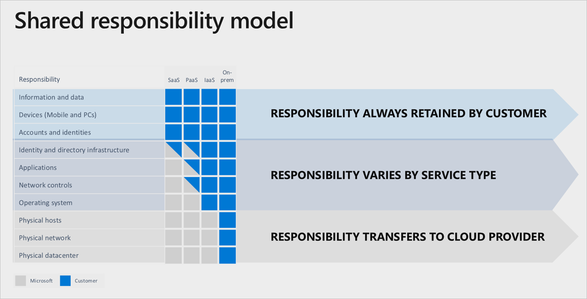
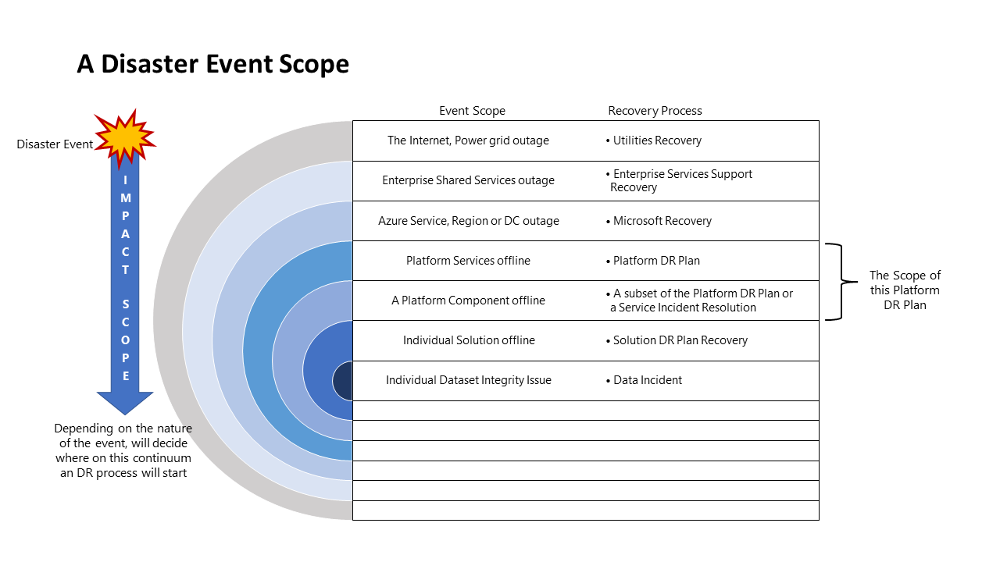
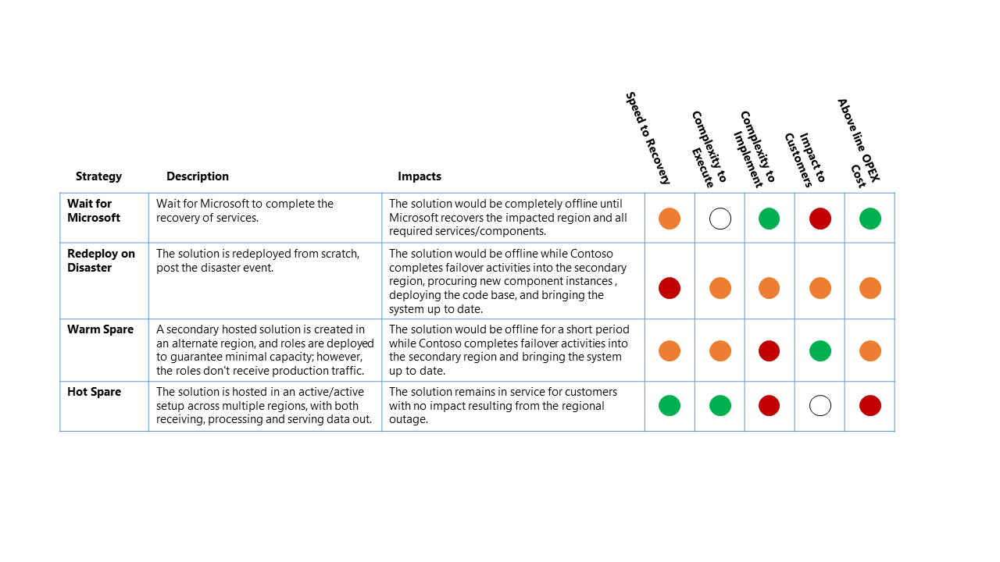

## Lessons learned

1. Ensure that all the parties involved understand the difference between high availability (HA) and disaster recovery (DR). Confusing these concepts can result in mismatched solutions.

1. To define the recovery point objectives (RPOs) and recovery time objectives (RTOs), discuss with business stakeholders their expectations regarding the following factors:

    1. The amount of downtime that they can tolerate. Keep in mind that faster recovery usually incurs a higher cost.

    1. The types of incidents that stakeholders need protection against and how likely they are to occur. For instance, a server failure is more likely to happen than a natural disaster that affects all datacenters in a region.

    1. The effects of system unavailability on their business.

    1. The operational expenses (OPEX) budget for the long-term solution.

1. Consider which degraded service options your end-users can accept. These options might include:

    1. Access to visualization dashboards, even if the data isn't up-to-date. In this scenario, end-users can view their data, even if ingestion pipelines fail.

    1. Read access without write capabilities.

1. Your target RTO and RPO metrics determine the DR strategy that you choose to implement. These strategies include active/active, active/passive, and active/redeploy on disaster. Consider your own [composite service-level objective](/azure/well-architected/reliability/metrics) to factor in the tolerable downtimes.

1. Ensure that you understand all the components that might affect the availability of your systems, such as:

    1. Identity management.

    1. Networking topology.

    1. Secret management and key management.

    1. Data sources.

    1. Automation and job scheduling.

    1. Source repository and deployment pipelines like GitHub and Azure DevOps.

1. Early detection of outages is also a way to decrease RTO and RPO values significantly. Include the following key factors:

    1. Define what an outage is and how it maps to the definition of an outage according to Microsoft. The Microsoft definition is available on the [Azure service-level agreement (SLA)](https://azure.microsoft.com/support/legal/sla/) page at the product or service level.

    1. Implement an efficient monitoring and alerting system with accountable teams that review metrics and alerts promptly to support the goal.

1. For subscription design, the extra infrastructure for DR can be stored in the original subscription. Platform-as-a-service services like Azure Data Lake Storage and Azure Data Factory typically include native failover features. These capabilities allow secondary instances in other regions while remaining within the original subscription. To optimize costs, some organizations might choose to allocate a dedicated resource group exclusively for DR-related resources.

    1. [Subscription limits](/azure/azure-resource-manager/management/azure-subscription-service-limits) might introduce constraints in this approach.

    1. Other constraints might include the design complexity and management controls to ensure that the DR resource groups aren't used for business-as-usual workflows.

1. Design the DR workflow based on the criticality and dependencies of a solution. For example, don't try to rebuild an Azure Analysis Services instance before your data warehouse is operational because it triggers an error. Leave development labs for later in the process and recover core enterprise solutions first.

1. Identify recovery tasks that can be parallelized across solutions. This approach reduces the total RTO.

1. If Azure Data Factory is used in a solution, don't forget to include self-hosted integration runtimes in the scope. [Azure Site Recovery](/azure/site-recovery/site-recovery-overview) is ideal for these machines.

1. Automate manual operations as much as possible to prevent human error, especially when under pressure. We recommend that you:

    1. Adopt resource provisioning through Bicep, Azure Resource Manager templates, or PowerShell scripts.

    1. Adopt versioning of source code and resource configuration.

    1. Use continuous integration and continuous delivery release pipelines instead of select-ops.

1. Because you have a plan for failover, you should consider procedures to fall back to the primary instances.

1. Define clear indicators and metrics to validate that the failover is successful and that solutions are operational. Confirm that performance is back to normal, also known as *primary functional*.  

1. Decide if your SLAs should remain unchanged after a failover or if you allow for a temporary reduction in service quality. This decision greatly depends on the business service process being supported. For example, the failover for a room-booking system is much different than a core operational system.

1. Base an RTO or RPO definition on specific user scenarios instead of at the infrastructure level. This approach provides greater granularity in how to determine which processes and components you should prioritize for recovery during an outage or disaster.

1. Ensure that you perform capacity checks in the target region before you proceed with a failover. In a major disaster, many customers might attempt to fail over to the same paired region simultaneously. This scenario can result in delays or contention in resource provisioning. If these risks are unacceptable, consider either an active/active or active/passive DR strategy.

1. You must create and maintain a DR plan to document the recovery process and the action owners. Keep in mind that some team members might be on leave, and ensure that secondary contacts are included.

1. Perform regular DR drills to validate the DR plan workflow, ensure that it meets the required RTO and RPO requirements, and train the responsible teams. Regularly test data and configuration backups to ensure that they're *fit for purpose*, which means that they're suitable and effective for their intended use. This process ensures that they can support recovery activities.

1. Early collaboration with teams responsible for networking, identity, and resource provisioning facilitates agreement on the most optimal solution for how to:

    1. Redirect users and traffic from your primary to your secondary site. Concepts such as Domain Name System redirection or the use of specific tooling like [Azure Traffic Manager](/azure/traffic-manager/traffic-manager-overview) can be evaluated.

    1. Provide access and rights to the secondary site in a timely and secure manner.

1. During a disaster, effective communication between the many parties involved is key to the efficient and rapid implementation of the plan. Teams might include:

    1. Decision-makers.
    1. Incident response teams.
    1. Affected internal users and teams.
    1. External teams.

1. Orchestration of the different resources at the right time ensures efficiency in the DR plan implementation.

## Considerations

### Antipatterns

- **Copy/paste this article series**

   This article series provides guidance for customers seeking a deeper understanding of an Azure-specific DR process. It's based on the generic Microsoft intellectual property and reference architectures instead of any single customer-specific Azure implementation.

   This content provides a strong foundational understanding. But customers must tailor their approach by considering their unique context, implementation, and requirements to develop a fit-for-purpose DR strategy and process.  

- **Treat DR as a tech-only process**

  Business stakeholders are crucial in defining the requirements for DR and completing the business validation steps required to confirm a service recovery.  

  Ensuring that business stakeholders are engaged across all DR activities provides a DR process that's fit for purpose, represents business value, and is implementable.  

- **"Set and forget" DR plans**

  Azure is constantly evolving, as is the way individual customers use various components and services. A fit-for-purpose DR process must evolve with them.  

  Customers should regularly reassess their DR plan through the software development life cycle or periodic reviews. This strategy keeps the service recovery plan valid and properly addresses any changes across components, services, or solutions.

- **Paper-based assessments**

  The end-to-end simulation of a DR event is difficult to perform across a modern data ecosystem. However, efforts should be made to get as close as possible to a complete simulation across affected components.  

  Regularly scheduled drills help an organization develop the instinctive ability to confidently implement the DR plan.

- **Relying on Microsoft to do it all**

  Within the Microsoft Azure services, there's a clear [division of responsibility](/azure/reliability/business-continuity-management-program#shared-responsibility-model), anchored by the cloud service tier used.
  
    

  Even if a full [software-as-a-service stack](https://azurecharts.com/overview/?f=saas) is used, the customer retains the responsibility to ensure that the accounts, identities, and data are correct and up-to-date, along with the devices used to interact with the Azure services.  

## Event scope and strategy  

### Disaster event scope  

Different events have varying scopes of impact that require different responses. The following diagram illustrates the scope of impact and response for a disaster event.

  

### Disaster strategy options  

There are four high-level options for a DR strategy:  

- **Wait for Microsoft**

  As the name suggests, the solution is offline until the complete recovery of services in the affected region by Microsoft. After recovery, the customer validates the solution, and it's then updated to help ensure service recovery.

- **Redeploy on disaster**

  The solution is manually redeployed as a fresh deployment into an available region after a disaster event.

- **Warm spare (active/passive)**

  A secondary hosted solution is created in an alternate region and components are deployed to guarantee minimal capacity. However, the components don't receive production traffic.

  The secondary services in the alternative region might be *turned off*, or run at a lower performance level until a DR event occurs.  

- **Hot spare (active/active)**

  The solution is hosted in an active/active setup across multiple regions. The secondary hosted solution receives, processes, and serves data as part of the larger system.  

### DR strategy effects  

The operating cost attributed to the higher levels of service resiliency often plays a major role in the [key design decision](/azure/architecture/framework/cost/tradeoffs#cost-vs-reliability) for a DR strategy, but other important factors should also be considered.

> [!NOTE]  
> [Cost Optimization](/azure/well-architected/cost-optimization/checklist) is one of the five pillars of architectural excellence within the [Azure Well-Architected Framework](/azure/well-architected/pillars). Its goal is to reduce unnecessary expenses and improve operational efficiencies.  

The DR scenario for this worked example is a complete Azure regional outage that directly affects the primary region that hosts the Contoso Data Platform.

The following table is a comparison between the options. A strategy that has a green indicator is better for that classification than a strategy that has an orange or red indicator.

  

### Classification key

For this outage scenario, the relative impact on the four high-level DR strategies is based on the following factors:  

- **RTO:** The expected elapsed time from the disaster event to platform service recovery.  

- **Complexity to execute:** The complexity for the organization to carry out the recovery activities.  

- **Complexity to implement:** The complexity for the organization to implement the DR strategy.  

- **Customer impact:** The direct impact to customers of the data platform service from the DR strategy.  

- **Above-the-line OPEX cost:** The extra cost expected from implementing this strategy, like increased monthly billing for Azure for extra components and extra resources required to support.

## Next steps

- [Mission-critical workload](/azure/architecture/framework/mission-critical/mission-critical-overview)
- [Well-Architected Framework recommendations for designing a DR strategy](/azure/well-architected/reliability/disaster-recovery)

## Related resources

- [DR for Azure Data Platform - Overview](dr-for-azure-data-platform-overview.yml)
- [DR for Azure Data Platform - Architecture](dr-for-azure-data-platform-architecture.yml)
- [DR for Azure Data Platform - Scenario details](dr-for-azure-data-platform-scenario-details.yml)
