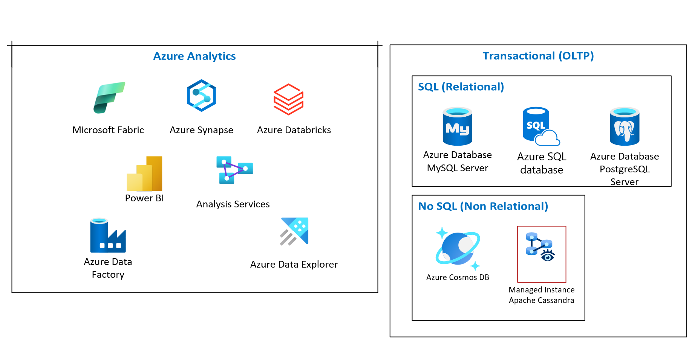

# Choosing a Data Store - Classification

Storage for **IoT (Internet of things)** scenarios is intentionally not covered in this document. For more information on IoT related storage see [Azure IoT](https://azure.microsoft.com/solutions/iot) and [IoT Architectures](../../reference-architectures/iot/iot-architecture-overview.md). Also, AI Search, AI databases and vector databases aren't covered in this article.

We can generally divide Azure storage into two general categories (unofficial classification, for the purposes of architecture only): **Database/Analytics storage** and more **simple storage** options.

**Simple storage options** include products like [Blob storage](/azure/storage/files/storage-files-introduction) (excluding Data Lake), [Azure Files](/azure/storage/files/storage-files-introduction), [Azure disks](/azure/virtual-machines/managed-disks-overview), [queue storage](/azure/storage/queues/), and [Table storage](/azure/storage/tables/). These options are good for use cases where you need to store large amounts of data that don’t necessarily need [ACID](/windows/win32/cossdk/acid-properties) capabilities. Simple storage options usually have lower costs than databases or analytics services. Examples of these use cases are files shares, data that doesn’t require as much structured querying or transactional capabilities, and long-term file retention.

Databases in Azure can be divided into two different groups: **Analytics databases/datastores** and **transactional databases/datastores**.

**Azure analytical databases/datastores (including OLAP workloads – Online Analytical Processing)** are specialized services designed to store, manage, and analyze large volumes of data. They provide the infrastructure for data warehousing, big data analytics, and real-time analytics. These workloads are optimized for reading large amounts of data and often involve columnar storage. If you're looking to perform analytics with your workloads see [Analytical Data Stores](../technology-choices/analytical-data-stores.md).

**Transactional databases (also referred to as OLTP – Online transaction processing)** in Azure are designed to handle workloads that require quick, reliable, and secure processing of transactions. These databases are optimized for operations that involve frequent reads and writes, ensuring data integrity and consistency. These workloads are optimized for reading/writing data and often involve row storage (with some exceptions). If you're looking to deploy a transactional database see [OLTP Solutions.](../relational-data/online-transaction-processing.md)

**Transactional databases** can also be divided into 2 groups, **Relational Databases (often called SQL databases)** and **Non-relational Databases (often called NoSQL databases)**.

**Relational databases** are a type of database that store and organize data points with defined relationships for easy and fast access. They're structured into tables that represent predefined categories through rows and columns, which hold information about each entity. This organization allows for efficient and flexible access to data. Examples of these databases in Azure include:

- [SQL Server on Azure VMs](/azure/azure-sql/virtual-machines/windows/sql-server-on-azure-vm-iaas-what-is-overview)
- [Azure SQL Database](/azure/azure-sql)
- PostgreSQL and [Azure Database for PostgreSQL](/azure/postgresql/) 
- MySQL and [Azure Database for MySQL](/azure/mysql) both in their IaaS and PaaS versions.

**NoSQL databases**, also known as "nonrelational" or "non-SQL" databases, are designed to store, manage, and retrieve data that isn't necessarily structured in a tabular form like relational databases. They can handle a wide variety of data types, including structured, semi-structured, and unstructured data. Examples of these databases in Azure are [Azure Cosmos DB](/azure/cosmos-db), [Azure Managed Instance for Cassandra](/azure/managed-instance-apache-cassandra/), etc.

You might have cases where you need a hybrid database/datastore in terms of analytics vs transactional. These use cases are called **HTAP (Hybrid Transactional/Analytical Processing)**. Products like [Azure Cosmos DB for PostgreSQL](/azure/cosmos-db/postgresql/) or [Azure SQL Hyperscale](/azure/azure-sql/database/service-tier-hyperscale) are good choices for these use cases.