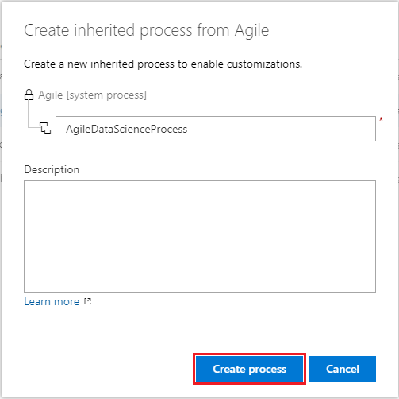
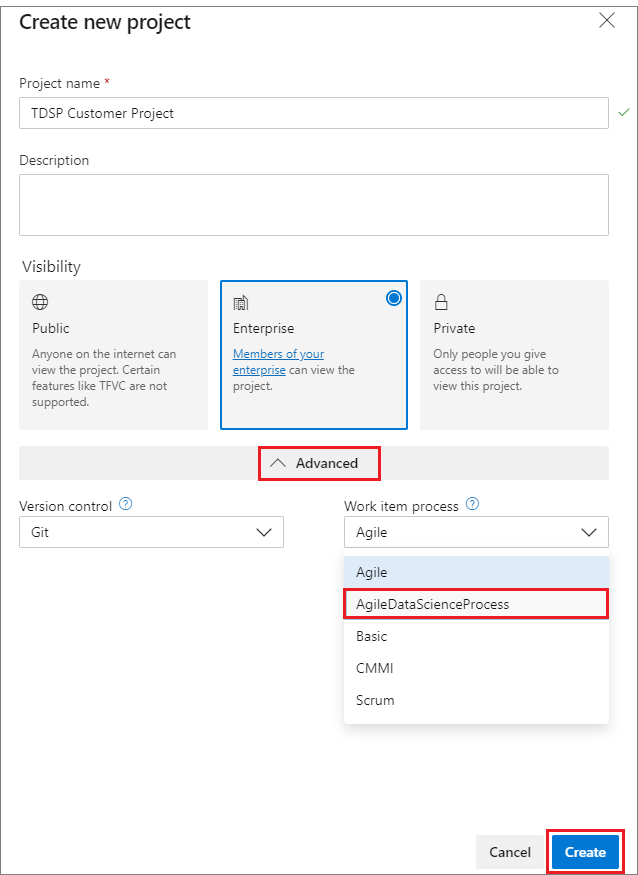
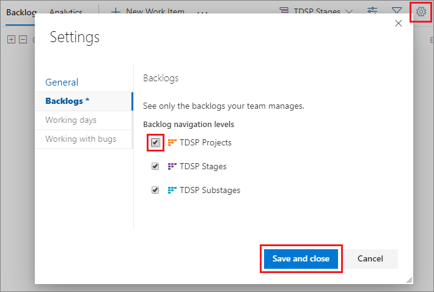
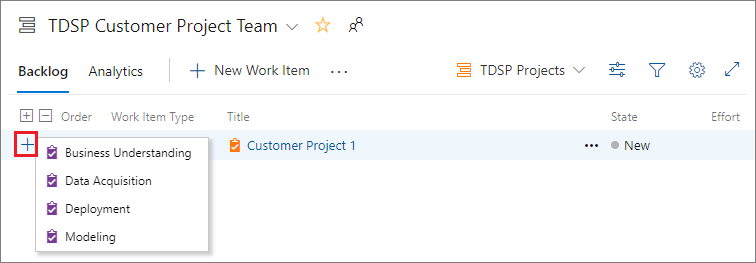
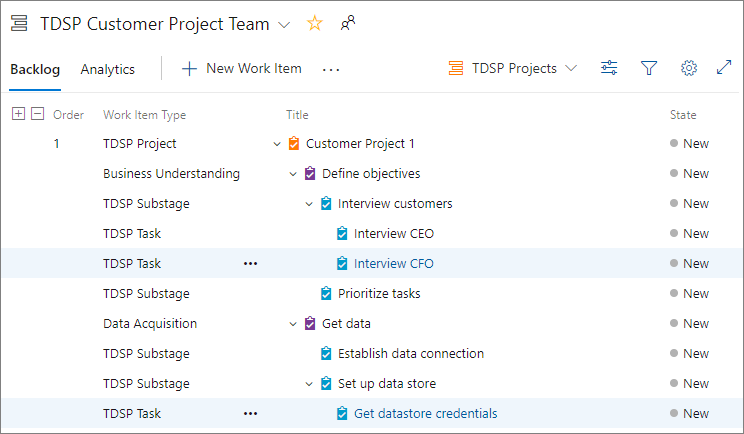

# Agile development of data science projects

This document describes how developers can execute a data science project in a systematic, version controlled, and collaborative way within a project team by using the [Team Data Science Process](overview.md) (TDSP). The TDSP is a framework developed by Microsoft that provides a structured sequence of activities to efficiently execute cloud-based, predictive analytics solutions. For an outline of the roles and tasks that are handled by a data science team standardizing on the TDSP, see [Team Data Science Process roles and tasks](roles-tasks.md). 

This article includes instructions on how to: 

- Do *sprint planning* for work items involved in a project.
- Add *work items* to sprints.
- Create and use an *agile-derived work item template* that specifically aligns with TDSP lifecycle stages.

The following instructions outline the steps needed to set up a TDSP team environment using Azure Boards and Azure Repos in Azure DevOps. The instructions use Azure DevOps because that is how to implement TDSP at Microsoft. If your group uses a different code hosting platform, the team lead tasks generally don't change, but the way to complete the tasks is different. For example, linking a work item with a Git branch might not be the same with GitHub as it is with Azure Repos.

The following figure illustrates a typical sprint planning, coding, and source-control workflow for a data science project:

##  Work item types

In the TDSP sprint planning framework, there are four frequently used *work item* types: *Features*, *User Stories*, *Tasks*, and *Bugs*. The backlog for all work items is at the project level, not the Git repository level. 

Here are the definitions for the work item types:

- **Feature**: A Feature corresponds to a project engagement. Different engagements with a client are different Features, and it's best to consider different phases of a project as different Features. If you choose a schema such as *\<ClientName>-\<EngagementName>* to name your Features, you can easily recognize the context of the project and engagement from the names themselves.
  
- **User Story**: User Stories are work items needed to complete a Feature end-to-end. Examples of User Stories include:
  - Get data 
  - Explore data 
  - Generate features
  - Build models
  - Operationalize models 
  - Retrain models
  
- **Task**: Tasks are assignable work items that need to be done to complete a specific User Story. For example, Tasks in the User Story *Get data* could be:
  - Get SQL Server credentials
  - Upload data to Azure Synapse Analytics
  
- **Bug**: Bugs are issues in existing code or documents that must be fixed to complete a Task. If Bugs are caused by missing work items, they can escalate to be User Stories or Tasks. 

Data scientists may feel more comfortable using an agile template that replaces Features, User Stories, and Tasks with TDSP lifecycle stages and substages. To create an agile-derived template that specifically aligns with the TDSP lifecycle stages, see [Use an agile TDSP work template](#set-up-agile-dsp-6).

> [!NOTE]
> TDSP borrows the concepts of Features, User Stories, Tasks, and Bugs from software code management (SCM). The TDSP concepts might differ slightly from their conventional SCM definitions.

## Plan sprints

Many data scientists are engaged with multiple projects, which can take months to complete and proceed at different paces. Sprint planning is useful for project prioritization, and resource planning and allocation. In Azure Boards, you can easily create, manage, and track work items for your projects, and conduct sprint planning to ensure projects are moving forward as expected.

For more information about sprint planning, see [Scrum sprints](https://en.wikipedia.org/wiki/Scrum_(software_development)#Sprint). 

For more information about sprint planning in Azure Boards, see [Assign backlog items to a sprint](/azure/devops/boards/sprints/assign-work-sprint). 

## Add a Feature to the backlog 

After your project and project code repository are created, you can add a Feature to the backlog to represent the work for your project.

1. From your project page, select **Boards** > **Backlogs** in the left navigation. 
   
1. On the **Backlog** tab, if the work item type in the top bar is **Stories**, drop down and select **Features**. Then select **New Work Item.**
   
   
   
1. Enter a title for the Feature, usually your project name, and then select **Add to top**. 
   
   
   
1. From the **Backlog** list, select and open the new Feature. Fill in the description, assign a team member, and set planning parameters. 
   
   You can also link the Feature to the project's Azure Repos code repository by selecting **Add link** under the **Development** section. 
   
   After you edit the Feature, select **Save & Close**.
   
   

## Add a User Story to the Feature 

Under the Feature, you can add User Stories to describe major steps needed to complete the project. 

To add a new User Story to a Feature:

1. On the **Backlog** tab, select the **+** to the left of the Feature. 
   
   
   
1. Give the User Story a title, and edit details such as assignment, status, description, comments, planning, and priority. 
   
   You can also link the User Story to a branch of the project's Azure Repos code repository by selecting **Add link** under the **Development** section. Select the repository and branch you want to link the work item to, and then select **OK**.
   
   
   
1. When you're finished editing the User Story, select **Save & Close**. 

## Add a Task to a User Story 

Tasks are specific detailed steps that are needed to complete each User Story. After all Tasks of a User Story are completed, the User Story should be completed too. 

To add a Task to a User Story, select the **+** next to the User Story item, and select **Task**. Fill in the title and other information in the Task.

After you create Features, User Stories, and Tasks, you can view them in the **Backlogs** or **Boards** views to track their status.

## Use an agile TDSP work template

Data scientists may feel more comfortable using an agile template that replaces Features, User Stories, and Tasks with TDSP lifecycle stages and substages. In Azure Boards, you can create an agile-derived template that uses  TDSP lifecycle stages to create and track work items. The following steps walk through setting up a data science-specific agile process template and creating data science work items based on the template.

### Set up an Agile Data Science Process template

1. From your Azure DevOps organization main page, select **Organization settings** from the left navigation. 
   
1. In the **Organization Settings** left navigation, under **Boards**, select **Process**. 
   
1. In the **All processes** pane, select the **...** next to **Agile**, and then select **Create inherited process**.
   
    
   
1. In the **Create inherited process from Agile** dialog, enter the name *AgileDataScienceProcess*, and select **Create process**.
   
   
   
1. In **All processes**, select the new **AgileDataScienceProcess**. 
   
1. On the **Work item types** tab, disable **Epic**, **Feature**, **User Story**, and **Task** by selecting the **...** next to each item and then selecting **Disable**. 
   
   
   
1. In **All processes**, select the **Backlog levels** tab. Under **Portfolios backlogs**, select the **...** next to **Epic (disabled)**, and then select **Edit/Rename**. 
   
1. In the **Edit backlog level** dialog box:
   1. Under **Name**, replace **Epic** with *TDSP Projects*. 
   1. Under **Work item types on this backlog level**, select **New work item type**, enter *TDSP Project*, and select **Add**. 
   1. Under **Default work item type**, drop down and select **TDSP Project**. 
   1. Select **Save**.
   
     
   
1. Follow the same steps to rename **Features** to *TDSP Stages*, and add the following new work item types:
   
   - *Business Understanding*
   - *Data Acquisition*
   - *Modeling*
   - *Deployment*
   
1. Under **Requirement backlog**, rename **Stories** to *TDSP Substages*, add the new work item type *TDSP Substage*, and set the default work item type to **TDSP Substage**.
   
1. Under **Iteration backlog**, add a new work item type *TDSP Task*, and set it to be the default work item type. 
   
After you complete the steps, the backlog levels should look like this:
   
   

### Create Agile Data Science Process work items

You can use the data science process template to create TDSP projects and track work items that correspond to TDSP lifecycle stages.

1. From your Azure DevOps organization main page, select **New project**. 
   
1. In the **Create new project** dialog, give your project a name, and then select **Advanced**. 
   
1. Under **Work item process**, drop down and select **AgileDataScienceProcess**, and then select **Create**.
   
   
   
1. In the newly created project, select **Boards** > **Backlogs** in the left navigation.
   
1. To make TDSP Projects visible, select the **Configure team settings** icon. In the **Settings** screen, select the **TDSP Projects** check box, and then select **Save and close**.
   
   
   
1. To create a data science-specific TDSP Project, select **TDSP Projects** in the top bar, and then select **New work item**. 
   
1. In the popup, give the TDSP Project work item a name, and select **Add to top**.
   
   
   
1. To add a work item under the TDSP Project, select the **+** next to the project, and then select the type of work item to create. 
   
   
   
1. Fill in the details in the new work item, and select **Save & Close**.
   
1. Continue to select the **+** symbols next to work items to add new TDSP Stages, Substages, and Tasks. 
   
Here is an example of how the data science project work items should appear in **Backlogs** view:

## Next steps

[Collaborative coding with Git](collaborative-coding-with-git.md) describes how to do collaborative code development for data science projects using Git as the shared code development framework, and how to link these coding activities to the work planned with the agile process.

[Example walkthroughs](walkthroughs.md) lists walkthroughs of specific scenarios, with links and thumbnail descriptions. The linked scenarios illustrate how to combine cloud and on-premises tools and services into workflows or pipelines to create intelligent applications.
  
Additional resources on agile processes:

- [Agile process](/azure/devops/boards/work-items/guidance/agile-process)
  
- [Agile process work item types and workflow](/azure/devops/boards/work-items/guidance/agile-process-workflow)
