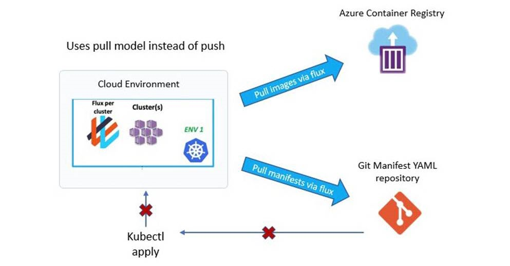
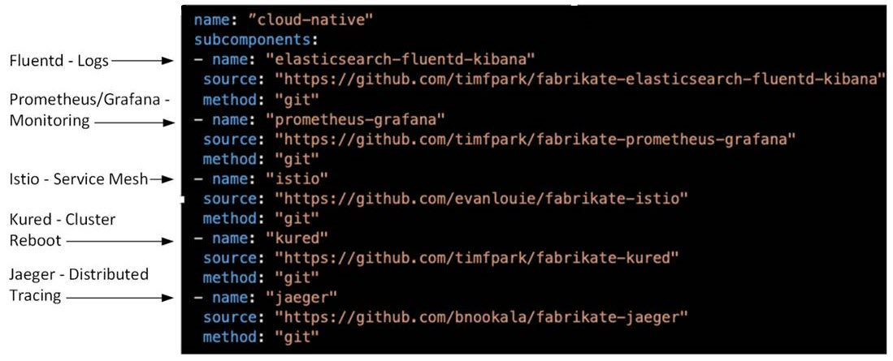
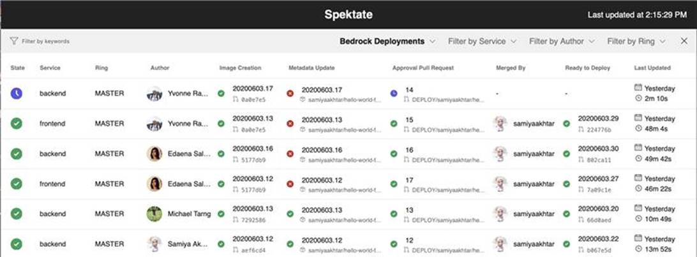
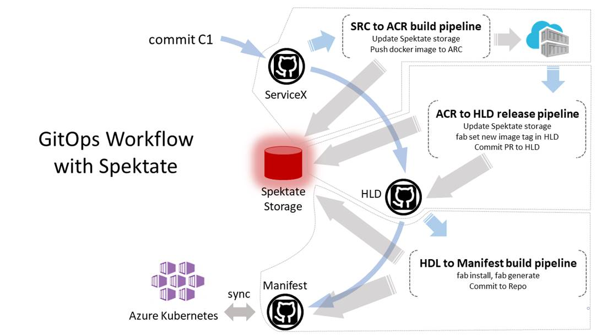
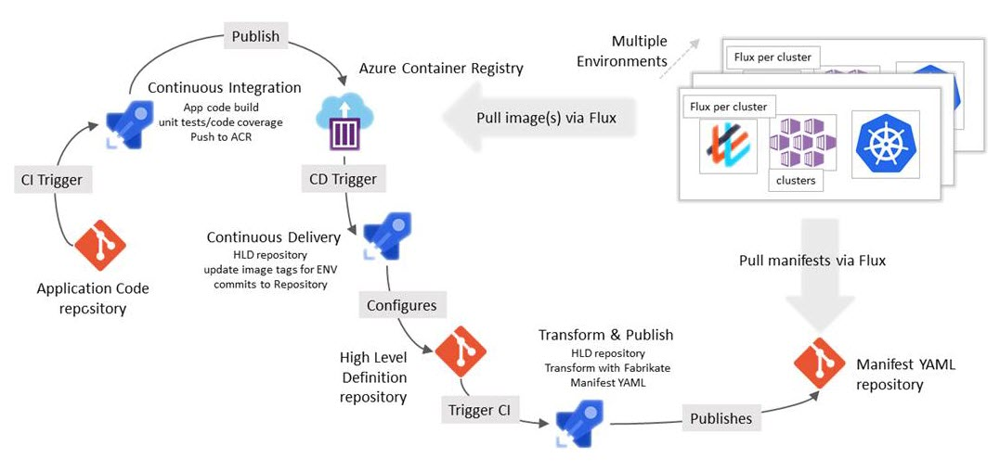
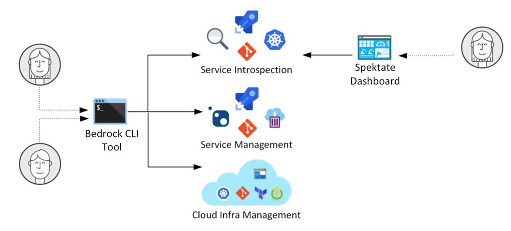
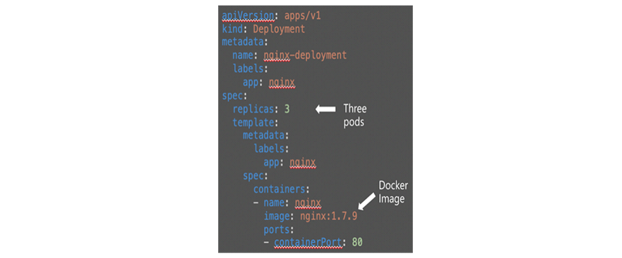
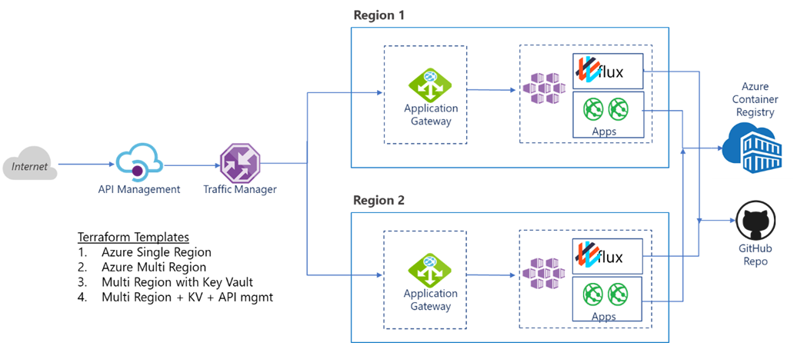

# Automated Kubernetes deployments with Bedrock

Configuring [Kubernetes](#kubernetes) deployments and managing clusters can be a complex and time-consuming process complicated by missteps and lurking errors. [Bedrock](https://github.com/microsoft/bedrock) was born from the collective experience of helping many customers adopt the new architectural patterns for Kubernetes. At the same time, applying DevOps principles and tooling make the development, deployment, and maintenance of these Kubernetes based apps sustainable at a production level.

[GitOps](#gitops) is the name applied to this pattern and Bedrock is the pattern of best practices for implementing apps with GitOps in Azure.

Using Bedrock, organizations can fast track their end-to-end Kubernetes deployments including infrastructure provisioning, GitOps setup, and [Azure Pipelines](https://azure.microsoft.com/services/devops/pipelines/) with observability into the deployment status.

Bedrock has the following objectives for addressing the challenges of configuring Kubernetes deployments and managing clusters:

* Provide a way to deploy infrastructure reliably and efficiently.
* Allow service deployments to be secure and auditable.
* Provide a workflow that is readily adaptable to any organization’s needs.
* Allow developers to avoid hand editing complex YAML files to define infrastructure.
* Provide a comprehensive view of cluster deployment status for developers and Site Reliability Engineers (SREs).
* Provide all of these things in an efficient and repeatable process that works in the real world.

The team identified the following principal requirements for Bedrock to achieve these objectives:

* Leverage full cloud native capabilities.
* Enable the implementing of complex microservices architectures on Kubernetes.
* Provide end to end workflow for deploying a complete Kubernetes solution using best practices.
* Embody practical real-world experiences at scale.
* Validate and improve the solution by implementation with actual customers.

## Use cases

Bedrock helps you with these use cases:

* Define and maintain infrastructure deployments across multiple clusters.
* Deploy and automate a secure end-to-end GitOps workflow.
* Deploy and manage service workloads from source code to their deployment in-cluster.
* Observe ongoing deployments across multiple services, their revisions, and multiple clusters using those services.

## Architecture

1. The Bedrock GitOps workflow is driven by High-Level Definition (HLD) files that are maintained in a Git repository.
2. A Git pull request (PR) initiates the process, and based on a specific HLD script from the repo, the [Azure Pipeline](https://azure.microsoft.com/services/devops/pipelines/) automation processes the HLD script through [Fabrikate](#fabrikate) to generate the required YAML manifest files and stores them in the manifest repo.
3. The deployment is monitored, and deployment status is available through the [Spektate](#spektate) dashboard.

This workflow includes provisions for:

* Fabrikate HLD definitions that allow you to leverage common elements across multiple deployments. With Fabrikate, you can share structure between different clusters by making a configuration change in an HLD script and a pull request.
* Bedrock tools that include [guidance and automation](https://github.com/microsoft/bedrock/blob/master/gitops/README.md) for building GitOps pipelines with [Azure DevOps](https://azure.microsoft.com/services/devops/) or other popular Continuous Integration and Continuous Delivery (CI/CD) orchestrators.
* Bedrock deployment automation that includes setting up the GitOps operator [Flux](#flux) in your cluster, automatically ensuring that the state of a cluster matches the configuration stored in Git.

## Components

Bedrock makes use of the following components.

### Kubernetes

[Kubernetes](https://azure.microsoft.com/topic/what-is-kubernetes/) is an open-source container-orchestration system (maintained by the Cloud Native Computing Foundation) for automating application deployment, scaling, and management. Kubernetes is designed to provide a platform for automating deployment, scaling, and operations of containerized applications across clusters of hosts. Kubernetes is central to Bedrock because it has proven to be an effective foundation for building efficient and scalable applications in the cloud.

You can deploy and manage containerized applications more easily with a fully managed Kubernetes service. [Azure Kubernetes Service (AKS)](https://azure.microsoft.com/services/kubernetes-service) offers serverless Kubernetes, an integrated continuous integration and continuous delivery (CI/CD) experience, and enterprise-grade security and governance.

*Infrastructure as Code (IaC)* is the process of managing and provisioning the technology stack for an application through version-controlled software, rather than using a manual process to configure discrete hardware devices and operating systems.

Kubernetes is designed to work with containerized applications. Containers are readily versioned and managed through development and deployment. By including the infrastructure configuration manifests in this management structure, it becomes easier to deploy to the correct infrastructure and have alternate infrastructure definitions available for different purposes. This process is the essence of how Bedrock implements IaC using [Terraform](#terraform) templates.

### GitOps

[GitOps](https://www.weave.works/technologies/gitops/) is DevOps applied to Kubernetes based systems. The automation and coordination of development, orchestration, monitoring, and maintenance becomes the focus of the Bedrock pattern and process using GitOps. Because Kubernetes is declarative, the entire system can be described declaratively. This means that configuration is guaranteed by a set of facts instead of by a set of instructions and those factual declarations are versioned in Git from which they can be deployed as needed.

The desired state of your system is kept in Git source control. This provides a simple model for auditing deployments and rolling back to a previous state. The Git repository provides auditability for moving between the states of a deployment and the Git commit history provides a full accounting for the application deployment state transitions that are made by the cluster.

Bedrock leverages the following aspects of GitOps:

* GitOps, like Kubernetes, use a declarative model.
* The deployment process is built around a repository (HLD repo) that holds the current expected state of the system.
* Operational changes are made to the running system by making commits on this repository.
* The in-cluster daemon Flux watches this repository, detects divergence, and reconciles the current state of the cluster.
* The prescriptive style of GitOps accommodates IaC for a cloud native environment.
* An easy mental model for deployments: Change the HLD definition of what should be running in Git and then the system snaps to that.
* More secure because the cluster pulls what it should be running from a verified endpoint via Transport Layer Security (TLS) and does not expose external endpoints for configuration changes.

The following image shows how these aspects all interact.

### Terraform

[Terraform](https://github.com/hashicorp/terraform) is an open-source tool for building, changing, and versioning infrastructure safely and efficiently. Terraform enables you to define and provision the infrastructure of a cloud-based application using a high-level configuration language known as [Hashicorp Configuration Language (HCL)](https://github.com/hashicorp/hcl). These configuration files are used to describe the components needed to run simple or complex applications.

Based on the selected configuration files, Terraform generates an execution plan describing what it will do to reach the desired deployment state and then executes the plan to build the described infrastructure. As the configuration changes, Terraform can determine what changed and then create incremental execution plans that can be applied. Thus, it is highly suitable for supporting Kubernetes in a CI/CD process environment.

Like other Bedrock components, Terraform has certain features that fit well into the Bedrock process.

* Declarative infrastructure deployment
* Multi-operator support
* Pre-configured Azure environments that are available in template form for common enterprise scenarios. 

Bedrock provides the following sample templates that developers can use as starting points for their own deployments with AKS and GitOps. These templates can be extended to support multiple clusters.

* [azure-simple](https://github.com/microsoft/bedrock/tree/master/cluster/environments/azure-simple)
* [azure-single-keyvault](https://github.com/microsoft/bedrock/tree/master/cluster/environments/azure-single-keyvault)

### Fabrikate

[Fabrikate](https://github.com/Microsoft/fabrikate) is a central part of GitOps in Bedrock. Fabrikate converts the HLD script files to the YAML configuration files required for Kubernetes deployment.

Most cloud infrastructure tools and environments support reading a manifest document that automates the process of creating and setting up environments that support multiple features. A Kubernetes based system deployment typically uses a manifest created in YAML. Creating these manifests manually can be time-consuming and tedious. So, using a tool to simplify manifest creation will increase productivity and reduce errors.

Fabrikate simplifies the front end of the GitOps workflow by using templating tools like [Helm](#helm) to render a high-level Kubernetes deployment description into YAML resource manifests. Fabrikate runs as part of the CI/CD pipeline such that every commit to your Fabrikate deployment definition triggers the generation of Kubernetes deployment manifests. The in-cluster GitOps pod Flux watches for new commits and reconciles them with the current set of applied resource manifests in the Kubernetes cluster.

The following diagram shows how Fabrikate is integrated into the GitOps workflow.

For example, Fabrikate allows you to write DRY resource definitions (used for dry-run deployments) and configurations for multiple environments while taking advantage of the broad Helm chart ecosystem. These special purpose HLD scripts become shareable components that both simplify and support making deployments more auditable.

The following example shows how some common resources are specified in a sample HLD script.

### Spektate

[Spektate](https://github.com/Microsoft/Spektate) service introspection is an enabler for instrumentation. An introspection service can reveal information about the cloud internals to interested applications. The Spektate service introspection tool provides insight into the deployment status at all times, allowing it to facilitate the reliability, security, and auditability of deployments.

Kubernetes deployments can be complex. Multiple microservices become even more complicated when considering factors like latency, scalability, and reliability to deployments across multiple clusters in multiple regions and zones. This complexity creates a practical problem to determine the current state of any individual cluster or a collection of clusters that collectively carry the workload demands. Bedrock addresses this problem with Spektate by integrating it with the GitOps pipeline and service management that is a key element of the Bedrock process.

Spektate provides views into the current status of any change in the system. These changes can include everything from tracking continuous integration builds to tracking the deployment of the container containing that commit in each of the downstream clusters consuming that container.

The following screenshot shows a view of Bedrock deployments in the Spektate dashboard.

Spektate includes:

* A Bedrock GitOps pipeline that reports back with telemetry data for each of the steps of the system; currently supported in Azure DevOps.
* An [Azure Storage](https://azure.microsoft.com/services/storage/) table that stores all of the telemetry that is reported back.
* Integration with the [Bedrock Command Line Interface (CLI)](https://github.com/microsoft/bedrock-cli) and a web dashboard.

Developers and SREs need to be able to monitor and observe the end-to-end deployment and workflow. Bedrock includes the Spektate dashboard as part of the [Bedrock CLI](#bedrock-cli) to allow an easy to use view of the deployment process and operational clusters. This level of monitoring simplifies deployment management.

For example, developers and SREs need a comprehensive view of deployment status changes as they make their way from application level changes to the cluster, including the GitOps sync status. The Spektate dashboard is designed to provide this valuable overview capability.

The following diagram shows how Spektate and the Bedrock CLI integrate with the GitOps workflow.

Sometimes additional monitoring needs are identified and the Spektate dashboard cannot fulfill those new needs. Bedrock is designed to accommodate additional tools that can be deployed to fulfill those special monitoring needs. For more information, see [Extending Bedrock](#extend-bedrock).

### Flux

[Flux](https://github.com/fluxcd/flux) is a tool that automatically ensures that the state of a cluster matches the configuration defined in Git. Flux uses an operator in the cluster to trigger deployments inside Kubernetes, fulfilling the role of a CD tool. Flux monitors all relevant image repositories, detects new images, triggers deployments, and updates the running configuration based on those changes and a configurable policy.

Flux provides these benefits to Bedrock:

* You do not need to grant your CI automation access to the cluster.
* Every change is atomic and transactional.
* Git provides your audit log.
* Each transaction either fails or succeeds cleanly.
* You are entirely code-centric, fully supporting IaC.

Flux is most useful when used as a deployment tool at the end of a CD pipeline. Flux makes sure that your new container images and config changes are propagated to the cluster, as shown in the following diagram.

### Helm

[Helm](https://helm.sh/) is a Kubernetes package manager that streamlines the installing and managing of Kubernetes deployments. 

Helm uses charts to package pre-configured Kubernetes resources. This allows application deployments to be defined as Helm Charts, which supports reproducible builds of your Kubernetes applications. Helm also allows you to intelligently manage your Kubernetes manifest files and releases of Helm packages. Helm packages (or charts) contain at least two items: a description of the package (`Chart.YAML`) and one or more templates containing Kubernetes manifest files. All charts are stored in Git repositories, as required by GitOps. Charts are fetched as needed to render the correct templates for a deployment by communicating with the Kubernetes API.

### Bedrock CLI

[Bedrock CLI](https://github.com/microsoft/bedrock-cli) is a command-line tool unique to Bedrock that is used to facilitate automation of the cluster infrastructure, service management, and introspection/monitoring using the Spektate dashboard.

Both the system cloud infrastructure and deployed services require management, and this management aspect both lends itself to, and benefits from, automation. Bedrock CLI is a tool created to automate three key areas: infrastructure management, service management, and introspection using Spektate.

## Considerations

The following considerations apply when using Bedrock:

### Extend Bedrock

While the core of Bedrock is a significant productivity improvement for dealing with Kubernetes deployments in a production environment, there will be specific use case requirements that go beyond the core Bedrock capabilities. Bedrock is designed to accommodate these added requirements by supporting the integration of additional tools to the process.

For example, if a particular use case required additional monitoring or metrics collection, then [Prometheus](https://prometheus.io/docs/introduction/overview/) and [Grafana](https://grafana.com/docs/grafana-cloud/grafana/) could be added to the deployment as shown in the following diagram. In this case, Prometheus could be considered a dial-tone for Kubernetes clusters. Also, Prometheus/Grafana can work in-cluster, aggregated by [Azure Monitor](https://azure.microsoft.com/services/monitor/) for multiple clusters.

By integrating such additional tools into the Bedrock automation, Bedrock provides a firm foundation for Kubernetes deployments to meet any specialized use case.

### Cobalt vs Bedrock

[Cobalt](https://github.com/Microsoft/cobalt) hosts reusable Terraform modules to scaffold managed container services like [Azure Container Instances](https://docs.microsoft.com/azure/container-instances/) and [Azure App Service](https://docs.microsoft.com/azure/app-service/) following a DevOps workflow. 

While Bedrock targets Kubernetes based container orchestration workloads and follows a [GitOps](https://medium.com/@timfpark/highly-effective-kubernetes-deployments-with-gitops-c7a0354f1446) workflow, Cobalt templates (manifests) reference Terraform modules like virtual networks, traffic manager, and so on, to define infrastructure deployments. Bedrock uses Terraform to pre-configure environment deployment, but also uses Fabrikate templates to define manifests for deployment automation.

### Pre-configured environment deployment

Creating, configuring, and deploying environments is typically time consuming and presents many opportunities for error and, in some scenarios, requires specialized knowledge. The ability to have pre-configured environments where creation and deployment are automated enables development teams to be more productive and reduces the probability of starting with misconfigured environments that impact project time and cost.

To address these issues, Bedrock uses Terraform to pre-configure environment deployment and Fabrikate templates to define manifests for deployment automation. Also, by maintaining multiple profiles in repos accessible to the deployment workflow, it becomes a simple task to initiate a specific deployment.

### The problem with low-level YAML

Creating Kubernetes manifests in YAML is a great enabler for automation. However, there are a number of challenges such as the fact that the vast majority of a deployment declaration is repeated in boilerplate fashion across all deployments. This duplication is prone to errors and unintended results given the low contextuality of individual entries. These challenges are compounded because real world deployments are complex. So, while there are templating solutions to the problem such as Helm, a typical deployment ends up stitching together dozens of Helm chart outputs that devolve into a complex web of shell scripts.

### Securing the Bedrock GitOps workflow

In a production scenario, it can be tempting to modify a Kubernetes resource directly using the [kubectl](https://kubernetes.io/docs/reference/kubectl/overview/) command-line tool or the web-based UI [Kubernetes dashboard](https://kubernetes.io/docs/tasks/access-application-cluster/web-ui-dashboard/).

Doing this is not advisable! The reason to avoid this practice is that GitOps are centered around a single interface and tooling infrastructure where the repos will always contain the **single source of truth** for a given deployment. Git's version control system is the basis for managing all configuration. Any configuration scenario that circumvents Git in GitOps loses out on the ability to roll back changes, audit logs, and raises the potential for buggy or unsanctioned functionality in the clusters. Moreover, the ability to detect changes and automate actions (such as alerts and updates) is compromised.

> [!NOTE]
> While kubectl can duplicate some of the GitOps automation steps here, doing so will break the automation. Avoid any use of kubectl to directly make changes to the cluster.

### Disaster recovery

Things can and will go wrong at some point. When that happens, it is important that the system does not go down. Bedrock supports many strategies for keeping your application up and running.

In a worst-case scenario where the deployed clusters can no longer function, recovery is accomplished by merely redeploying the clusters. To do this, you simply point to the correct manifest repo after you deploy the new cluster with Flux. Bedrock takes care of the rest.

If the outage is caused by a hardware failure, you just redirect the deployment by specifying a new destination in the HLD script, commit the script, and create a new PR. In some cases, this alternate HLD script might be a standard contingency created as part of an organization’s standard operating procedure and held in the repo until needed.

### Bedrock best practices

The following are some of the best practices and lessons learned when working with Bedrock:

* Use the HLD repo as application configuration as code.
* Use Bedrock Terraform templates as your declarative infrastructure as code.
* Use existing HLD templates as starting points for your HLD scripts.
* All operational changes should be made by Git PR.
* Do not publish changes to the cluster by hand or via command-line tools (such as kubectl) for any reason, as it will break GitOps and the IaC functionality.
* Practice container image promotion.
* Build once and promote to environments via testing gates.
* Promotion is configured in HLD scripts only.
* Bedrock supports an organization with multiple operational roles (Devs, SWEng, and so on) where the different roles can use Bedrock for specific operational tasks. Repo access permissions can also be used to allow access for specific roles through Bedrock.

## Deployment

A typical Bedrock deployment follows three high-level steps:

1. Create and deploy a GitOps enabled Kubernetes cluster.
2. Create a Fabrikate high-level deployment definition.
3. Set up a GitOps pipeline to automate deployments of the Fabrikate definition to the Kubernetes cluster based on typical application and cluster lifecycle events.

A major benefit of Bedrock is that, when compared to a manual deployment process that is inherently slow, Bedrock’s automated deployment process is fast and easily repeatable. This benefit equates to higher productivity and efficiencies when using Bedrock.

Because Kubernetes is a *declarative system*, GitOps leverages that fact in the following ways:

Kubernetes uses manifests (typically written in YAML) to specify a set of resources that should exist and run in the system. Based on these manifests, Kubernetes works to create the specified resources and keep them running. No installations or manual configuration changes are required because, the textual manifest *declares* the desired state. The current state of the cluster is captured completely in the resource manifests as text where it can be programmatically audited against this declarative definition and the textual nature of the declarations allows for easy source control management.

The following image shows a sample Kubernetes manifest written in YAML.

Because Bedrock provides a simple method for defining and automating a deployment, there are many abnormal situations that can be planned for and executed quickly just by selecting the correct preconfigured deployment. This level of preplanning makes Bedrock useful in supporting:

* Test deployments (also known as Canary deployments)
* Rollbacks 
* Blue/Green deployments
* Failovers
* Regional rotations, load sharing, and other unusual scenarios.

The following diagram shows a normal Bedrock deployment:

### Test deployments (Canary deployments)

To do a Canary Deployment of a revised application, you first deploy the revised application to a single pod or cluster to allow testing the application in its deployed state and verify it before allowing further deployments. If the deployment does not pass testing, the cluster can be halted, removing the application from deployment. Or, if a test cluster is chosen that is not publicly exposed, the testing can fail without affecting the operational public application.

### Rollback

If a problem fails discovery in testing and that application version is fully deployed, Bedrock makes it a simple matter to redeploy the previous known working version of the application to replace the buggy version. 

Other rollback scenarios that are made easier by Bedrock include:

* Rolling back a promoted container
* Multi-cluster rollbacks
* Ensuring created cluster resources are removed

Sometimes, changes to your application configuration can yield undesired results. Being able to easily roll back your application code configuration to a previous state is a must have. 

We recommend a few options to accomplish rollbacks:

* Create a new commit to your high-level deployment repo to reverse rollback application changes. This approach is probably the easiest and most straightforward method.
* Use the `Git reset --hard (COMMIT_ID)` command to revert the undesired COMMIT_ID. This command alters the history of your Git repo. So, it might not be the most transparent approach as to what actually may have happened on your cluster.
* Use `Git revert HEAD` to create a new commit with the inverse of the last commit. This command allows you to see that a something was reverted in the Git history.

### Blue/Green deployments

Because Bedrock gives you control over deploying clusters to different IP addresses, you can deploy two versions of your application and examine their individual performance based on on-site metrics and customer feedback to determine which version is better for full deployment. This kind of Blue/Green deployment allows for optimizing application designs as a function of actionable data.

### Failover

By using the ability of Bedrock with Kubernetes to manage complex deployment schemes, you can spread your deployment over multiple regions and apply load balancing to user traffic. Then, if one or more clusters go down for any reason, the remaining clusters can pick up the load. Microservice architectures are also inherently resilient by running a service only when needed and otherwise being shut down.

This scenario is illustrated in the following image where the Region 1 deployment fails, and the Region 2 deployment picks up the workload until the problem in Region 1 is resolved.

## Next steps

* [A First Workload With Bedrock](https://github.com/microsoft/bedrock/tree/master/docs/firstWorkload)

## Resources

* [Bedrock project on GitHub](https://github.com/microsoft/bedrock/tree/master/docs/firstWorkload)
* [Bedrock Walkthrough Demo](https://github.com/microsoft/bedrock/tree/master/docs/firstWorkload)
* [Bedrock CLI](https://github.com/Microsoft/Bedrock-cli)
* [Spektate](https://github.com/Microsoft/Spektate)
* [Fabrikate](https://github.com/Microsoft/Fabrikate)
* [Fabrikate Cloud Native](https://github.com/timfpark/fabrikate-cloud-native)
* [Fabrikate HLD Definitions](https://github.com/microsoft/fabrikate-definitions)
* [Building GitOps Pipelines](https://github.com/microsoft/bedrock/blob/master/gitops/README.md)
* [Guide to GitOps](https://www.weave.works/technologies/gitops/)
* [GitOps - Frequently Asked Questions](https://www.weave.works/technologies/gitops-frequently-asked-questions/)
* [Flux on GitHub](https://github.com/fluxcd/flux)
* [Terraform on GitHub](https://github.com/hashicorp/terraform)
