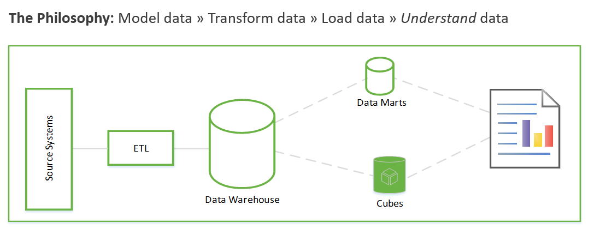
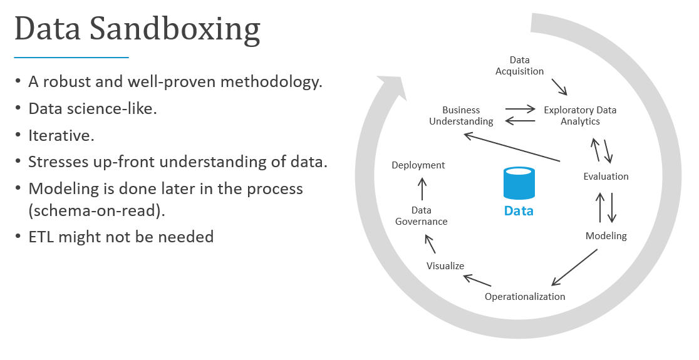
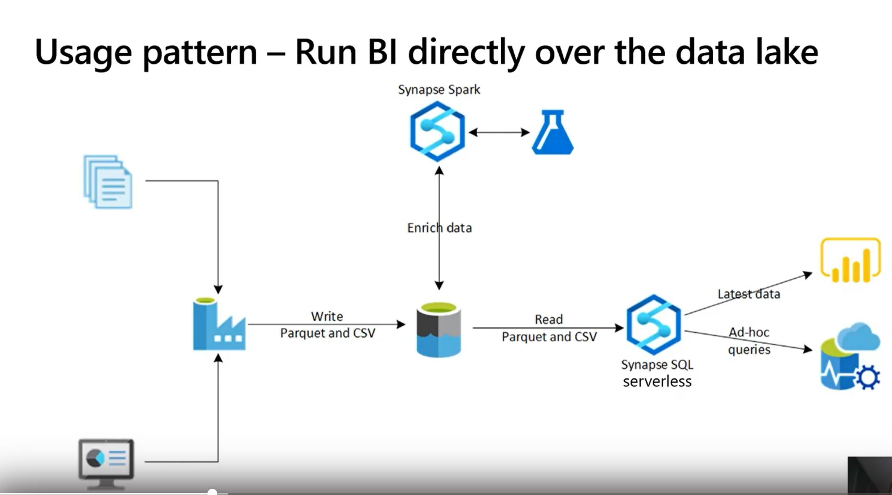

This article describes an alternative aproach to data warehouse projects to reduce the challenges of extract, transform, load (ETL) operations. 

Here's the traditional approach to data warehouse projects:

- Requirements gathering. Document what you'll do with the data.  

- Data modeling. Determine how to model the numeric and attribute data into fact and dimension tables. Traditionally, we do this before we even acquire the new data.

- ETL. Acquire the data and massage it into the data warehouse's data model.  

These steps can take weeks or even months. Only then can we begin to query the data and solve the business problem. The user sees value only after the reports are created. The solution architecture usually looks something like this:  

There is another way we can do this that focuses first on generating business insights, then worries about solving the modeling and ETL tasks.  The process looks something like this and is very data science-like:

The industry calls this EDA, or _Exploratory Data Analytics_.  

Conceptually, here are the steps:

- Data acquisition.  We need to determine what data sources we need to ingest into our data lake/sandbox and then bring that data into the `landing` area of our lake.  In Azure we have tools like Azure Data Factory and Azure Logic Apps that can do data ingestion quickly.  

- Data sandboxing.  Initially, we like to do pair-programming with a business analyst and a technical resource that is skilled in Exploratory Data Analytics using Synapse Serverless or basic SQL.  During this phase, we are trying to uncover the _business insight_ using this new data.  EDA is an iterative process that may require ingesting more data, speaking with SMEs, asking more questions, and generating visualizations.  

- Evaluation Phase.  When we find the _business insight_, we need to evaluate what to do with that data.  Sometimes we will want to persist that data into the data warehouse (so we will move to our "modeling" phase), in other cases we may decide to keep the data in the data lake/lakehouse and use it for predictive analytics (ML algorithms), and in other cases we may decide to backfill our Systems of Record with the new insights.  Based on these decisions we have a better understanding of what we need to do next.  

These methods are the core of true _Self-Service Analytics_.  Using the data lake and a query tool that understands data lake query patterns like Synapse Serverless, we can put our data assets into the hands of business people that understand a modicum of SQL.  We can radically shorten the time-to-value using this method and remove some of the risk associated with corporate data initiatives.  

## Potential use cases

Other scenarios that can benefit from this analytics pattern:

- Prescriptive Analytics.  Companies want to ask questions of their data such as _Next Best Action_ or _what do we do next?_.  We want to use data to be more _data-driven_ and less _gut-driven_.  Often this data is unstructured from many external sources of varying quality.  We want to use this data as fast as possible to evaluate our business strategy without actually loading the data into a data warehouse.  This data might be disposable after we have answered our questions.  

- Self-service ETL.  Our business analysts are actually doing ETL/ELT when they are doing their data sandboxing (EDA) activities.  They are _transforming_ data and making it valuable.  This can improve the scale of our ETL developers.  

## Architecture

Sample architecture for Exploratory Data Analytics:  

For EDA, we are only concerned with the right side of the picture.  We use Synapse SQL Serverless as the compute engine over the data lake files.  EDA is accomplished using:

- T-SQL queries running directly in Synapse SQL Serverless or Synapse Spark.
- Queries executed from a graphical query tool like Power BI or Azure Data Studio.  

We recommend all lakehouse data be persisted using Parquet or Delta.  

The left side of the picture (data ingestion) can be accomplished with any ELT-style tool and has no impact on EDA.  

### Components

- [Azure Synapse Analytics](https://azure.microsoft.com/services/synapse-analytics) is an analytics service that combines data integration, enterprise data warehousing, and big data analytics over "lakehouse" data. In this solution:

  - An [Azure Synapse Workspace](/azure/synapse-analytics/quickstart-create-workspace) promotes collaboration between data engineers, data scientists, data analysts, and business intelligence (BI) professionals for EDA tasks
  - [Azure Synapse serverless SQL pools](/azure/synapse-analytics/get-started-analyze-sql-on-demand) analyze unstructured and semi-structured data in Data Lake Storage using an on-demand billing model using standard T-SQL.  
  - [Azure Synapse serverless Apache Spark pools](/azure/synapse-analytics/get-started-analyze-spark) do code-first explorations in Data Lake Storage with Spark languages like Spark SQL, pySpark, and Scala.

Synapse SQL Serverless pools are available on-demand, do not require scaling up/down/in/out or administration of any kind.  They utilize a pay-per-query model so there is no unused capacity at any time.  Serverless pools are ideal for:
   - Ad-hoc data science explorations in T-SQL format.
   - Early prototyping for data warehouse entities.
   - Defining views that consumers can use, for example in Power BI, for scenarios that can tolerate performance lag.
   - Exploratory Data Analytics

### Alternatives

- [Azure Databricks](https://azure.microsoft.com/en-us/services/databricks/) could replace or complement Synapse SQL Serverless pools. 

- You can use [Synapse Analytics dedicated SQL pools](/azure/synapse-analytics/sql-data-warehouse/sql-data-warehouse-overview-what-is) for storing enterprise data, instead of using a lakehouse model with Synapse SQL Serverless pools. Review the use cases and considerations in this article and related resources to make a decision.

## Considerations

The following considerations apply to this scenario:

### Availability

Synapse SQL Serverless Pools is a PaaS service that can meet your high availability (HA) and disaster recovery (DR) requirements. 

### Operations

Synapse SQL Serverless uses standard T-SQL for querying and operations.  The tool could be Synapse workspace UI, Azure Data Studio or SQL Server Management Studio.  

## Pricing

- [Data Lake Storage](https://azure.microsoft.com/pricing/details/storage/data-lake/) pricing depends on the amount of data you store and how often you use the data. The sample pricing includes 1 TB of data stored, with further transactional assumptions. The 1 TB refers to the size of the data lake, not the original legacy database size.

- [Azure Synapse Spark pool](https://azure.microsoft.com/pricing/details/synapse-analytics/#overview) bases pricing on node size, number of instances, and uptime. The example assumes one small compute node with five hours a week to 40 hours a month utilization.

- [Azure Synapse serverless SQL pool](https://azure.microsoft.com/pricing/details/synapse-analytics/#overview) bases pricing on TBs of data processed. The sample assumes 50 TBs processed a month. This figure refers to the size of the data lake, not the original legacy database size.

## Next steps

- For training content and labs, see the Microsoft Learn [Data Engineer Learning Paths](/learn/roles/data-engineer).
- [Tutorial: Get started with Azure Synapse Analytics](/azure/synapse-analytics/get-started)
- [Create a single database - Azure SQL Database](/azure/azure-sql/database/single-database-create-quickstart)
- [Create a storage account for Azure Data Lake Storage](/azure/storage/blobs/create-data-lake-storage-account)
- [Azure Event Hubs Quickstart - Create an event hub using the Azure portal](/azure/event-hubs/event-hubs-create)
- [Quickstart - Create a Stream Analytics job by using the Azure portal](/azure/stream-analytics/stream-analytics-quick-create-portal)
- [Quickstart: Get started with Azure Machine Learning](/azure/machine-learning/quickstart-create-resources)

## Related resources

- For comprehensive architectural guidance on data pipelines, data warehousing, online analytical processing (OLAP), and big data, see the [Azure Data Architecture Guide](../../data-guide/index.md).
- Learn more about:
  - [Data lakes](../../data-guide/scenarios/data-lake.md)
  - [Data warehousing and analytics](data-warehouse.yml)
  - [Analytics end-to-end with Azure Synapse](../dataplate2e/data-platform-end-to-end.yml)
  - [Big data analytics with enterprise-grade security using Azure Synapse](../../solution-ideas/articles/big-data-analytics-enterprise-grade-security.yml)
  - [Enterprise business intelligence](../../reference-architectures/data/enterprise-bi-synapse.yml)
