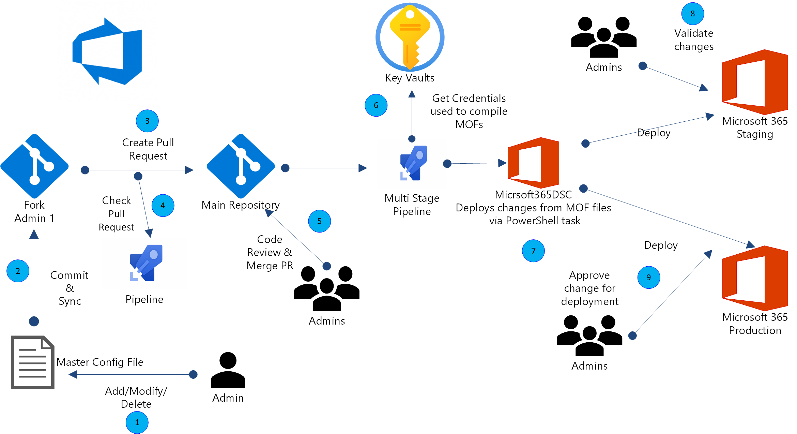

Many companies are adopting DevOps practices and want to apply these practices to their Microsoft 365 tenants. If you don't adopt DevOps for Microsoft 365, you might encounter some common problems:

- Misconfiguration
- Challenges with tracking configuration changes
- No approval process for tenant modifications 

You can use the solution described in this article to automate changes to Microsoft 365 tenant configurations by using [Azure DevOps](/azure/devops/user-guide/what-is-azure-devops) and [Microsoft365DSC](https://microsoft365dsc.com). Microsoft365DSC is a [PowerShell Desired State Configuration (DSC)](https://docs.microsoft.com/en-us/powershell/scripting/dsc/overview/overview) module. You can use it to configure and manage Microsoft 365 tenants in a true DevOps style: configuration as code. You can use the solution to track changes made by service administrators and put an approval process around deployments to Microsoft 365 tenants. The solution helps you prevent untracked changes into Microsoft 365 tenants. It also helps to prevent configuration drift between multiple Microsoft 365 tenants.

## Potential use cases

Managing Microsoft 365 tenant configuration in a controlled and automated way, using DevOps tools and practices, across:

- Development, test, acceptance, and production environments.
- Multiple customer tenants, like in a managed service provider scenario.

## Architecture

*Download an [SVG](./media/Manage-Microsoft365-tenant-configuration-with-Microsoft365DSC-and-Azure-DevOps-content.svg) of this architecture.*

1. Admin 1 adds/updates/deletes entry in user's fork of Microsoft 365 Config file
2. Admin 1 commits and syncs changes to user's forked repository
3. Admin 1 creates pull request back to main repository
4. Build pipeline runs on pull request
5. Admins review code and perform merge on PR
6. Merged PR triggers pipeline to compile MOFs calling Azure Key Vault to retrieve credentials used in MOFs
7. Azure PowerShell task in multi stage pipeline deploys configuration changes via Microsoft365DSC using compiled MOF files
8. Admins validate changes in staging Microsoft 365 tenant
9. Admins get notification from approval process in Azure DevOps for production Microsoft 365 tenant

### Components

The following assets and components were used to build the Microsoft365DSC DevOps solution.

- [Azure Pipeline](https://docs.microsoft.com/azure/devops/pipelines/) allows continuous integration (CI) and continuous delivery (CD) to test and build your code and ship it to any target
- [Microsoft365DSC](https://microsoft365dsc.com) allows organizations to automate the deployment, configuration, and monitoring of Microsoft 365 Tenants via PowerShell Desired State Configuration
- [Azure KeyVault](https://docs.microsoft.com/azure/key-vault/) lets you securely store and tightly control access to tokens, passwords, certificates, API keys, and other secrets
- [Windows Desired State Configuration](https://docs.microsoft.com/powershell/scripting/dsc/overview/overview) is a management platform in PowerShell for development infrastructure with configuration as code

### Alternatives

As a next step, you can use Desired State Configuration in [Azure Automation](https://docs.microsoft.com/en-us/azure/automation/automation-dsc-overview) to store configurations in a central location and add reporting of compliance with the desired state.

We chose to use Azure KeyVault to store Azure App certificates or user credentials used for authentication to Microsoft 365 tenant, since that offers scalability. You can also consider using pipeline variables to reduce the complexity of the solution.

## Considerations

Most people starting out with PowerShell Desired State Configuration experience a steep learning curve. To smoothen this learning curve, make sure you have a solid understanding of PowerShell and have experience with creating scripts.

When talking to Operations teams, they usually consider Azure DevOps "a tool that developers use" and which is not for Operations. However those teams can greatly benefit from using Azure DevOps by storing their scripts in a repository (and adding source control/versioning), automated deployments of those scripts and using boards to track tasks, projects, etc. Invest some time in investigating what Azure DevOps can offer Operations teams.

### Operations

Using "Configuration as Code" isn't a one time deal, it is a shift in the way of working. This means the way Operations teams work is changing fundamentally and all have to be on board. Changes are no longer performed manually, but everything is implemented in scripts and deployed automatically. This requires that all team members have the skills to change to this new way of working.

### Scalability

This solution is suitable when working with multiple environments, multiple workloads and/or multiple teams. The validation process can be configured in such a way approval has to be given by experts from each workload. The solution is also able to be extended to deploy to multiple tenants, both for a Dev, Test, Acceptance, Production use and/or for multiple organizations.

To increase scalability even further, an aggregated configuration data solution like [Datum](https://github.com/gaelcolas/datum/) can be considered. Datum is outside the scope of this scenario.

### Security

Most Microsoft365DSC resources support authentication via username/password, but since Microsoft best practices state that multifactor authentication (MFA) is recommended using this type of authentication is not recommended. Instead using application credentials is the way to go, where supported by the Microsoft 365 resources. For example currently Security and Compliance only supports username/password but SharePoint Online, AzureAD and others support application credentials. Building M365DSC solution upon Azure DevOps you can also take advantage security within [Azure Pipelines](https://docs.microsoft.com/en-us/azure/devops/pipelines/security/overview?view=azure-devops) as well as an [approval process](https://docs.microsoft.com/en-us/azure/devops/pipelines/release/approvals/approvals?view=azure-devops) to safeguard deployment to production tenant.

### DevOps

This solution can run in Azure DevOps server and a similar solution can be created in GitHub using GitHub actions.  

## Next steps

- The whitepaper [Microsoft365Dsc and Azure DevOps](https://microsoft365dsc.com/Pages/Resources/Whitepapers/Managing%20Microsoft%20365%20with%20Microsoft365Dsc%20and%20Azure%20DevOps.pdf) details creating a solution with Azure DevOps and Microsoft365DSC.

## Related resources

- [Microsoft365DSC source code](https://github.com/microsoft/Microsoft365DSC)
- [Microsoft365DSC YouTube channel](https://www.youtube.com/channel/UCveScabVT6pxzqYgGRu17iw)
- [Microsoft365DSC site](https://microsoft365dsc.com/)
- [Microsoft365DSC export generator tool](https://export.microsoft365dsc.com/)

## Pricing

This solution utilizes Azure DevOps and for pricing information please visit [page](https://azure.microsoft.com/pricing/details/devops/azure-devops-services/). If you choose to incorporate Azure Key Vault into solution, you can find its pricing [here](https://azure.microsoft.com/pricing/details/key-vault/).

[calculator]: https://azure.com/e/