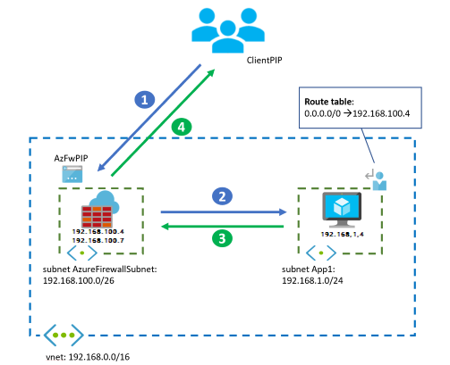
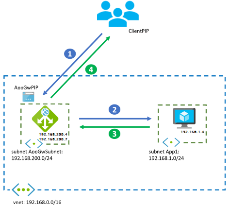
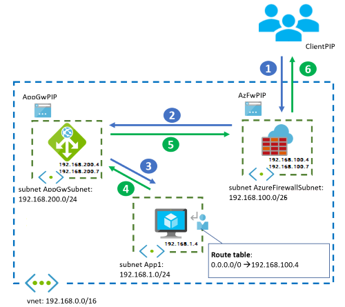
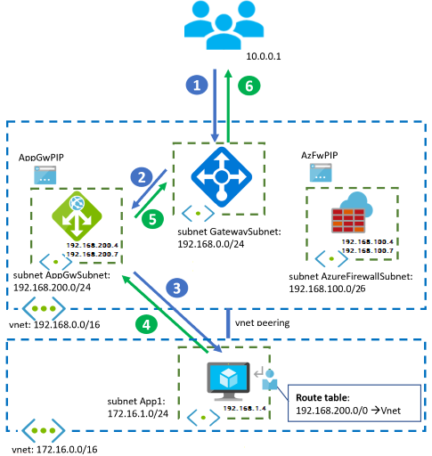

# Azure Virtual Network security

To secure Azure application workloads, you use protective measures like authentication and encryption in the applications themselves. You can also add security layers to the virtual machine (VM) networks that host the applications. This article describes [Azure Virtual Network][azure-virtual-network] security services like Azure Firewall and Azure Application Gateway, when to use each service, and network design options that combine both services.

- [Azure Firewall][azfw-overview] is a managed next-generation firewall that offers [network address translation (NAT)][nat]. Azure Firewall bases packet filtering on internal protocol (IP) addresses and Transmission Control Protocol and User Datagram Protocol (TCP/UDP) ports, or on application-based HTTP(S) or SQL attributes. Azure Firewall also leverages Microsoft threat intelligence to identify malicious IP addresses. For more information, see the [Azure Firewall documentation][azfw-docs].
  
- [Azure Application Gateway][appgw-overview] is a managed web traffic load balancer and HTTP(S) full reverse proxy that can do secure socket layer (SSL) encryption and decryption. Application Gateway also uses Web Application Firewall to inspect web traffic and detect attacks at the HTTP layer. For more information, see the [Application Gateway documentation][appgw-docs].
  
  [Azure Web Application Firewall (WAF)][web-application-firewall] on top of Azure Application Gateway is a security-hardened device with a limited attack surface that operates facing the public internet. For more information, see the [Web Application Firewall documentation][waf-docs].

These Azure services are complementary. One or the other may be best for your workloads, or you can integrate them for optimal protection at both the network and application layers. Use the following decision tree and the examples in this article to determine the best security option for your application's virtual network.

In general, use:

- [Azure Firewall alone](#azure-firewall-only) when there are no web applications in the virtual network.
- [Application Gateway alone](#application-gateway-only) when there are only web applications in the virtual network, and [network security groups (NSGs)][nsgs] provide sufficient output filtering.
- [Azure Firewall and Application Gateway in parallel](#firewall-and-application-gateway-in-parallel), the most common design, when you want Azure Application Gateway to protect HTTP(S) applications from web attacks, and Azure Firewall to protect all other workloads and filter outbound traffic.
- [Application Gateway in front of Azure Firewall](#application-gateway-before-firewall) when you want Azure Firewall to inspect all traffic and WAF to protect web traffic, and the application needs to know the client's source IP address.
- [Azure Firewall in front of Application Gateway](#application-gateway-after-firewall) when you want Azure Firewall to inspect and filter traffic before it reaches the Application Gateway.

Variations of the previous basic designs include [on-premises application clients](#on-premises-clients), [hub and spoke networks](#hub-and-spoke-topology), and [Azure Kubernetes Service (AKS)][aks-overview] implementations. You can add services like an [API Management][apim-overview] gateway, or you can replace the Azure resources with third-party [network virtual appliances](#other-network-virtual-appliances).

## Azure Firewall only

If there are no web-based workloads in the virtual network that can benefit from WAF, you can use Azure Firewall only. The design in this case is simple, but reviewing the packet flow will help understand more complex designs.

The following packet walk example shows how a client accesses a VM-hosted application from the public internet. The diagram includes only one VM for simplicity. For higher availability and scalability, you'd have multiple application instances behind a load balancer.

1. The client initiates the connection to the public IP address of the Azure Firewall:
   - Source IP address: ClientPIP
   - Destination IP address: AzFwPIP
2. The Azure Firewall [Destination NAT (DNAT) rule][azfw-dnat] translates the destination IP address to the application IP address inside the virtual network. The Azure Firewall also *Source NATs (SNATs)* the packet if it performs DNAT. For more information, see [Azure Firewall known issues][azfw-issues]. The VM sees the following IP addresses in the incoming packet:
   - Source IP address: 192.168.100.7 
   - Destination IP address: 192.168.1.4
3. The VM answers the application request, reversing source and destination IP addresses. The inbound flow doesn't require a *user-defined route (UDR)*, because the source IP is Azure Firewall's IP address. Establish a UDR for outbound connections, making sure packets to the public internet go through the Azure Firewall.
   - Source IP address: 192.168.1.4
   - Destination IP address: 192.168.100.7
4. Finally, Azure Firewall undoes the SNAT and DNAT operations, and delivers the response to the client:
   - Source IP address: AzFwPIP
   - Destination IP address: ClientPIP

In this design, Azure Firewall inspects both incoming connections from the public internet, and outbound connections from the application subnet VM by using the UDR.

- The IP address `192.168.100.7` is one of the instances the Azure Firewall service deploys under the covers, here with the front-end IP address `192.168.1.4`. These individual instances are normally invisible to the Azure administrator, but noticing the difference is useful in some cases, such as when troubleshooting network issues.

- If traffic comes from an on-premises virtual private network (VPN) or [Azure ExpressRoute][expressroute] gateway instead of the internet, the client initiates the connection to the VM's IP address, not to the firewall's IP address.

## Application Gateway only

When only web applications exist in the virtual network, and inspecting outbound traffic with NSGs is enough protection, there's no need for Azure Firewall. The main difference from Azure Firewall is that the Application Gateway doesn't act as a routing device with NAT, but behaves as a full reverse application proxy. That is, Application Gateway terminates the web session from the client, and establishes a separate session with one of its backend servers.

The following packet walk example shows how a client accesses the VM-hosted application from the public internet.

1. The client initiates the connection to the public IP address of the Azure Application Gateway:
   - Source IP address: ClientPIP
   - Destination IP address: AppGwPIP
2. The Application Gateway instance that receives the request terminates the connection from the client, and establishes a new connection with one of the back ends. The back end sees the Application Gateway instance as the source IP address. The Application Gateway inserts an *X-Forwarded-For* HTTP header with the original client IP address.
   - Source IP address: 192.168.200.7 (the private IP address of the Application Gateway instance)
   - Destination IP address: 192.168.1.4
   - X-Forwarded-For header: ClientPIP
3. The VM answers the application request, reversing source and destination IP addresses. The VM already knows how to reach the Application Gateway, so doesn't need a UDR.
   - Source IP address: 192.168.1.4
   - Destination IP address: 192.168.200.7
4. Finally, the Application Gateway instance answers the client:
   - Source IP address: AppGwPIP
   - Destination IP address: ClientPIP

Azure Application Gateway adds metadata to the packet HTTP headers, such as the *X-Forwarded-For* header containing the original client's IP address. Some application servers need the source client IP address to serve geolocation-specific content, or for logging. For more information, see [How an application gateway works][appgw-networking].

- The IP address `192.168.200.7` is one of the instances the Azure Application Gateway service deploys under the covers, here with the front-end IP address `192.168.1.4`. These individual instances are normally invisible to the Azure administrator, but noticing the difference is useful in some cases, such as when troubleshooting network issues.

- The flow is similar if the client comes from an on-premises network over a VPN or ExpressRoute gateway, except the client accesses the private IP address of the Application Gateway instead of the public address.

## Firewall and Application Gateway in parallel

Due to its simplicity and flexibility, running Application Gateway and Azure Firewall in parallel is usually the best scenario.

Implement this design if there's a mix of web and non-web workloads in the virtual network. WAF protects inbound traffic to the web workloads, and the Azure Firewall inspects inbound traffic for the other applications.

Also use this design if filtering outbound connections with NSGs is very complex or insufficient. For example, if you want to allow connectivity to a specific Azure Storage Account but not others, you need *fully qualified domain name (FQDN)*-based filters. Hence this design is often used where outbound traffic requires FQDN-based filtering, for example when [limiting egress traffic from an Azure Kubernetes Services cluster][aks-egress].

The following diagram illustrates the traffic flow for inbound connections from an outside client:

The following diagram illustrates the traffic flow for outbound connections from the network VMs to the internet, for example to connect to backend systems or get operating system updates:

The packet flow steps for each service are the same as in the previous standalone design options.

## Application Gateway before Firewall

In this option, all traffic goes through both Azure Firewall and WAF. The WAF provides protection at the web application layer, and Azure Firewall acts as a central logging and control point. The Application Gateway and Azure Firewall aren't sitting in parallel, but one after the other.

This design is appropriate for applications that need to know incoming client source IP addresses, for example to serve geolocation-specific content or for logging. Azure Firewall SNATs the incoming traffic, changing the original source IP address. Application Gateway in front of Azure Firewall captures the incoming packet's source IP address in the *X-forwarded-for* header, so the web server can see the original IP address. For more information, see [How an application gateway works][appgw-networking].

One limitation of this design is that Azure Firewall doesn't add much value for inbound web traffic, since the firewall only inspects already-allowed traffic from WAF to the web application. The need to inspect web traffic also places additional pressure on Azure Firewall.

Network traffic from the public internet follows this flow:

1. The client initiates the connection to the public IP address of the Azure Application Gateway:
   - Source IP address: ClientPIP
   - Destination IP address: AppGwPIP
2. The Application Gateway instance terminates the connection from the client, and establishes a new connection with one of the back ends. The UDR to `192.168.1.0/24` in the Application Gateway subnet forwards the packet to the Azure Firewall, while preserving the destination IP to the web application:
   - Source IP address: 192.168.200.7 (private IP address of the Application Gateway instance)
   - Destination IP address: 192.168.1.4
   - X-Forwarded-For header: ClientPIP
3. Azure Firewall doesn't SNAT the traffic, since it's going to a private IP address, and forwards the traffic to the application VM if rules allow it. For more information, see [Azure Firewall SNAT][azfw-snat].
   - Source IP address: 192.168.200.7 (the private IP address of the Application Gateway instance)
   - Destination IP address: 192.168.1.4
   - X-Forwarded-For header: ClientPIP
4. The VM answers the request, reversing source and destination IP addresses. The UDR to `192.168.200.0/24` captures the packet sent back to the Application Gateway and redirects it to Azure Firewall, while preserving the destination IP toward the Application Gateway.
   - Source IP address: 192.168.1.4
   - Destination IP address: 192.168.200.7
5. Here again the Azure Firewall doesn't SNAT the traffic, since it's going to a private IP address, and forwards the traffic to the Application Gateway.
   - Source IP address: 192.168.1.4
   - Destination IP address: 192.168.200.7
6. Finally, the Application Gateway instance answers the client:
   - Source IP address: AppGwPIP
   - Destination IP address: ClientPIP

Outbound flows from the VMs to the public internet go through Azure Firewall, as defined by the UDR to `0.0.0.0/0`.

## Application Gateway after Firewall

This design lets Azure Firewall filter and discard malicious traffic before it reaches the Application Gateway. Another benefit of this design is that the application gets the same public IP address for both inbound and outbound traffic.

A downside of this design is that the application can't see the original source IP address of the web traffic, because Azure Firewall SNATs the packets as they come in to the virtual network.

Network traffic from the public internet follows this flow:

1. The client initiates the connection to the public IP address of the Azure Firewall:
   - Source IP address: ClientPIP
   - Destination IP address: AzFWPIP
2. The Azure Firewall DNATs the web port, usually TCP 443, to the private IP address of the Application Gateway instance. Azure Firewall also SNATs when doing DNAT. For more information, see [Azure Firewall known issues][azfw-issues]:
   - Source IP address: 192.168.100.7 (the private IP address of the Azure Firewall instance)
   - Destination IP address: 192.168.200.4
3. The Application Gateway establishes a new session between the instance handling the connection and one of the backend servers. Note that the original IP address of the client isn't in the packet:
   - Source IP address: 192.168.200.7 (the private IP address of the Application Gateway instance)
   - Destination IP address: 192.168.1.4
   - X-Forwarded-For header: 192.168.100.7
4. The VM answers the Application Gateway, reversing source and destination IP addresses:
   - Source IP address: 192.168.1.4
   - Destination IP address: 192.168.200.7
5. The Application Gateway replies to the SNAT source IP address of the Azure Firewall instance. Even if the connection is coming from a specific Application Gateway instance like `.7`, Azure Firewall sees the internal IP address of the Application Gateway `.4` as the source IP:
   - Source IP address: 192.168.200.4
   - Destination IP address: 192.168.100.7
6. Finally, Azure Firewall undoes SNAT and DNAT and answers the client:
   - Source IP address: AzFwPIP
   - Destination IP address: ClientPIP

Even if the Application Gateway has no listeners configured for applications, it still needs a public IP address so Microsoft can manage it.

## On-premises clients

The preceding designs all show application clients coming from the public internet. On-premises networks also access applications. Most of the preceding information and traffic flows are the same as for internet clients, but there are some notable differences:

- A VPN gateway or ExpressRoute gateway sits in front of Azure Firewall and/or Application Gateway.
- WAF uses the private IP address of the Application Gateway.
- Azure Firewall doesn't support DNAT for private IP addresses. Therefore, you must use UDRs to send inbound traffic to Azure Firewall from the VPN or ExpressRoute gateways.
- Make sure to verify caveats around *forced tunneling* for the [Azure Application Gateway][appgw-defaultroute] and for the [Azure Firewall][azfw-defaultroute]. Even if your workload doesn't need outbound connectivity to the public internet, you can't inject a default route like `0.0.0.0/0` for the Application Gateway that points to the on-premises network, or you'll break control traffic. For Azure Application Gateway, the default route needs to point to the public internet.

The following diagram shows the Azure Application Gateway and Azure Firewall parallel design, with application clients coming from an on-premises network connected to Azure over VPN or ExpressRoute:

Even if all clients are located on-premises or in Azure, both the Azure Application Gateway and the Azure Firewall need to have public IP addresses, so that Microsoft can manage the services.

## Hub and spoke topology

The designs in this article still apply in a *hub and spoke* topology, where shared resources in a central hub virtual network connect to applications in separate spoke virtual networks via virtual network peerings.

Some considerations for this topology include:

- Usually, Azure Firewall, Application Gateway, and API Management gateway components all go to the hub virtual network.
- Having the Azure Application Gateway in a spoke would be difficult in some designs, because you can't have a default route like `0.0.0.0/0` in the Application Gateway subnet with a next hop to anything other than the internet.
- You can still define backend servers in the Application Gateway, even if they're in a peered virtual network.
- Pay special attention to UDRs in the spoke networks. When the application server receives traffic from a specific Azure Firewall instance, like the `.7` address in the previous examples, it should send return traffic back to the same instance. If a UDR in the spoke sends traffic addressed to the hub to the Azure Firewall IP address, like the `.4` address in the previous examples, return packets might end up on a different Azure Firewall instance, causing asymmetric routing.
- A route table isn't always needed, but you need to verify that the next hop for the Azure Application Gateway subnet and the Azure Firewall subnet is the virtual network.

## Integration with other Azure products

You can integrate Azure Firewall and Azure Application Gateway with other Azure products and services.

### API Management Gateway

Integrate reverse proxy services like [API Management][apim] gateway into the previous designs to provide functionality like API throttling or authentication proxy. Integrating an API Management gateway doesn't greatly alter the designs. The main difference is that instead of the single Application Gateway reverse proxy, there are two reverse proxies chained behind each other.

For more information, see the [Design Guide to integrate API Management and Application Gateway in a virtual network][appgw-apim] and the application pattern [API Gateways for Microservices][app-gws].

### Azure Kubernetes Service

For workloads running on an AKS cluster, you can deploy Azure Application Gateway independently of the cluster, or you can integrate it with the AKS cluster using the [Azure Application Gateway Ingress Controller][agic_overview]. The benefit of this integration is that when configuring certain objects at the Kubernetes levels such as services and ingresses, the Application Gateway automatically adapts without needing additional manual steps.

Azure Firewall plays an important role in AKS cluster security, since it offers the required functionality to filter egress traffic from the AKS cluster based on FQDN and not just IP address. For more information, see [Control egress traffic for AKS cluster nodes][aks-egress].

When using Application Gateway and Azure Firewall together to protect an AKS cluster, it's best to use the parallel design option. The Application Gateway with WAF processes inbound connection requests to web applications in the cluster, and Azure Firewall permits only explicitly allowed outbound connections.

### Azure Front Door

[Azure Front Door][frontdoor] functionality partly overlaps with Azure Application Gateway. For example, both services offer web application firewalling, SSL offloading, and URL-based routing. One main difference is that while Azure Application Gateway is inside a virtual network, Azure Front Door is a global, decentralized service.

In some situations, you can simplify virtual network design by replacing Application Gateway with a decentralized Azure Front Door. Most of the designs described in this document are still valid, except for the option of placing Azure Firewall in front of Azure Front Door.

For more information about the differences between the two services, or when to use each one, see [Frequently Asked Questions for Azure Front Door][afd-vs-appgw].

## Other network virtual appliances

Microsoft products aren't the only choice to implement web application firewall or next-generation firewall functionality in Azure. A wide range of Microsoft partners provide network virtual appliances (NVAs). The concepts and designs are essentially the same as in this article, but there are some important considerations:

- Partner NVAs for next-generation firewalling may offer more control and flexibility for NAT configurations not supported by the Azure Firewall, such as DNAT from on-premises, or DNAT from the internet without SNAT.
- Azure-managed NVAs like Application Gateway and Azure Firewall reduce complexity, compared to NVAs where users need to handle scalability and resiliency across multiple appliances.
- When using NVAs in Azure, use *active-active* and *autoscaling* setups, so these appliances aren't a bottleneck for applications running in the virtual network.

[azfw-overview]: https://docs.microsoft.com/azure/firewall/overview
[azfw-docs]: https://docs.microsoft.com/azure/firewall/
[azfw-dnat]: https://docs.microsoft.com/azure/firewall/tutorial-firewall-dnat
[azfw-snat]: https://docs.microsoft.com/azure/firewall/snat-private-range
[azfw-issues]: https://docs.microsoft.com/azure/firewall/overview#known-issues
[appgw-overview]: https://docs.microsoft.com/azure/application-gateway/overview
[appgw-docs]: https://docs.microsoft.com/azure/application-gateway/
[waf-docs]: https://docs.microsoft.com/azure/web-application-firewall/
[appgw-apim]: https://docs.microsoft.com/azure/api-management/api-management-howto-integrate-internal-vnet-appgateway
[api-gws]: https://docs.microsoft.com/azure/architecture/microservices/design/gateway
[agic_overview]: https://docs.microsoft.com/azure/application-gateway/ingress-controller-overview
[apim-overview]: https://docs.microsoft.com/azure/api-management/api-management-key-concepts
[aks-overview]: https://docs.microsoft.com/azure/aks/intro-kubernetes
[aks-egress]: https://docs.microsoft.com/azure/aks/limit-egress-traffic
[afd-overview]: https://docs.microsoft.com/azure/frontdoor/front-door-overview
[afd-vs-appgw]: https://docs.microsoft.com/azure/frontdoor/front-door-faq#what-is-the-difference-between-azure-front-door-and-azure-application-gateway
[appgw-networking]: https://docs.microsoft.com/azure/application-gateway/how-application-gateway-works
[azure-virtual-network]: https://azure.microsoft.com/services/virtual-network/
[web-application-firewall]: https://azure.microsoft.com/services/web-application-firewall/
[nat]: https://docs.microsoft.com/azure/virtual-network/nat-overview
[expressroute]: https://azure.microsoft.com/services/expressroute/
[apim]: https://azure.microsoft.com/services/api-management/
[app-gws]: https://microservices.io/patterns/apigateway.html
[frontdoor]: https://azure.microsoft.com/services/frontdoor/
[nsgs]: https://docs.microsoft.com/azure/virtual-network/security-overview
[azfw-defaultroute]: https://docs.microsoft.com/azure/firewall/forced-tunneling
[appgw-defaultroute]:https://docs.microsoft.com/azure/application-gateway/configuration-overview#azure-virtual-network-and-dedicated-subnet
