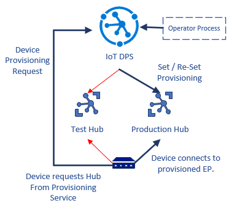

# Attestation, Provisioning, and Authentication

Connecting Devices to Azure IoT involves three primary concepts of
Attestation, Provisioning, and Authentication. A simple analogy for
these would be how the device authenticates, where the device connects,
and how the device identifies itself.

| Mechanism | Description |
--- | ---
| [**Attestation**](https://docs.microsoft.com/azure/iot-dps/concepts-security#attestation-mechanism) |      **How the device authenticates:** Attestation represents the method chosen for a device to confirm its identity when it connects to a service like IoT Hub. In Azure IoT supported attestation mechanism include: [symmetric key, X.509 thumbprint, X.509 CA](https://azure.microsoft.com/blog/iot-device-authentication-options/).|
|[**Provisioning**](https://docs.microsoft.com/azure/iot-dps/about-iot-dps#provisioning-process) |  **Where the device connects:** Provisioning a device is the act of enrolling it into the Azure IoT Hub that it will connect to. This makes the Hub aware of the device along with the attestation mechanism the device uses to prove its identity.|
|[**Authentication**](https://docs.microsoft.com/azure/iot-hub/iot-hub-devguide-security#authentication) |**How the device identifies itself:** IoT Hub grants access to devices based on its ability to prove itself using its unique device identity in combination with the attestation mechanism the device was enrolled to the IoT Hub with. |

## Late Binding to IoT with Device Provisioning Service

Provisioning of devices can happen through the [Azure IoT Device
Provisioning Service](https://docs.microsoft.com/azure/iot-dps/)
or directly with **IoT Hub** (via [IoT Hub Registry Manager
APIs](https://docs.microsoft.com/dotnet/api/microsoft.azure.devices.registrymanager?view=azure-dotnet)).
Using DPS confers the benefit of **late binding**, enabling devices to
be removed from and re-provisioned to IoT Hubs in the field with zero
changes to the device software.

 

**Representative Test to Production Environment Transition Workflow with
DPS**

-   Solution Developer links test and production IoT clouds to
    provisioning service.

-   Device implements Device Provisioning protocol to find Hub should it
    be no longer provisioned. The device is initially provisioned to the
    test environment.

-   Since device is registered with the test environment it connects
    there and testing is carried out.

-   Developer re-provisions device to production environment (through
    solution control plane) and removes it from current test Hub. Hub
    will reject the device the next time it reconnects.

-   Device connects and re-negotiates provisioning flow. Device is now
    directed to the production environment and connects and
    authenticates there.

## Protocols, Devices, and IoT Edge

Given the [supported protocols in Azure IoT
Hub,](https://docs.microsoft.com/azure/iot-hub/iot-hub-devguide-protocols)
it's worth considering the combinations possible when working through a
solution end-to-end. Some combinations may be incompatible or come with
added considerations (indicated by red lines in the following diagram):

 

**Considerations for Protocols, Attestation, and Authentication**

-   Symmetric Keys (SAS tokens) are always registered as symmetric keys
    with IoT Hub.

-   IoT Hub supports x.509 CA authentication. However, provisioning
    devices with x.509 CA through DPS will provision them to Hub as
    x.509 thumbprint.

-   Web socket variants of AMQP and MQTT do not support with x.509 CA
    certificates in IoT Hub.

-   Revoking certificates through DPS does not prevent currently
    provisioned devices from continuing to authenticate with IoT Hub.
    After a certificate is revoked in DPS, the device should be
    individually removed from the Hub (either manually through dashboard
    or programmatically using [Registry Manager
    APIs](https://docs.microsoft.com/en-us/rest/api/iothub/service/registrymanager)).
