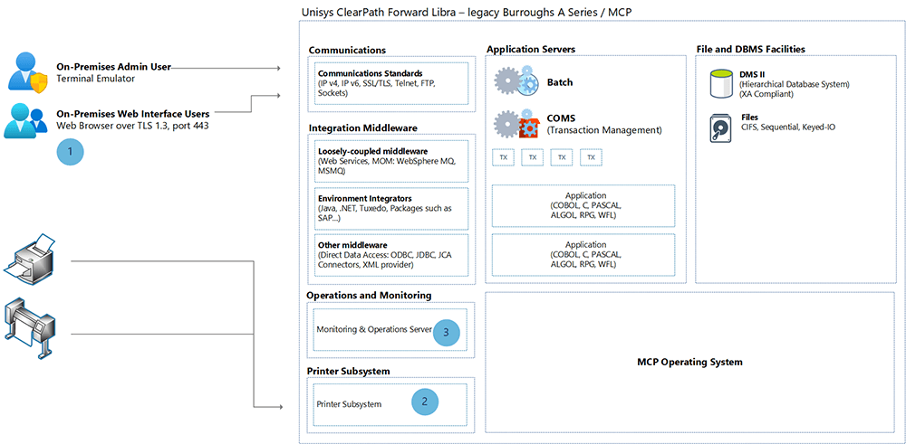
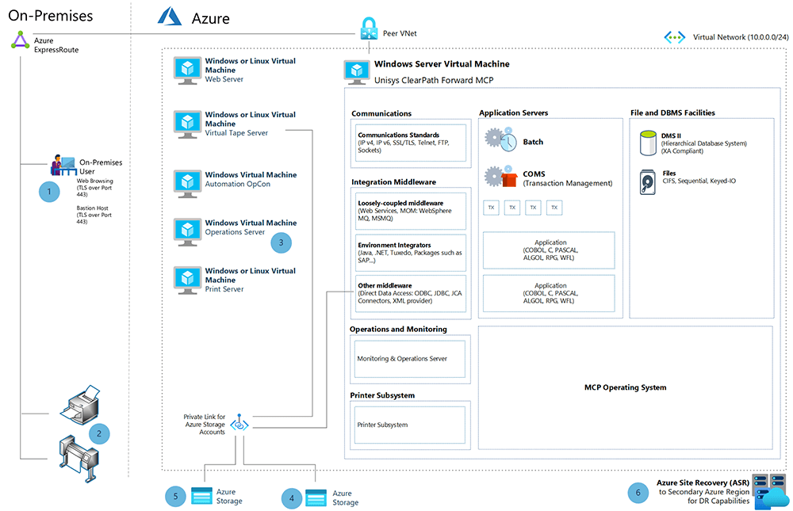

<!-- cSpell:ignore Unisys ClearPath postmigration HDDs Tmax tmaxsoft openframe replatforming replatformed -->

The Unisys mainframe systems trace their heritage to the first commercially available mainframes. The Unisys ClearPath Forward (CPF) Dorado (1100/2200) and Libra (Master Control Program) systems are full-featured mainframe operating environments. They can scale vertically to handle mission-critical workloads. These systems can be emulated, converted, or modernized into Azure. Azure offers similar or even improved performance characteristics and service-level agreement (SLA) metrics.

This article shows how to use virtualization technologies from Microsoft partner Unisys with a legacy Unisys CPF Libra mainframe. This approach allows an accelerated move into Azure. It eliminates the need to rewrite the application code or redesign the database architecture. Legacy code is maintained in its original form — eliminating the need to recompile application code. The application screens, user interactions, and data structures behind the scenes are unchanged, which eliminates the need to retrain your users.

Unisys replatforming lifts the entire Libra system from today's proprietary hardware to Azure as a virtual machine (VM). The Master Control Program (MCP) OS and all processors, libraries, and data appear just as they did on the proprietary environment. The OS requires a license from Unisys. The architecture includes support VMs, which handle functions such as virtual tapes operations, automation and workload management (OpCon), web services, and other support functions.

The benefit of this approach is a rapid move to Azure compared to other methodologies. Because hardware maintenance and facility costs are dropped, there's a quick return on investment (ROI). Because the MCP environment is unchanged, there's no cost associated with retraining users and programmers.

Depending upon the client's end goal, the transitioned Azure MCP could be the end state or a first step toward modernizing applications within the MCP environment or within Azure. This approach to landing in Azure permits a measured, planned path to updating applications. It retains the investment made in existing application code. After conversion, other Unisys Cloud Forte and Azure data analytic services can be employed as well.

## Potential use cases

- Move existing Unisys ClearPath Forward Libra workloads to Azure rapidly, with low risk.
- Use [Azure Arc](https://azure.microsoft.com/services/azure-arc/) so Azure can become the disaster recovery (DR) plan for an existing on-premises workload.
- Add Azure data services to existing client capabilities.

## Architecture

**Example source (premigration) architecture.** The architecture below illustrates a typical, on-premises Unisys ClearPath Forward Libra (MCP) mainframe.

*Download an [SVG of this premigration diagram](./media/unisys-clearpath-forward-mainframe-rehost-diagram-premigration.svg).*

**Example Azure (postmigration) architecture.** The architecture below illustrates an example utilizing virtualization technologies from Microsoft partner Unisys with respect to the legacy Unisys CPF Libra mainframe.

*Download an [SVG of this postmigration diagram](./media/unisys-clearpath-forward-mainframe-rehost-diagram-postmigration.svg).*

### Workflow

The legend matches both diagrams to highlight the similarities between the original and migrated state of the system.

1. Legacy Burroughs terminal emulation for demand and online users is replaced by a web browser to access system resources in Azure. User access provided over TLS port 443 for accessing web-based applications. Web-based applications presentation layer can be kept virtually unchanged to minimize customer retraining. On the other hand, the web-application presentation layer can be updated with modern UX frameworks if desired. Further, for admin access to the VMs, [Azure Bastion hosts](https://azure.microsoft.com/services/azure-bastion/) can be used to maximize security by minimizing open ports.
1. Printers and other legacy system output devices are supported as long as they're IP attached to the Azure network. Print functions on MCP are retained so that no application changes are needed.
1. `Operations` is moved out of the MCP to an external VM. More automation can be achieved by use of an OpCon VM in the ecosystem to monitor and control the entire environment.
1. If physical tapes are in use, they're converted to virtual tape. Tape formatting and read/write functionality are retained. The tapes are written to Azure or offline storage. Tape functionality is maintained, eliminating the need to rewrite source code. Benefits include [Azure Blob Storage](https://azure.microsoft.com/services/storage/blobs/) accounts for backup of virtual tape files and faster access times, as IO operations are conducted directly against disk media.
1. The MCP storage construct can be mapped onto Azure storage, maintaining the MCP drive mapping nomenclature. No application or operations changes are needed.
1. [Azure Site Recovery](https://azure.microsoft.com/services/site-recovery/) provides disaster recovery capabilities by mirroring the Azure VMs to a secondary Azure region for quick failover in the rare case of an Azure datacenter failure.

### Components

- [Azure Virtual Machines](/azure/well-architected/service-guides/virtual-machines) is one of several types of on-demand, scalable computing resources that Azure offers. An Azure virtual machine gives you the flexibility of virtualization without having to buy and maintain the physical hardware that runs it.
- [Azure Virtual Network](/azure/well-architected/service-guides/virtual-network) is the fundamental building block for your private network in Azure. Virtual Network enables many types of Azure resources, such as Azure Virtual Machines, to securely communicate with each other, the internet, and on-premises networks. Virtual Network is similar to a traditional network that you'd operate in your own datacenter, but with the added benefits of Azure's infrastructure, such as scale, availability, and isolation.
- [Azure Virtual Network interface cards](/azure/virtual-network/virtual-networks-overview) enable an Azure VM to communicate with internet, Azure, and on-premises resources. As shown in this architecture, you can add more network interface cards to the same Azure VM, which allows the Solaris child-VMs to have their own dedicated network interface device and IP address.
- [Azure SSD managed disks](/azure/virtual-machines/managed-disks-overview) are block-level storage volumes managed by Azure and used with Azure Virtual Machines. The available types of disks are ultra disks, premium solid-state drives (SSDs), standard SSDs, and standard hard disk drives (HDDs). For this architecture, we recommend either premium SSDs or ultra disk SSDs.
- [Azure Files](/azure/well-architected/service-guides/azure-files) offers fully managed file shares in the cloud that are accessible by using the industry-standard Server Message Block (SMB) protocol. Azure file shares can be mounted concurrently by cloud or on-premises deployments of Windows, Linux, and macOS.
- [Azure ExpressRoute](/azure/well-architected/service-guides/azure-expressroute) lets you extend your on-premises networks into the Microsoft cloud over a private connection facilitated by a connectivity provider. With ExpressRoute, you can establish connections to Microsoft cloud services, such as Microsoft Azure and Office 365.

## Considerations

These considerations implement the pillars of the Azure Well-Architected Framework, which is a set of guiding tenets that can be used to improve the quality of a workload. For more information, see [Microsoft Azure Well-Architected Framework](/azure/well-architected/).

### Reliability

Reliability ensures your application can meet the commitments you make to your customers. For more information, see [Design review checklist for Reliability](/azure/well-architected/reliability/checklist).

Unisys CPF in Azure uses Site Recovery to ensure system availability and consistency.  ASR estabishes a baseline to be used for backup systems or for disaster recovery (DR) purposes.

### Security

Security provides assurances against deliberate attacks and the abuse of your valuable data and systems. For more information, see [Design review checklist for Security](/azure/well-architected/security/checklist).

Unisys CPF is inherently a very secure system on its own.  THe added value of Azure security with encryption in motion as we as with data at rest provides a secure enterprise solution.

### Cost Optimization

Cost Optimization is about looking at ways to reduce unnecessary expenses and improve operational efficiencies. For more information, see [Design review checklist for Cost Optimization](/azure/well-architected/cost-optimization/checklist).

Unisys CPF in Azure eliminates hardware maintenance and facility costs upfront. Further savings derive from not having to retrain staff how to operate or use the system. The virtualized computer runs just as it did on the datacenter floor.

You can also optimize your costs by following the process to right-size the capacity of your VMs, from the beginning, along with simplified resizing, as needed. For more information, see the Azure Well-Architected Framework's [Principles of Cost Optimization](/azure/architecture/framework/cost/overview).

To estimate the cost of Azure products and configurations, visit the [Azure pricing calculator](https://azure.microsoft.com/pricing/calculator/).  VMs will be used for the MCP along with any support VMs for print or tape.  Storage would range from Premium SSD to Blob storage dependant upon perfomance needs and data retention policies.  

To learn more about Unisys CPF offerings and pricing, visit the [Unisys ClearPath Forward Products webpage](https://stealthsecurity.unisys.com/solutions/clearpath-forward/).

### Operational Excellence

Operational Excellence covers the operations processes that deploy an application and keep it running in production. For more information, see [Design review checklist for Operational Excellence](/azure/well-architected/operational-excellence/checklist).

Unisys demonstrates operational excellence by presenting a known environment to the staff, while including new capabilities like Azure Site Recovery to provide disaster recovery failover.

You can optimize your operational efficiency by deploying your solution with Azure Resource Manager templates, and by using Azure Monitor to measure and improve your performance. See the Azure Well-Architected Framework's [Operational Excellence principles](/azure/architecture/framework/devops/principles) and [Monitoring for DevOps](/azure/architecture/framework/devops/checklist).

### Performance Efficiency

Performance Efficiency is the ability of your workload to scale to meet the demands placed on it by users in an efficient manner. For more information, see [Design review checklist for Performance Efficiency](/azure/well-architected/performance-efficiency/checklist).

Unisys matches operational performance in Azure with Bronze, Silver, Gold, Platinum, and Titanium offerings to match client workload to operational needs.

## Contributors

*This article is maintained by Microsoft. It was originally written by the following contributors.* 

Principal author:

 - [Philip Brooks](https://www.linkedin.com/in/philipbbrooks/) | Senior TPM

*To see non-public LinkedIn profiles, sign in to LinkedIn.*

## Next steps

For more information, please contact **legacy2azure@microsoft.com**, or check out the following resources:

- [Azure Mainframe and midrange migration](https://azure.microsoft.com/migration/mainframe)
- [Mainframe rehosting on Azure virtual machines](/azure/virtual-machines/workloads/mainframe-rehosting/overview)
- [Unisys Cloud Migration Services](https://www.unisys.com/solutions/cloud-management/)
- [Unisys Documentation Libraries](https://public.support.unisys.com/common/epa/documentationlibraries.aspx)
- [Azure Virtual Network documentation](/azure/virtual-network)
- [Manage Azure Virtual Network interface cards](/azure/virtual-network/virtual-network-network-interface)
- [Introduction to Azure managed disks](/azure/virtual-machines/managed-disks-overview)
- [What is Azure Files?](/azure/storage/files/storage-files-introduction)
- [Azure ExpressRoute documentation](/azure/expressroute/expressroute-introduction)

## Related resources

- [Unisys ClearPath Forward OS 2200 enterprise server virtualization on Azure](../../mainframe/virtualization-of-unisys-clearpath-forward-os-2200-enterprise-server-on-azure.yml)
- [SMA OpCon in Azure](../../solution-ideas/articles/sma-opcon-azure.yml)
- [Mainframe file replication and sync on Azure](../../solution-ideas/articles/mainframe-azure-file-replication.yml)
- [Azure Database Migration Guides](https://datamigration.microsoft.com)
- [Unisys mainframe migration to Azure using Avanade AMT](../../reference-architectures/migration/unisys-mainframe-migration.yml)
- [Micro Focus Enterprise Server on Azure VMs](./micro-focus-server.yml)
- [Modernize mainframe & midrange data](/azure/architecture/example-scenario/mainframe/modernize-mainframe-data-to-azure)
- [Migrate IBM mainframe applications to Azure with TmaxSoft OpenFrame](../../solution-ideas/articles/migrate-mainframe-apps-with-tmaxsoft-openframe.yml)

