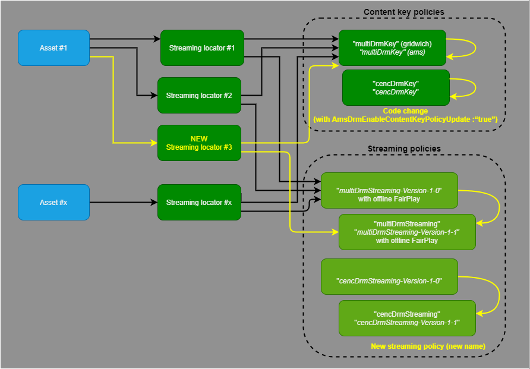

# Content protection and DRM

This article explains the concepts Gridwich uses for audio and video content protection when it publishes a container or asset with Azure Media Services. Media Services uses [Digital Rights Management (DRM)](https://en.wikipedia.org/wiki/Digital_rights_management) to protect content, and supports [Microsoft PlayReady](https://www.microsoft.com/playready/overview/), [Google Widevine](https://www.widevine.com/solutions/widevine-drm) and [Apple FairPlay](https://developer.apple.com/streaming/fps/).

## Assets, streaming locators, and policies

When Gridwich first publishes an asset, it creates a streaming locator by calling the Azure Media Services v3 API. This streaming locator references two Azure Media Services policies:

- The streaming policy describes which protocols are enabled for a secured adaptive streaming output.
  
- The content key policy describes how to deliver the key or DRM license to a player. In the case of DRM, the policy describes the DRM license properties, like duration, offline mode, minimum device security level, digital output protection, and so on. Gridwich configures the DRM secrets and settings, and uses them when creating and updating the content key policy.

The following diagram shows the Azure Media Services policies and their relationship to Gridwich assets and streaming locators.


Gridwich creates the two policies in the Media Services account at first publication, and reuses them for the next publications.

The Gridwich publication message must specify the streaming policy and content key policy. The following example shows a publication messages:

```json
{
    "id": "string",
    "topic": "string",
    "subject": "string",
    "data": {
        "containerUri": "https://azurestorageaccount.blob.core.windows.net/fd7b4d3a-8f20-4744-b7a0-c26252580677",
        "generateAudioFilters": true,
        "operationContext": {}

        "streamingPolicyName": "clearStreamingOnly",
        "contentKeyPolicyName": null,
    },
    "eventType": "request.mediaservices.locator.create",
    "dataVersion": "1.0"
}
```

To enable Microsoft PlayReady and Google Widevine on MPEG-DASH output, use `cencDrmStreaming` and `cencDrmKey`:

```json
        "streamingPolicyName": "cencDrmStreaming",
        "contentKeyPolicyName": "cencDrmKey",
```
To enable Microsoft PlayReady and Google Widevine on MPEG-DASH output, and Apple FairPlay on HLS (TS and CMAF), use `multiDrmStreaming` and `multiDrmKey`:

```json
        "streamingPolicyName": "multiDrmStreaming",
        "contentKeyPolicyName": "multiDrmKey",
```

## Update policies

To change the DRM license properties or authorized protocols for content protection, update the content key policy or the streaming policy. The mechanisms to update these policies depend on the type of policy.



- The Media Services *streaming policy* can't be updated. So, Gridwich uses an internal Media Services name to version the policy, and an external Gridwich name that doesn't change. Old locators will still use the old streaming policy, while new locators will use the updated streaming policy.

- The Media Services *content key policy* can be updated, so Gridwich uses the same name in Media Services and in the Gridwich message. Updating the content key policy impacts all locators, both old ones and new ones.
  
  Gridwich could also be extended to have two or more content key policies with different names side-by-side. The other policies might be used for completely different asset classes with differing rights.

### Streaming policy update

The streaming policy uses an internal Media Services name to version the policy, and an external request name that doesn't change over time. For example, the `multiDRMStreaming` policy in the request has a matching name like `multiDRMStreaming-Version-1-0` in Media Services. When the [MediaServicesV3CustomStreamingPolicyMultiDrmStreaming](../src/Gridwich.SagaParticipants.Publication.MediaServicesV3/src/StreamingPolicies/MediaServicesV3CustomStreamingPolicyMultiDrmStreaming.cs) streaming policy code is changed, update the name in the file to increment the version number.

```csharp
private readonly string nameInAmsAccount = CustomStreamingPolicies.MultiDrmStreaming + "-Version-1-0";
```

### Content key policy update

The content key policy can be updated in Media Services, so use the same name name in Media Services and in the request message. The update process is sensitive because it impacts all locators, so the policy is updated only if the app settings `AmsDrmEnableContentKeyPolicyUpdate` is set to `true`. This settings allows the user to decide when to force the update after a code change. The update process should be forced to occur after the Azure Function instance is restarted and when the next publication process is run.

The `cencDRMKey` policy code is in [MediaServicesV3CustomContentKeyPolicyCencDrmKey](../src/Gridwich.SagaParticipants.Publication.MediaServicesV3/src/ContentKeyPolicies/MediaServicesV3CustomContentKeyPolicyCencDrmKey.cs).

The `multiDRMKey` policy code is in [MediaServicesV3CustomContentKeyPolicyMultiDrmKey](../src/Gridwich.SagaParticipants.Publication.MediaServicesV3/src/ContentKeyPolicies/MediaServicesV3CustomContentKeyPolicyMultiDrmKey.cs).

The `cencDRMKey` contains options 1 through 6, and the `multiDRMKey` contains options 1 through 9:

1. Microsoft PlayReady / non persistent license
1. Microsoft PlayReady / 2 hours persistent license
1. Microsoft PlayReady / 14 days persistent license
1. Google Widevine / non persistent license
1. Google Widevine / 2 hours persistent license
1. Google Widevine / 14 days persistent license
1. Apple FairPlay / non persistent license
1. Apple FairPlay / 2 hours persistent license
1. Apple FairPlay / 14 days persistent license

A secured token service (STS), not provided in this solution, should deliver tokens with correct and expected claims. The `persistent` claim specifies the option Media Services should use when generating the license. The issuer `iss`, and audience `aud` claims should match the definition in [ContentKeyPolicyClaims](../src/Gridwich.SagaParticipants.Publication.MediaServicesV3/src/Constants/ContentKeyPolicyClaims.cs).

For example, the JSON token the player provides to Media Services should look similar to one of the following examples. These token examples are case-sensitive.

```json
{
  "urn:microsoft:azure:mediaservices:contentkeyidentifier": "insert the content key id here",
  "persistent": "none",
  "nbf": 1586946219,
  "exp": 1586947419,
  "iss": "gridwich",
  "aud": "urn:drm"
}
```

```json
{
  "urn:microsoft:azure:mediaservices:contentkeyidentifier": "insert the content key id here",
  "persistent": "14Days",
  "nbf": 1586946219,
  "exp": 1586947419,
  "iss": "gridwich",
  "aud": "urn:drm"
}
```


```json
{
  "urn:microsoft:azure:mediaservices:contentkeyidentifier": "insert the content key id here",
  "persistent": "2Hours",
  "nbf": 1586946219,
  "exp": 1586947419,
  "iss": "gridwich",
  "aud": "urn:drm"
}
```

## Related resources
- For more information about Media Services content protection, see [Content protection overview](/azure/media-services/latest/content-protection-overview).
- For more information about DRM settings, see [Getting started with DRM Settings](./GettingStarted_DRM_Settings.md).

