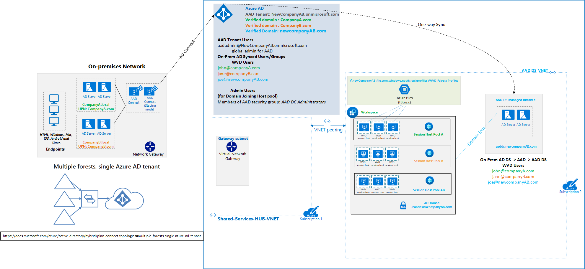

# Solution idea: WVD using AAD DS

Deploy WVD rapidly in Minimum Viable Product (MVP) or Proof of Concept (PoC) environment with the use of Azure Active Directory Domain Services (AAD DS). Extend  on-premises multi forest AD DS identities to Azure without private connectivity and support for [Legacy Authentication](https://docs.microsoft.com/azure/active-directory-domain-services/concepts-resource-forest).

Also applicable to scenarios of mergers and acquisitions, organization re-branding and multiple on-premises identities requirements.

[!INCLUDE [header_file](../../../includes/sol-idea-header.md)]

## Architecture

*Download the <a href="images/WVD-two-forest-to-Azure-AADDS-No-Private-Connectivity.vsdx" download> Visio</a> diagram of this architecture.*

## Data Flow

In the example scenario, the identity flow works as follows.

1. Complex hybrid on-premises Active Directory Environments with two or more AD forests. Domains live in separate forests. For example, *companyA.local* with UPN suffix *companyA.com*, *companyB.local* with UPN suffix *CompanyB.com* and additional UPN suffix *newcompanyAB*.
1. There are no IaaS domain controllers in Azure, instead the two domain controllers provided by [AAD DS](https://docs.microsoft.com/azure/active-directory-domain-services/overview) are used.
1. Azure AD Connect syncs users from both CompanyA.com and CompanyB.com to Azure AD tenant (NewCompanyAB.onmicrosoft.com). The user account is represented only once in AAD and there's no private connectivity used.
1. Users then sync from AAD to the managed AAD DS (one-way sync).
1. A custom and routable AAD DS domain name is created (aadds.newcompanyAB.com). The newcompanyAB.com is a registered domain to support LDAP certificates. It is generally recommended not to use non-routable domain names (as contoso.local) as it can cause issues with DNS resolution. 
1. The WVD Session hosts join the AAD DS domain controllers.
1. Host pools and App groups can be created in a separate subscriptions and spoke vNet.
1. Users are assigned to the App groups.
1. Users sign in via [WVD Desktop](https://docs.microsoft.com/azure/virtual-desktop/connect-windows-7-10#install-the-windows-desktop-client) or [Web client](https://docs.microsoft.com/azure/virtual-desktop/connect-web) with either format, for example john@companyA.com, jane@companyB.com or joe@newcompanyAB.com depending on the UPN Suffix configured.
1. Users are presented with their respective virtual desktops or Apps. For example, joe@companyA.com will be presented with virtual desktops or apps in host pool A, jane@companyB will be presented with virtual desktops or apps in host pool B and joe@newcompanyAB will be presented with virtual desktops or apps in host pool AB.
1. The storage account (Azure files used for FSLogix) is joined to the managed domain AD DS. The FSLogix user profiles are created in Azure file shares.

> [!NOTE]
  > 1. For Group Policy requirements in AAD DS you can [install Group Policy Management tools](https://docs.microsoft.com/azure/active-directory-domain-services/manage-group-policy#before-you-begin) on a Windows Server VM that is joined to AAD DS.
> 2. To extend GPO infrastructure for WVD, from the on-premises domain controllers, manual export and import to AAD DS will be required.  
> 3. Custom ADMX templates are not supported in AAD DS, therefore the FSLogix ADMX templates should not be used instead FSLogix settings should be set in the Group Policy Preferences, windows registry or scripts. 

## Next steps

For more information, refer to these articles:

- [Azure AD Connect Topology](https://docs.microsoft.com/azure/active-directory/hybrid/plan-connect-topologies)
- [Compare different Identity options: Self-managed Active Directory Domain Services (AD DS), Azure Active Directory (Azure AD), and Azure Active Directory Domain Services (Azure AD DS)](https://docs.microsoft.com/azure/active-directory-domain-services/compare-identity-solutions)
- [Windows Virtual Desktop Documentation](https://docs.microsoft.com/azure/virtual-desktop/)
