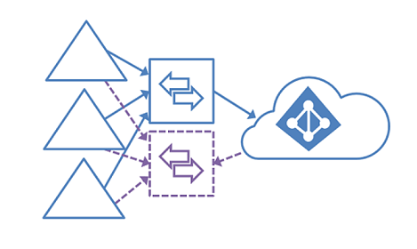

# Multiple AD Forests Architecture in Windows Virtual Desktop

Many organizations desire to leverage Windows Virtual Desktop (WVD) and have environments with multiple on-premises Active Directory forests. This article builds from the [WVD at enterprise scale Architecture](./windows-virtual-desktop.md) and helps Desktop Infrastructure Architects, Cloud Architects, Desktop Administrators, or System Administrators understand how multiple domains and WVD can be integrated based on some most common cases.

## Relevant use cases

- Mergers and acquisitions, organization re-branding and multiple on-premises identities requirements. 
- [Complex on-premises active directory environments (Multi-Forest, Multi-domains, GPO Requirements, Legacy Authentication)](https://docs.microsoft.com/azure/active-directory-domain-services/concepts-resource-forest).
- [Using AAD DS for Cloud organizations, Minimum Viable Product(MVP) and Proof-of-Concept(POC)](https://docs.microsoft.com/azure/virtual-desktop/overview)

## Architecture

<a href="images/WVD-two-forest-hybrid-with-VPN-to-Azure-AADDS-POC.vsdx" download>Click to Download Visio</a>

## Scenario
This architecture diagram shows a typical scenario that involves:

- Azure Tenant (newcompanyAB.onmicrosoft.com)
- Azure AD connect syncing multiple users from on-premises active directory
- Different Azure subscriptions (Shared Services Subscription, Subscription for Company A, Subscription for Company B)
- [Azure Hub-spoke Architecture with Shared services hub vnet](https://docs.microsoft.com/azure/architecture/reference-architectures/hybrid-networking/hub-spoke).
- Complex hybrid on-premises Active Directory Environments with two or more AD forests. Domains live in separate forests (companyA.local, companyB.local)
- Use of GPO and legacy authentication such as [Kerberos](https://docs.microsoft.com/windows-server/security/kerberos/kerberos-authentication-overview), [NTLM](https://docs.microsoft.com/windows-server/security/kerberos/ntlm-overview), and [LDAP](https://social.technet.microsoft.com/wiki/contents/articles/2980.ldap-over-ssl-ldaps-certificate.aspx)
- Azure environments that still have dependency on-premises infrastructure, private connectivity (Site-to-Site VPN or ExpressRoute) is setup between on-premises and Azure.
- The WVD session hosts join domain controllers in Azure (companyA session hosts joining companyA.local domain, CompanyB session hosts joining CompanyB.local)
- Separate Azure Storage accounts leverage Azure Files for Fslogix profiles. Azure files domain join the corresponding domain for companyA.local and companyB.local
- NOTE: This design can leverage  Azure AD Domain Services for POC/MVP environments. In that use case, WVD session hosts will join AAD DS domain controllers and private connectivity will not be needed (AAD DS Domain: aadds.newcompanyAB.com)

## Additional Components

In addition to [components](https://docs.microsoft.com/azure/architecture/example-scenario/wvd/windows-virtual-desktop#components-you-manage) listed in [WVD at enterprise scale Architecture](./windows-virtual-desktop.md)

- **Azure AD connect in staging mode:** [Staging server for Azure AD Connect topologies](https://docs.microsoft.com/azure/active-directory/hybrid/plan-connect-topologies#staging-server)  provides additional redundancy for the Azure AD connect instance.

- **AAD DS:** [Azure AD DS](https://docs.microsoft.com/azure/active-directory-domain-services/overview) Managed instance in Azure that is ideal for cloud organizations, MVP or PoC.

- **Azure subscriptions, WVD workspaces and host pools:** Multiple Subscriptions, WVD workspaces and host pools can be leveraged for administration boundaries and business requirements. 

## Data Flow

In the example scenario, the identity flow works as follows.

1. Two or more Active Directory Forest domains reside on-premises. For example, *companyA.local with UPN suffix companyA.com* and *companyB.local with UPN suffix CompanyB.com*. User John@companyA.com is a member of companyA.com and Jane@companyB.com is a member of companyB.com.
2. Domain controllers for both forests are located on-premises and Azure.
3. Azure AD tenant for the merged new company with the Azure AD tenant NewCompanyAB.onmicrosoft.com (TBD?)
4. Verified domains in Azure for CompanyA.com, CompanyB.com and CompanyAB.com.
5. Azure AD Connect syncs users from both CompanyA.com and CompanyB.com to Azure AD tenant (NewCompanyAB.onmicrosoft.com).
6. Session hosts join the domains CompanyA.com and CompanyB.com using the domain controllers in Azure.
7. Azure files used for fslogix and AD join the corresponding domains
8. Users can sign-in to WVD using their login the respective format user@NewCompanyA.com, user@CompanyB.com or user@NewCompanyAB.com depending on the UPN Suffix configured.

NOTE: In case of leveraging the hybrid design to use AAD DS managed instance (common use case scenarios are POC/MVP or Domain consolidation in case of Mergers and Acquisitions ) sync all groups and users from AAD to AAD DS domain (example: aadds.newcompanyAB.com).  WVD Session Hosts join the AAD DS Domain Controllers.

## Considerations

### Azure Active Directory

In case of scenarios with users in multiple on-premises Active Directory forests, only one Azure AD Connect sync server connected to the same Azure AD Tenant is supported, except for an AD Connect in staging mode. 

Supported identity topologies:

- Multiple on-premises Active Directory forests.  
- One or more resource forest trusts all account forests.
- A full mesh topology allows users and resources to be in any forest. Commonly, there are two-way trusts between the forests.

For more details, read the [Staging server section of Azure AD Connect topologies](https://docs.microsoft.com/azure/active-directory/hybrid/plan-connect-topologies#staging-server).

### Group Policy Objects (GPO)

For Cloud first, MVP and PoC, leveraging AAD DS and having large dependency on GPOs, will need to migrate the GPOs to AAD DS manually.
For hybrid implementation, GPOs will sync from On-premises DC to Azure DC and will requires private connectivity.
Note: TBD

### Network and Connectivity

Design considerations from a network and connectivity standpoint
- Landing Zone is Azure using Hub-spoke topology with shared services hub VNET for domain controllers.
- For WVD deployments in a cloud first, MVP and POC leveraging AAD DS, no private connectivity is needed. 
- From WVD deployments in hybrid implementations, use a virtual private connectivity. WVD Sessions hosts will join the domain controller in Azure.

## Next steps

For more information, refer to these articles:

- [Azure AD Connect Topology](https://docs.microsoft.com/azure/active-directory/hybrid/plan-connect-topologies)
- [Compare different Identity options: Self-managed Active Directory Domain Services (AD DS), Azure Active Directory (Azure AD), and Azure Active Directory Domain Services (Azure AD DS)](https://docs.microsoft.com/azure/active-directory-domain-services/compare-identity-solutions)
- [Windows Virtual Desktop Documentation](https://docs.microsoft.com/azure/virtual-desktop/)
