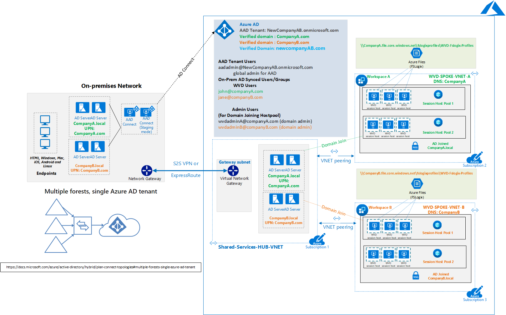

# Multiple AD Forests Architecture in Windows Virtual Desktop

Many organizations desire to leverage Windows Virtual Desktop (WVD) and have environments with multiple on-premises Active Directory forests. This article builds from the [WVD at enterprise scale Architecture](./windows-virtual-desktop.md) and helps understand how multiple domains and WVD can be integrated in an example scenario.

## Relevant use cases

- Mergers and acquisitions, organization re-branding and multiple on-premises identities requirements
- [Complex on-premises active directory environments (Multi-Forest, Multi-domains, GPO Requirements and Legacy Authentication)](https://docs.microsoft.com/azure/active-directory-domain-services/concepts-resource-forest)
- Use of on-premises GPO infrastructure with Azure WVD

> [!NOTE]
  > For the use case of AAD DS for Cloud organizations, Minimum Viable Product(MVP) and Proof-of-Concept(POC) see the [solution idea Multi forest with AAD DS](./multi-forest-w-AADDS.md)

## Architecture

*Download the <a href="images/WVD-two-forest-hybrid-Azure.vsdx" download>Visio</a> diagram of this architecture*

## Scenario
This architecture diagram shows a typical scenario that involves:

- Azure AD tenant for the new company with the Azure AD tenant NewCompanyAB.onmicrosoft.com.
- [Azure AD Connect](https://docs.microsoft.com/azure/active-directory/hybrid/whatis-hybrid-identity) syncing users from on-premises AD DS to AAD.
- Different Azure subscriptions (Shared Services Subscription, Subscription for Company A, Subscription for Company B)
- [Azure Hub-spoke Architecture with Shared services hub vNet](https://docs.microsoft.com/azure/architecture/reference-architectures/hybrid-networking/hub-spoke).
- Complex hybrid on-premises Active Directory Environments with two or more AD forests. Domains live in separate forests. For example, *companyA.local with UPN suffix companyA.com*, *companyB.local with UPN suffix CompanyB.com* and additional UPN suffix newcompanyAB. 
- Domain controllers for both forests are located on-premises and in Azure.
- Verified domains in Azure for CompanyA.com, CompanyB.com and NewCompanyAB.com.
- Use of Group Policy (GPO) and legacy authentication such as [Kerberos](https://docs.microsoft.com/windows-server/security/kerberos/kerberos-authentication-overview), [NTLM](https://docs.microsoft.com/windows-server/security/kerberos/ntlm-overview), and [LDAP](https://social.technet.microsoft.com/wiki/contents/articles/2980.ldap-over-ssl-ldaps-certificate.aspx)
- Azure environments that still have dependency on-premises infrastructure, private connectivity ([Site-to-Site VPN or Azure ExpressRoute](https://docs.microsoft.com/azure/architecture/reference-architectures/hybrid-networking/)) is setup between on-premises and Azure.
- The [WVD environment](https://docs.microsoft.com/azure/virtual-desktop/environment-setup) consists of a WVD workspace and Azure subscription for each business unit and two host pools per workspace.
- The WVD session hosts are joined to domain controllers in Azure (companyA session hosts joining companyA.local domain, CompanyB session hosts joining CompanyB.local)
- Separate Azure Storage accounts leverage [Azure Files for FSLogix profiles](https://docs.microsoft.com/azure/virtual-desktop/FSLogix-containers-azure-files). Azure files domain join the corresponding domain for companyA.local and companyB.local

## Additional Components

In addition to [components](https://docs.microsoft.com/azure/architecture/example-scenario/wvd/windows-virtual-desktop#components-you-manage) listed in [WVD at enterprise scale Architecture](./windows-virtual-desktop.md)

- **Azure AD connect in staging mode:** [Staging server for Azure AD Connect topologies](https://docs.microsoft.com/azure/active-directory/hybrid/plan-connect-topologies#staging-server)  provides additional redundancy for the Azure AD connect instance.

- **Azure subscriptions, WVD workspaces and host pools:** Multiple Subscriptions, WVD workspaces and host pools can be leveraged for administration boundaries and business requirements. 

## Data Flow

In the example scenario, the identity flow works as follows.

1. Azure AD Connect syncs users from both CompanyA.com and CompanyB.com to Azure AD tenant (NewCompanyAB.onmicrosoft.com)
2. Host pools and App groups are created in the respective subscriptions and spoke vNets.
3. Workspaces and users are assigned to the App groups.
4. WVD session hosts in the host pools join the domains CompanyA.com and CompanyB.com using the domain controllers in Azure.  
5. Users sign in via [WVD Desktop](https://docs.microsoft.com/azure/virtual-desktop/connect-windows-7-10#install-the-windows-desktop-client) or [Web client](https://docs.microsoft.com/azure/virtual-desktop/connect-web) with the respective format user@NewCompanyA.com, user@CompanyB.com or user@NewCompanyAB.com depending on the UPN Suffix configured.
6. Users are presented with their respective virtual desktops or Apps. For example, users in CompanyA will be presented with virtual desktops or apps in in Workspace A, host pool 1 or 2.
7. FSLogix user profiles are created in Azure file shares on the on the corresponding storage accounts.
8. GPOs synced from on-premises are applied to users and WVD session hosts.

## Considerations

### Group Policy Objects (GPO)

- To extend GPO infrastructure for WVD, the on-premises domain controllers will sync to the Azure IaaS domain controllers. 
- Extending the GPO infrastructure to Azure IaaS domain controllers requires private connectivity.

### Network and Connectivity

- Landing Zone is [Azure Hub-spoke Architecture with Shared services hub vNet](https://docs.microsoft.com/azure/architecture/reference-architectures/hybrid-networking/hub-spoke) for domain controllers.
- WVD Sessions hosts join the domain controller in Azure over their respective hub-spoke vNet peering.

### Azure Storage

Storage design considerations for user profiles containers, cloud cache containers and MSIX packages
- Both, [Azure files and NetApp files](https://docs.microsoft.com/azure/virtual-desktop/store-FSLogix-profile#azure-platform-details) can be used in this scenario. Business requirements like performance will be the deciding factors for choosing the right solution.
- Both, Azure Storage accounts and NetApp files present the same limitation of being able to join to one single AD DS at a time, therefore multiple Azure Storage accounts or NetApp instances will be required.

### Azure Active Directory

In case of scenarios with users in multiple on-premises Active Directory forests, only one Azure AD Connect sync server connected to the same Azure AD Tenant is supported, except for an AD Connect in staging mode. 

Supported identity topologies:

- Multiple on-premises Active Directory forests.  
- One or more resource forest trusts all account forests.
- A full mesh topology allows users and resources to be in any forest. Commonly, there are two-way trusts between the forests.

For more details, read the [Staging server section of Azure AD Connect topologies](https://docs.microsoft.com/azure/active-directory/hybrid/plan-connect-topologies#staging-server).

## Next steps

For more information, refer to these articles:

- [Azure AD Connect Topology](https://docs.microsoft.com/azure/active-directory/hybrid/plan-connect-topologies)
- [Compare different Identity options: Self-managed Active Directory Domain Services (AD DS), Azure Active Directory (Azure AD), and Azure Active Directory Domain Services (Azure AD DS)](https://docs.microsoft.com/azure/active-directory-domain-services/compare-identity-solutions)
- [Solution idea Multi forest with AAD DS](./multi-forest-w-AADDS.md)
- [Windows Virtual Desktop Documentation](https://docs.microsoft.com/azure/virtual-desktop/)
