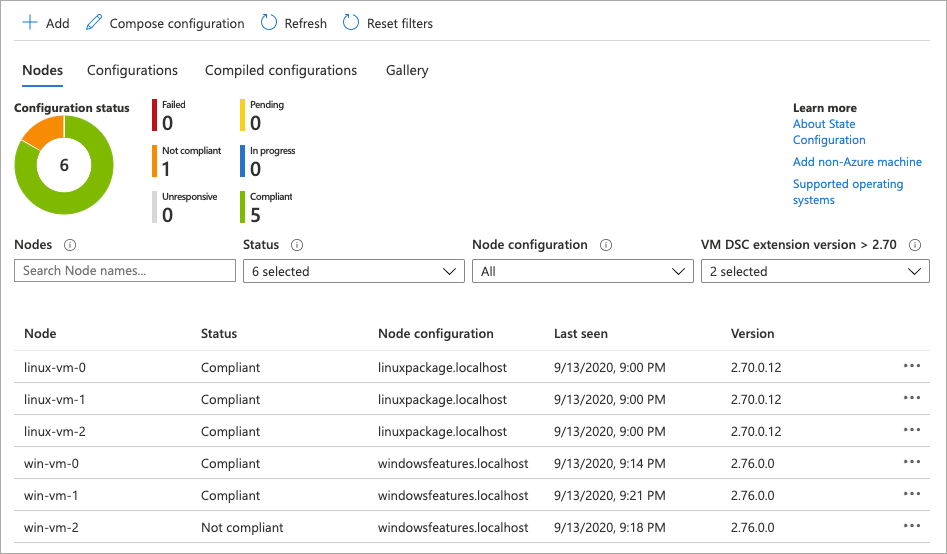

# Configure infrastructure

When working with Azure, many services can be created and configured programmatically using automation or infrastructure as code tooling. These tools access Azure through the exposed REST APIs or what we refer to as the [Azure control plane](https://docs.microsoft.com/azure/azure-resource-manager/management/control-plane-and-data-plane#control-plane). For example, an Azure Network Security Group can be deployed, and security group rules created using an Azure Resource Manager template. The Network Security Group and its configuration are exposed through the Azure control plane, and natively accessible.

Other configurations, such as installing software on a virtual machine, adding data to a database, or starting pods in an Azure Kubernetes Service cluster can not be accessed through the Azure control plane and require a different set of configuration tools. We consider these configurations as being on the [Azure data plane](https://docs.microsoft.com/azure/azure-resource-manager/management/control-plane-and-data-plane#data-plane) side, or not exposed through Azure REST APIs. These data plane enabled tools use agents, networking, or other access methods to provide resource-specific configuration options. 

For example, when deploying a set of virtual machined to Azure, you may also want to install and configure a web server, stage content, and then make the content available on the internet. Furthermore, if the configuration of the virtual machine changes and no longer aligns with the configuration definition, you may want a configuration management system to remediate the configuration. Many options are available for these data plane configurations; this document details several and provides links for in-depth information.

## Bootstrap virtual machines

When deploying a virtual machine, you may want to run a one-time command or script on the VM at deployment time or shortly after. Azure provides this capability with both Azure VM extensions and cloud-init.

Take note, using an extensions and cloud-inti are 'one-time' operations. Once run, this tech does not monitor the targeted resource or detect configuration change. If you need ongoing configuration management, consider the technology discussed under 'Configuration management' found in this document.

### Azure VM extensions

Azure virtual machine extensions are small packages that run post-deployment configuration and automation on Azure virtual machines. Several extensions are available for many different configuration tasks, such as running scripts, configuring antimalware solutions, and configuring logging solutions. These extensions can be installed and run on virtual machines using an ARM template, the Azure CLI, Azure PowerShell module, or the Azure portal. Each Azure VM has a VM Agent installed, and this agent manages the lifecycle of the extension.

A typical VM extension use case would be to use a custom script extension to install software, run commands, and perform configurations on a virtual machine or virtual machine scale set. The custom script extension uses the Azure virtual machine agent to download and execute a script. The custom script extensions can be configured to run as part of infrastructure as code deployments such that the VM is created, and then the script extension is run on the VM. Extensions can also be run outside of an Azure deployment using the Azure CLI, PowerShell module, or the Azure portal.

In the following example, the Azure CLI is used to run a command on a virtual machine.

```
az vm extension set \
  --resource-group myResourceGroup \
  --vm-name myVM --name customScript \
  --publisher Microsoft.Azure.Extensions \
  --settings '{"commandToExecute": "apt-get install -y nginx"}'
```

**Learn more**

[Docs: Azure virtual machine extensions](https://docs.microsoft.com/azure/virtual-machines/extensions/overview)

[Code Samples: Configure VM with script extension during ARM deployent](https://docs.microsoft.com/samples/browse/?terms=arm%20templates)

### cloud-init

cloud-init is an industry used tool for configuring Linux virtual machines on first boot. Much like the Azure custom script extension, cloud-init allows you to bootstrap Linux virtual machines with software installation, configurations, and content staging. Azure included many cloud-init enable marketplace images across many of the most well known Linux distributions. For a full list, see [cloud-init support for virtual machines in Azure](https://docs.microsoft.com/azure/virtual-machines/linux/using-cloud-init#canonical).

To use cloud-init, create a text file named *cloud-init.txt* and enter your cloud-init configuration. In this example, the nginx package is added to the configuration.

```yaml
#cloud-config
package_upgrade: true
packages:
  - nginx
```

Create a resource group for the virtual machine.

```azurecli
az group create --name myResourceGroupAutomate --location eastus
```

Create the virtual machine, specifying the *--custom-data* property with the cloud-inti configuration name.

```azurecli
az vm create \
    --resource-group myResourceGroupAutomate \
    --name myAutomatedVM \
    --image UbuntuLTS \
    --admin-username azureuser \
    --generate-ssh-keys \
    --custom-data cloud-init.txt
```

**Learn more**

[Docs: cloud-init support for virtual machines in Azure](https://docs.microsoft.com/azure/virtual-machines/linux/using-cloud-init#canonical)

[Code Samples: Configure VM with cloud-inti during ARM deployent](https://docs.microsoft.com/samples/browse/?terms=arm%20templates)

## Configuration Management

### Azure Automation State Configuration

Azure Automation State Configuration is a configuration management solution built on top of PowerShell Desired State Configuration (DSC). State configuration works with Azure virtual machines, on-premises machines, and machiens in a cloud other than Azure. Using state configuration, you can import PowerShell DSC resources and assign them to many virtual from a central location. Once each endpoint has evaluated and / or applied the desired state, state compliance is reported back to Azure and can be seen on a built-in dashboard.

The following example uses PowerShell DSC to ensure the NGINX has been installed on Linux systems.

```powershell
configuration linuxpackage {

    Import-DSCResource -Module nx

    Node "localhost" {
        nxPackage nginx {
            Name = "nginx"
            Ensure = "Present"
        }
    }
}
```

Once imported into Azure State Configuration and assigned to nodes, the state configuration dasboard provides compliance results.



**Learn more**

[Docs: Get started with Azure Automation State Configuration](https://docs.microsoft.com/azure/virtual-machines/extensions/overview)

[Code Samples: Deploy DSC and VMs with an ARM tempalte](https://docs.microsoft.com/samples/browse/?terms=arm%20templates)

### Chef

**Learn more**

### Puppet

**Learn more**

## Other automation

### Azure deployment script resource

#### Next steps

> [!div class="nextstepaction"]
> [Automate operational tasks](./automation-tasks.md)
