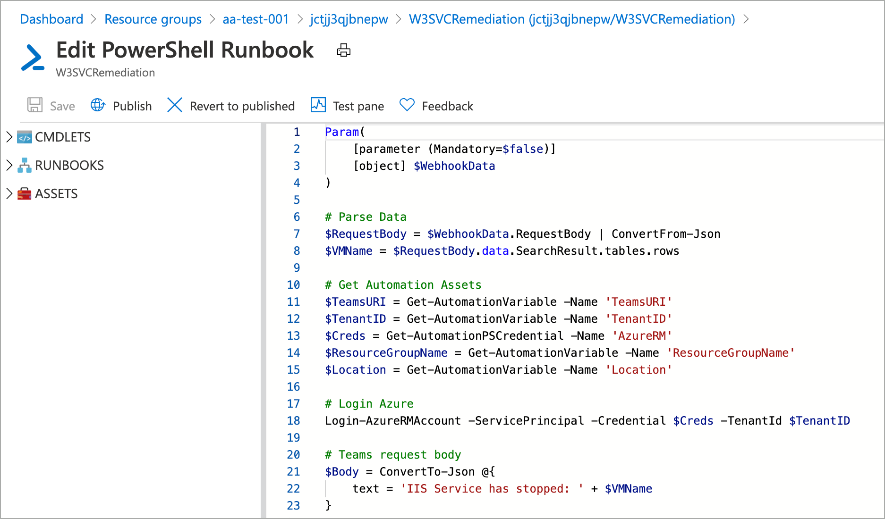

# Automated Tasks

## Azure Functions 

## Azure Automation

PowerShell and Python are popular programming languages for automating operational tasks. Using these languages, performing operations like restarting services, moving logs between data stores, and scaling infrastructure to meet demand can be expressed in code and executed on demand. Alone, these languages do not offer a platform for centralized management, version control, or execution history. The languages also lack a native mechanism for responding to events like monitoring driven alerts. To provide these capibilities, an automation platform is needed.

Azure Automation provides an Azure-hosted platform for hosting and running PowerShell and Python code across Azure, non-Azure cloud, and on-premises environments. PowerShell and Python code is stored in an Azure Automation Runbook which has the following attributes:

- Execute runbooks on demand, on a schedule, or through a webhook
- Execution history and logging
- Integrated secrets store
- Source Control integration

As seen in the following image, Azure Automation provides a portal experience for managing Azure Automation Runbooks.

**Learn more**

- [Docs: What is Azure Automation](https://docs.microsoft.com/azure/automation/automation-intro)
- [Code Samples: Azure Automation example](https://docs.microsoft.com/samples/browse/?terms=arm%20templates)

## Logic apps

#### Next steps