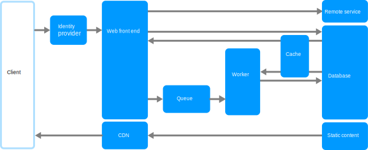
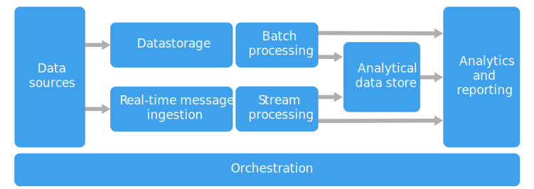

# Architecture styles

An *architecture style* is a family of architectures that share certain characteristics. For example, [N-tier][n-tier] is a common architecture style. More recently, [microservice architectures][microservices] are starting to gain favor. Architecture styles don't require the use of particular technologies, but some technologies are well-suited for certain architectures. For example, containers are a natural fit for microservices.

We have identified a set of architecture styles that are commonly found in cloud applications. The article for each style includes:

- A description and logical diagram of the style.
- Recommendations for when to choose this style.
- Benefits, challenges, and best practices.
- A recommended deployment using relevant Azure services.

## A quick tour of the styles

This section gives a quick tour of the architecture styles that we've identified, along with some high-level considerations for their use. Note that the list isn't exhaustive. Read more details in the linked topics.

### N-tier

**[N-tier][n-tier]** is a traditional architecture for enterprise applications. Dependencies are managed by dividing the application into *layers* that perform logical functions, such as presentation, business logic, and data access. A layer can only call into layers that sit below it. However, this horizontal layering can be a liability. It can be hard to introduce changes in one part of the application without touching the rest of the application. That makes frequent updates a challenge, limiting how quickly new features can be added.

N-tier is a natural fit for migrating existing applications that already use a layered architecture. For that reason, N-tier is most often seen in infrastructure as a service (IaaS) solutions, or applications that use a mix of IaaS and managed services.

### Web-Queue-Worker

For a purely PaaS solution, consider a **[Web-Queue-Worker](./web-queue-worker.yml)** architecture. In this style, the application has a web front end that handles HTTP requests and a back-end worker that performs CPU-intensive tasks or long-running operations. The front end communicates to the worker through an asynchronous message queue.

Web-Queue-Worker is suitable for relatively simple domains with some resource-intensive tasks. Like N-tier, the architecture is easy to understand. The use of managed services simplifies deployment and operations. But with complex domains, it can be hard to manage dependencies. The front end and the worker can easily become large, monolithic components that are hard to maintain and update. As with N-tier, Web-Queue-Worker can reduce the frequency of updates and limit innovation.

### Microservices

If your application has a more complex domain, consider moving to a **[Microservices][microservices]** architecture. A microservices application is composed of many small, independent services. Each service implements a single business capability. Services are loosely coupled, communicating through API contracts.

Each service can be built by a small, focused development team. Individual services can be deployed with less coordination between teams, which encourages frequent updates. A microservice architecture is more complex to build and manage than either N-tier or web-queue-worker. It requires a mature development and DevOps culture. But done right, this style can lead to higher release velocity, faster innovation, and a more resilient architecture.

### Event-driven architecture

**[Event-Driven Architectures](./event-driven.yml)** use a publish-subscribe (pub-sub) model, where producers publish events, and consumers subscribe to them. The producers are independent from the consumers, and consumers are independent from each other.

Consider an event-driven architecture for applications that ingest and process a large volume of data with low latency, such as IoT solutions. The style is also useful when different subsystems must perform different types of processing on the same event data.

### Big data, big compute

**[Big Data](./big-data.yml)** and **[Big Compute](./big-compute.yml)** are specialized architecture styles for workloads that fit certain specific profiles. Big data divides a large dataset into chunks, performing parallel processing across the entire set, for analysis and reporting. Big compute, also called high-performance computing (HPC), makes parallel computations across a large number (thousands) of cores. Domains include simulations, modeling, and 3-D rendering.

## Architecture styles as constraints

An architecture style places constraints on the design, including the set of elements that can appear and the allowed relationships between those elements. Constraints guide the "shape" of an architecture by restricting the universe of choices. When an architecture conforms to the constraints of a particular style, certain desirable properties emerge.

For example, the constraints in microservices include:

- A service represents a single responsibility.
- Every service is independent of the others.
- Data is private to the service that owns it. Services don't share data.

By adhering to these constraints, what emerges is a system where services can be deployed independently, faults are isolated, frequent updates are possible, and it's easy to introduce new technologies into the application.

Each architecture style has its own trade-offs. Therefore, before choosing any architectural style, make sure that you understand the underlying principles and constraints of that style. Otherwise, you can end up with a design that conforms to the style at a superficial level, but doesn't achieve the full potential of that style. You need to pay attention more to why you're choosing a certain architectural style than to how to implement it. It's also important to be pragmatic. Sometimes it's better to relax a constraint, rather than insist on architectural purity.

Choosing an appropriate architectural style should be done ideally with a consensus of informed workload stakeholders. The workload team should firstly identify the nature of the problem they are trying to solve. Then they should identify business drivers and corresponding architecture characteristics (also known as nonfunctional requirements) then prioritize them. For example, if they need shorter time to market, they might prioritize maintainability, testability, and reliability by rapid deployment capabilities. Or if the workload team's budget is constrained, they might prioritize feasibility and simplicity. Choosing and maintaining an architectural style isn't a one-off activity but a continuous approach: the architecture should be continuously measured, validated, and fine-tuned over time. Usually, there's significant cost involved in switching architectural style, so more effort up front can be justified for long term team efficiency and risk mitigation.

The following table summarizes how each style manages dependencies, and the types of domain that are best suited for each.

| Architecture style | Dependency management | Domain type |
|--------------------|------------------------|-------------|
| [N-tier][n-tier] | Horizontal tiers divided by subnet | Traditional business domain. Frequency of updates is low. |
| [Web-Queue-Worker](./web-queue-worker.yml) | Front and backend jobs, decoupled by async messaging. | Relatively simple domain with some resource intensive tasks. |
| [Microservices][microservices] | Vertically (functionally) decomposed services that call each other through APIs. | Complicated domain. Frequent updates. |
| [Event-driven architecture](./event-driven.yml) | Producer/consumer. Independent view per subsystem. | IoT and real-time systems. |
| [Big data](./big-data.yml) | Divide a huge dataset into small chunks. Parallel processing on local datasets. | Batch and real-time data analysis. Predictive analysis using ML. |
| [Big compute](./big-compute.yml) | Data allocation to thousands of cores. | Compute intensive domains such as simulation. |

## Consider challenges and benefits

Constraints also create challenges, so it's important to understand the trade-offs when adopting any of these styles. Do the benefits of the architecture style outweigh the challenges, *for this subdomain and bounded context*.

Here are some of the types of challenges to consider when selecting an architecture style:

- **Complexity**. Is the complexity of the architecture justified for your domain? Conversely, is the style too simplistic for your domain? In that case, you risk ending up with a "[big ball of mud][ball-of-mud]" because the architecture doesn't help you to manage dependencies cleanly.

- **Asynchronous messaging and eventual consistency**. Asynchronous messaging can be used to decouple services, and increase reliability (because messages can be retried) and scalability. However, asynchronous messaging also creates challenges in handling eventual consistency, and the possibility of duplicate messages.

- **Inter-service communication**. As you decompose an application into separate services, there's a risk that communication between services will cause unacceptable latency or create network congestion (for example, in a microservices architecture).

- **Manageability**. How hard is it to manage the application, monitor, deploy updates, and so on?

## Related resources

- [Ten design principles for Azure applications](/azure/architecture/guide/design-principles/)
- [Build applications on the Microsoft Cloud](/azure/architecture/guide/microsoft-cloud/overview)
- [Best practices in cloud applications](/azure/architecture/best-practices/index-best-practices)
- [Cloud Design Patterns](/azure/architecture/patterns/)
- [Performance testing and antipatterns for cloud applications](/azure/architecture/antipatterns/)
- [Architect multitenant solutions on Azure](/azure/architecture/guide/multitenant/overview)
- [Mission critical workload architecture on Azure](/azure/architecture/reference-architectures/containers/aks-mission-critical/mission-critical-intro)
- [Architecture for startups](/azure/architecture/guide/startups/startup-architecture)

[ball-of-mud]: https://en.wikipedia.org/wiki/Big_ball_of_mud
[microservices]: ./microservices.md
[n-tier]: ./n-tier.yml
