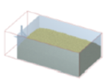
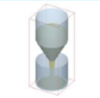
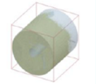
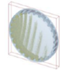
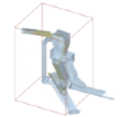

This article briefly describes the steps for running [Altair
EDEM](https://www.altair.com/edem) on a virtual machine (VM) that\'s
deployed on Azure. It also presents the performance results of running
EDEM on Azure.

EDEM is a high-performance application that's used for bulk material
simulation. EDEM uses discrete element method (DEM) to simulate and
analyze the behavior of coal, mined ores, soils, fibers, grains,
tablets, and powders. EDEM:

-   Shows crucial insight to bulk material interaction with equipment
    during a range of operation and process conditions.
-   Creates simulations of real-world materials like large rocks, fine
    powders, grains, fibers, and tablets, representing material
    behaviors like dry, sticky, and compressible.

EDEM includes three core components: EDEM Creator, Simulator, and
Analyst.

EDEM is primarily used in industries like construction, off-highway,
mining, agriculture, space exploration, and process industries.

## Why deploy EDEM on Azure?

-   Modern and diverse compute options to align to your workload's
    needs 
-   The flexibility of virtualization without the need to buy and
    maintain physical hardware 
-   Rapid provisioning 
-   Ability to solve simulations in a few hours with A100 GPUs

## Architecture

:::image type="content" source="media/hpc-edem.png" alt-text="Diagram that shows an architecture for deploying Altair EDEM." lightbox="media/hpc-edem.png" border="false":::

*Download a [Visio file](https://arch-center.azureedge.net/hpc-edem.vsdx) of this architecture.*

### Components

-   [Azure Virtual
    Machines](https://azure.microsoft.com/services/virtual-machines) is
    used to create Windows VMs. 
    -   For information about deploying the VM and installing the
        drivers, see [Windows VMs on Azure](../../reference-architectures/n-tier/windows-vm.yml).
-   [Azure Virtual
    Network](https://azure.microsoft.com/services/virtual-network) is
    used to create a private network infrastructure in the cloud. 
    -   [Network security
        groups](/azure/virtual-network/network-security-groups-overview)
        are used to restrict access to the VMs.  
    -   A public IP address connects the internet to the VM.   
-   A physical SSD is used for storage.   

## Compute sizing and drivers

[ND A100 v4](/azure/virtual-machines/nda100-v4-series) and [NCv3](/azure/virtual-machines/ncv3-series) series VMs, running the Windows operating system, were used to test the performance of EDEM on Azure. The following table provides the configuration details:

|  VM size|               vCPU    | Memory, in GiB |  Temporary storage (SSD), in GiB|   GPUs |    GPU  memory, in GiB     | Maximum data disks|
|--|--|--|--|--|--|--|
|Standard_ND96asr_v4|   96   |    900|       6,000|       8 A100|   40|        32|
|  Standard_NC6s_v3   |   6 |       112     |  736         |1 V100   |16        |12|

### Required drivers

To use EDEM on Standard_ND96asr_v4 VMs, you need to install NVIDIA and
AMD drivers.

To use EDEM on Standard_NC6s_v3 VMs, you need to install NVIDIA drivers.

## EDEM installation

Before you install EDEM, you need to deploy and connect a VM, install an eligible Windows 10 or Windows 11 image, and install
the NVIDIA drivers. On Standard_ND96asr_v4 VMs, you need to install the
AMD drivers.

For information about eligible Windows images, see [How to deploy Windows 10 on Azure](/azure/virtual-machines/windows/windows-desktop-multitenant-hosting-deployment) and [Use Windows client in Azure for dev/test scenarios](/azure/virtual-machines/windows/client-images).

> [!IMPORTANT]
> NVIDIA Fabric Manager installation is required for VMs
that use NVLink or NVSwitch.

For information about deploying the VM and installing the drivers, see [Run a Windows VM on Azure](../../reference-architectures/n-tier/windows-vm.yml).

To install EDEM, you need to download EDEM from Altair One Marketplace,
install License Manager, and then install EDEM. For detailed
installation instructions, see [Altair One
Marketplace](https://altairone.com/Marketplace?__hstc=142694250.005b507352b9e4107a39c334591c181a.1662053255169.1662498072969.1662503447214.4&__hssc=142694250.2.1662503447214&__hsfp=886166656).

## EDEM performance results

Seven real-world scenarios were used to test the performance of EDEM on
Azure VMs. Particle simulations were tested. Here are the details:

| Model | Angle of repose |Bed of material  |Hopper discharge  |Powder mixer|Screw augur|Mill|Transfer chute|
|---------|---------|---------|---------|--|--|--|--|
|   Description  |Cylinder angle of repose         |  Bed of material with tillage tool      |Hopper emptying into container         |Powder mixer|Screw augur|Mill| Transfer chute with dynamic factory|
|     |         |         |           | | | | |
|  Particle radius (m)| 0.0005 - 0.001|0.002 - 0.004 |0.003|0.0005|0.001|0.005|0.0045 - 0.009|
| Number of spheres    | 3        |3         |3         |1|1|1|3|
|   Size distribution  |Random         |Random         |Fixed|Fixed |    Fixed|Fixed|Random
| Number of particles    |  1,000,000 |  1,000,000 | 1,000,000 | 1,000,000| 1,000,000| 1,000,000| 1,000,000|
|  Physics|Hertz-Mindlin  |Hertz-Mindlin with JKR |Hertz-Mindlin  |Hertz-Mindlin|Hertz-Mindlin|Hertz-Mindlin|Hertz-Mindlin with JKR|
|Time steps|5.73E-06 |5.00E-05 |4.00E-05 |9.20E-06|1.40E-05|0.00016|5.97E-05|
| Total time |   0.5 | 1 |1 |1|1 |1|1 |
|Save interval |0.1|0.1|0.1  |0.1 |0.1 |0.1 |0.1|
| Grid cell size (x Rmin)| 3|3|3|3| 3 |3 |5|
| Factory |No|No| No|No|No|No|Yes|
|  Periodic boundaries   |No|No| No|No|No|No|No|

This table shows the elapsed wall-clock time needed to complete each of
the simulations, in seconds:

| Model               | 96 CPUs     | 8 A100 GPUs (ND96asr_v4)        | V100 GPU (NC6s_v3)     |
|     --               |--         |--                  |--              |
| Angle of repose     | 12819.80    | 1543.66          | 2319.39      |
| Bed of material     | 2650.56     | 320.24           | 475.04       |
| Hopper discharge    | 9318.89     | 566.59           | 1030.38      |
| Powder mixer        | 14028.50    | 1013.98          | 1312.27      |
| Screw auger         | 8871.59     | 1295.16          | 1158.98      |
| Mill                | 1339.11     | 83.18            | 116.49       |
| Transfer chute      | 3859.01     | 310.22           | 437.92       |

This graph shows the elapsed seconds for A100 GPUs, compared to the
results for 96 CPUs:

The following table shows the relative speed increases for A100 GPUs and
the V100 GPU, as compared to 96 CPUs:

| Model               | 96 CPUs     | 8 A100 GPUs (ND96asr_v4)      | V100 GPU (NC6s_v3)      |
|   --                  | --         |    -              |    -          |
| Angle of repose     | 1           | 8.30             | 5.53         |
| Bed of material     | 1           | 8.28             | 5.58         |
| Hopper discharge    | 1           | 16.45            | 9.04         |
| Powder mixer        | 1           | 13.84            | 10.69        |
| Screw auger         | 1           | 6.85             | 7.65         |
| Mill                | 1           | 16.10            | 11.50        |
| Transfer chute      | 1           | 12.44            | 8.81         |

This graph shows the relative speeds:

## Azure cost

Only rendering time is considered for these cost calculations.
Application installation time isn't considered.

You can use the wall-clock time presented in the following table and the
Azure hourly rate to calculate costs. For the current hourly costs,
see [Windows Virtual Machines
Pricing](https://azure.microsoft.com/pricing/details/virtual-machines/windows/#pricing).

You can use the [Azure pricing
calculator](https://azure.microsoft.com/pricing/calculator) to estimate
the costs for your configuration.

VM size      |              Model|                         Wall-clock time, in seconds|
|-|-|-|
|Standard_ND96asr_v4|        Angle of repose|               1543.66|
|Standard_ND96asr_v4|  Bed of material       |        320.244|
|Standard_ND96asr_v4|  Hopper discharge        |      566.587|
|Standard_ND96asr_v4|  Powder mixer           |       1013.98|
|Standard_ND96asr_v4|  Screw auger           |        1295.16|
|Standard_ND96asr_v4|  Mill            |              83.1794|
|Standard_ND96asr_v4|  Transfer chute       |         310.224|
|  Standard_NC6s_v3 |Angle of repose               |2319.39|
|  Standard_NC6s_v3 |Bed of material               |475.04|
|  Standard_NC6s_v3 | Hopper discharge       |       1030.38|
|  Standard_NC6s_v3 |Powder mixer           |       1312.27|
|  Standard_NC6s_v3 |Screw auger           |        1158.98|
|  Standard_NC6s_v3 |Mill                 |         116.49|
|  Standard_NC6s_v3 | Transfer chute     |           437.92|

## Summary

-   Altair EDEM was successfully tested on ND A100 v4 and NCv3 series
    VMs on Azure.
-   The highest speeds are achieved on ND96asr_v4 VMs.
-   Simulations for complex workloads are solved in a few hours on
    ND96asr_v4 VMs.

## Contributors

*This article is maintained by Microsoft. It was originally written by
the following contributors.*

Principal authors:

-   [Hari Bagudu](https://www.linkedin.com/in/hari-bagudu-88732a19) |
    Senior Manager
-   [Gauhar Junnarkar](https://www.linkedin.com/in/gauharjunnarkar) |
    Principal Program Manager
-   [Vinod
    Pamulapati](https://www.linkedin.com/in/vinod-reddy-20481a104) |
    HPC Performance Engineer

Other contributors:

-   [Mick Alberts](https://www.linkedin.com/in/mick-alberts-a24a1414) |
    Technical Writer
-   [Guy Bursell](https://www.linkedin.com/in/guybursell) | Director
    Business Strategy
-   [Sachin
    Rastogi](https://www.linkedin.com/in/sachin-rastogi-907a3b5) |
    Manager

*To see non-public LinkedIn profiles, sign in to LinkedIn.*

## Next steps

-   [GPU optimized virtual machine
    sizes](/azure/virtual-machines/sizes-gpu)
-   [Windows virtual machines in
    Azure](/azure/virtual-machines/windows/overview)
-   [Virtual networks and virtual machines in
    Azure](/azure/virtual-network/network-overview)
-   [Learning path: Run high-performance computing (HPC) applications on
    Azure](/learn/paths/run-high-performance-computing-applications-azure)

## Related resources

-   [Run a Windows VM on Azure](../../reference-architectures/n-tier/windows-vm.yml)
-   [HPC system and big-compute solutions](../../solution-ideas/articles/big-compute-with-azure-batch.yml)
-   [HPC cluster deployed in the cloud](../../solution-ideas/articles/hpc-cluster.yml)
