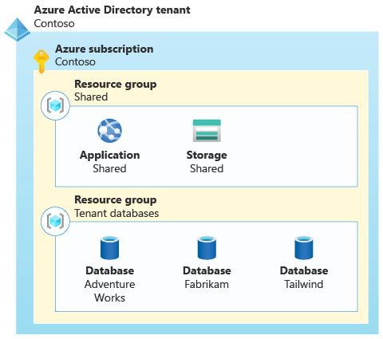
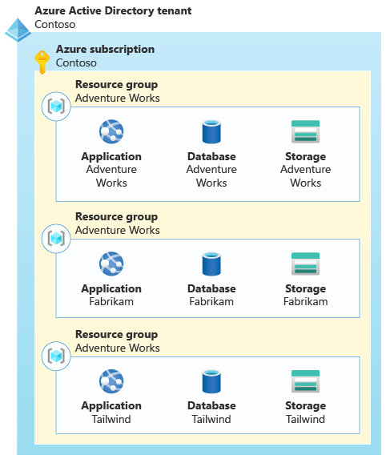
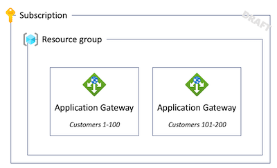

# Architectural approaches for multitenancy

There are many different ways that you can design and build multitenant solutions in Azure. At one extreme, you can deploy isolated resources for every tenant. A simple approach is to deploy separate resources, and it can work for a small numbers of tenants. However, it typically doesn't provide cost effectiveness, and it can become difficult to manage your resources. At the other extreme, you can share every resource in your solution between every tenant. There are also various approaches that fit between these extremes, and they all have tradeoffs: scale, isolation, cost efficiency, performance, implementation complexity, and manageability.

Throughout this section, we discuss the main categories of Azure services that comprise a solution, including [compute](compute.md), [storage and data](storage-data.md), messaging, IoT, and deployment. For each category, we outline the key patterns and approaches you can consider when you're designing a multitenant solution, and some antipatterns to avoid.

## Deployment Stamps pattern

The [Deployment Stamps pattern](../../../patterns/deployment-stamp.md) is frequently used in multitenant solutions. It involves deploying dedicated infrastructure for a tenant or for a group of tenants. A single stamp might contain multiple tenants or might be dedicated to a single tenant.

When using single-tenant stamps, the Deployment Stamps pattern tends to be straightforward to implement, because each stamp is likely to be unaware of any other, so no multitenancy logic or capabilities need to be built into the application layer. When each tenant has their own dedicated stamp, this pattern provides the highest degree of isolation, and it mitigates the [Noisy Neighbor problem](../../../antipatterns/noisy-neighbor/index.md). It also provides the option for tenants to be configured or customized according to their own requirements, such as to be located in a specific geopolitical region or to have specific high availability requirements.

When using multitenant stamps, other patterns need to be considered to manage multitenancy within the stamp, and the Noisy Neighbor problem still might apply. However, by using the Deployment Stamps pattern, you can continue to scale as your solution grows.

The biggest problem with the Deployment Stamps pattern, when being used to serve a single tenant, tends to be the cost of the infrastructure. When using single-tenant stamps, each stamp needs to have its own separate set of infrastructure, which isn't shared with other tenants. You also need to ensure that the resources deployed for a stamp are sufficient to meet the peak load for that tenant's workload. Ensure that your [pricing model](../considerations/pricing-models.md) offsets the cost of deployment for the tenant's infrastructure.

Single-tenant stamps often work well when you have a small number of tenants. As your number of tenants grows, it's possible but increasingly difficult to manage a fleet of stamps ([see this case study as an example](https://devblogs.microsoft.com/azure-sql/running-1m-databases-on-azure-sql-for-a-large-saas-provider-microsoft-dynamics-365-and-power-platform)). You can also apply the Deployment Stamps pattern to create a fleet of multitenant stamps, which can provide benefits for resource and cost sharing.

To implement the Deployment Stamps pattern, it's important to use automated deployment approaches. Depending on your deployment strategy, you might consider managing your stamps within your deployment pipelines, by using declarative infrastructure as code, such as Bicep, ARM templates, or Terraform templates. Alternatively, you might consider building custom code to deploy and manage each stamp, such as by using [Azure SDKs](https://azure.microsoft.com/downloads).

## Resource isolation

When you deploy a multitenant solution in Azure, you need to determine whether you dedicate resources to each tenant or if you share resources between multiple tenants. Throughout the multitenancy approaches and service-specific guidance sections of this series, we describe the options and their trade-offs for many categories of resources. In general, though, there are a range of options for *tenant isolation*.

Azure resources are deployed and managed through a hierarchy: most *resources* are deployed into *resource groups*, which are contained in *subscriptions*. *Management groups* logically group subscriptions together. All of these hierarchical layers exist within an *Azure Active Directory tenant*.

When you determine how to deploy resources for each tenant, you might choose to isolate at any of these levels in the hierarchy. Each option is valid for certain types of multitenant solutions, and comes with benefits and costs. It's also common to combine approaches, using different isolation models for different components of a solution.

### Isolation within a shared resource

You might choose to share an Azure resource among multiple tenants, and run all of their workloads on a single instance. Ensure you review the [service-specific guidance](../service/overview.md) for the resources you use to understand any specific considerations or options that might be important.

When you run single instances of a component, you need to consider any service limits that might become a problem as you scale. For example, there is a maximimum number of nodes in an Azure Kubernetes Service (AKS) cluster, and an upper limit on the number of transactions per second supported by a storage account. Consider how you'll [scale to multiple shared resources](#plan-to-scale-out) as you approach these limits.

You also need to ensure your application code is fully aware of multitenancy, and that it restricts access to the data for a specific tenant.

For example, suppose Contoso is building a multitenant SaaS application that includes a web application, a database, and a storage account. They might decide to deploy shared resources, and use these resources to service all of their customers:

### Separate resources in a resource group

You can also deploy dedicated resources for each tenant. You might deploy an entire copy of your solution for a single tenant, as in the [Deployment Stamps pattern](#deployment-stamps-pattern), or you might deploy some components that are shared between tenants and other components that are dedicated to a specific tenants.

It's important that you consider how you deploy and manage these resources, including [whether the deployment of tenant-specific resources is initiated by your deployment pipeline or an application component](deployment-configuration.yml#resource-management-responsibility). You also need to determine how you'll clearly identify that specific resources relate to specific tenants, which might include naming conventions, tags, and a tenant catalog database.

It's often a good practice to use separate resource groups for the resources you share between multiple tenants and those that you deploy for individual tenants. However, Azure limits the number of resources of a single type that can be deployed into a resource group, so you also need to consider [scaling across multiple resource groups](#resource-group-and-subscription-limits) as you grow.

Returning to our example, suppose Contoso has three customers: Adventure Works, Fabrikam, and Tailwind. They might choose to share the web application and storage account between the three customers, and deploy individual databases for each tenant:

For example, suppose Contoso has three customers. They might deploy dedicated resources for each customer, but place them in a single resource group:

### Separate resource groups in a subscription

When you deploy a set of resources for each tenant, consider using dedicated tenant-specific resource groups. For example, when you follow the [Deployment Stamps pattern](#deployment-stamps-pattern), each stamp should be deployed into its own resource group. You can consider deploying multiple tenant-specific resource groups into a shared Azure subscription. This enables you to easily configure policies and access control rules.

You might choose to create a set of resource groups for each tenant, and also shared resource groups for any shared resources.

When you deploy tenant-specific resource groups into shared subscriptions, be aware of the maximum number of resource groups in each subscription, and other subscription-level limits that apply to the resources you deploy. As you approach these limits, you might need to [scale across multiple subscriptions](#resource-group-and-subscription-limits).

In our example, Contoso might choose to deploy a stamp for each of their customers and place the stamps in dedicated resource groups within a single subscription:

### Separate subscriptions

By deploying tenant-specific subscriptions, you can completely isolate tenant-specific resources. Additionally, any most quotas and limits apply within each subscription, enabling you to scale to larger number of tenants and ensuring that each tenant has full use of any applicable quotas. You can also make use of [Azure reservations](/azure/cost-management-billing/reservations/save-compute-costs-reservations) across subscriptions.

However, it can be more difficult to request quota increases when you work across a large number of subscriptions. The [Quota API](/rest/api/reserved-vm-instances/quotaapi) provides a programmatic interface for certain resource types, but for many resource types, quota increases must be requested by [initiating a support case](/azure/azure-resource-manager/management/azure-subscription-service-limits#managing-limits). It can also be challenging to work with support contracts and support cases when you work with many subscriptions.

Consider grouping your tenant-specific subscriptions into a [management group](/azure/governance/management-groups/overview) hierarchy, to enable easy management of access control rules and policies.

For example, suppose Contoso decided to create separate Azure subscriptions for each of their three customers:

They use a management group to simplify the management of their subscriptions. They include *Production* in the name of the management group to clearly distinguish any production tenants from non-production or test tenants, which might have different access control rules and policies applies.

Because all of their subscriptions exist within a single Azure Active Directory tenant, the Contoso team's identities can be used throughout their entire Azure estate.

### Separate subscriptions in separate Azure AD tenants

It's also possible to deploy individual Azure Active Directory (Azure AD) tenants for each of your tenants, or to deploy your resources into subscriptions within your customers' Azure AD tenants. However, this introduces complexity and makes it more difficult to authenticate, to manage role assignments, to apply global policies, and perform many other management operations.

> [!WARNING]
> **We advise against deploying multiple Azure Active Directory tenants for most multitenant solutions.** It introduces extra complexity and reduces your ability to scale and manage your resources. Typically this approach is only used by managed service providers (MSPs), who run Azure environments on behalf of their customers.

In situations where you need to do this, consider using [Azure Lighthouse](/azure/lighthouse/overview) to help to manage across your Azure AD tenants.

For example, Contoso could deploy separate Azure AD tenants for each of their tenants:

## Plan to scale out

Regardless of your resource isolation model, it's important to consider when and how your solution will scale out across multiple resources. This might need to happen as the load on your system increases, or as the number of tenants grows.

> [!TIP]
> In many solutions, it's easier to scale your entire set of resources together instead of scaling individual resources. Consider following the [Deployment Stamps pattern](#deployment-stamps-pattern).

### Resource limits

Azure resources have [limits and quotas](/azure/azure-resource-manager/management/azure-subscription-service-limits) that must be considered in your solution planning. For example, resources might support a maximum number of concurrent requests or tenant-specific configuration settings.

Additionally, the way you configure and use each resource affects the scalability supported by that resource. For example, for a given set of compute resources, your application will be able to successfully respond to a defined number of transactions per second. Beyond this point, you might need to scale out. Performance testing helps you to identify the point at which your resources no longer meet your requirements.

> [!NOTE]
> The principle of scaling to multiple resources applies even when you work with services that support multiple instances.
> 
> For example, Azure App Service supports scaling out the number of instances of your plan, but there are limits about how far you can scale. In a high-scale multitenant app, you might exceed these limits and need deploy additional App Service resources to match your growth.

When you share some of your resources between tenants, consider *bin packing*. Determine the number of tenants that are supported by the resource when it's configured according to your requirements. Then, deploy as many resources as you need to serve your total number of tenants.

For example, suppose you deploy an Azure Application Gateway as part of a multitenant SaaS solution. After reviewing your application design, testing the application gateway's performance under load, and reviewing its configuration, you might determine that a single application gateway can be shared among 100 customers. According to your organization's growth plan, you expect to onboard 150 tenants in your first year. This means that you need to plan to deploy multiple application gateways to service your expected load:

### Resource group and subscription limits

Whether you work with shared or dedicated resources, it's important to account for the limits to the number of resources that can be [deployed into a resource group](/azure/azure-resource-manager/management/azure-subscription-service-limits#resource-group-limits) and [into an Azure subscription](/azure/azure-resource-manager/management/azure-subscription-service-limits#subscription-limits). As you approach these limits, you need to plan to scale across multiple resource groups or subscriptions.

For example, suppose you deploy a dedicated virtual machine for each of your tenants. You deploy them into a shared resource group. Azure supports deploying 800 resources of the same type into a single resource group, so when you reach this number, you need to deploy any new virtual machines into another resource group:

### Consider how to scale

If you expect to only have a small number of tenants with a small load, it might be possible to avoid scaling across multiple resources. But, if you expect to grow the number of tenants or the amount of overall usage, It's important to consider how you will work with resources as you scale.

If you have an automated deployment process, consider how you'll deploy and assign tenants across multiple resource instances. For example, how will you detect that you're approaching the number of tenants that can be assigned to a specific resource? Will you plan to deploy additional resources as you need them (*just in time*), or will you deploy a pool of resources *ahead of time* so they're ready for you to use when you need them?

It's also important to avoid making assumptions in your code and configuration that can limit your ability to scale. For example, if you plan to scale out to multiple storage accounts, ensure your application tier doesn't assume that it only connects to a single storage account for all tenants.

> [!TIP]
> In the early stages of design and development, you might not choose to implement an automated scale-out process. You should still consider and clearly document the processes required to scale as you grow.

## Intended audience

The pages in this section are intended to be useful for solution architects and lead developers of multitenant applications, including independent software vendors (ISVs) and startups who develop SaaS solutions. Much of the guidance in this section is generic and applies to multiple Azure services within a category.

## Next steps

Review the guidance for each category of service:

- [Storage and data](storage-data.md)
- [Compute](compute.md)
