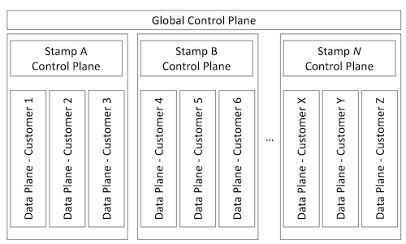
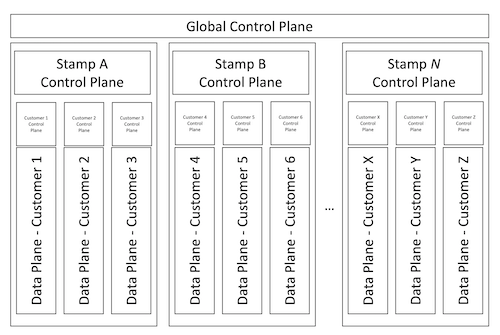

You can think about a multitenant solution as having multiple *planes*, each with separate responsibilities. The *data plane* is how end users and clients interact with the system for its intended purpose. The *control plane* is the component that manages higher level aspects across all tenants such as access control, provisioning, and system maintenance: 

For example, consider a bookkeeping system for managing financial records. Multiple tenants each store their financial records in the system. When end users access the system to view and enter their financial records, they use the *data plane*. This is likely the primary application component for your solution, and your tenants probably think of it as the way to use the system for its intended purpose. The *control plane* is the component that onboards new tenants, creates databases for each tenant, and performs other management and maintenance operations. If the system didn't include a control plane, the administrators would need to run many manual processes instead. Or, the data plane and control plane responsibilities would be mixed together, overcomplicating the solution.

Many complex solutions include control planes. For example, Azure's control plane, [Azure Resource Manager](/azure/azure-resource-manager/management/overview), is a set of APIs, tools, and backend components that are responsible for deploying and configuring Azure resources. The [Kubernetes control plane](https://kubernetes.io/docs/concepts/overview/components/#control-plane-components) manages many concerns, such as the placement of Kubernetes pods on worker nodes. Almost all SaaS (software as a service) solutions have a control plane to work with cross-tenant concerns.

Control planes are critical components to consider when you design your own multitenant solutions. In this article, we discuss the the responsibilities of control planes, and how to scope and design a control plane to meet your needs.

## Responsibilities of a control plane

The responsibilities of a control plane depend on your solution's requirements. There's no single template for a control plane or its responsibilities. In some multitenant solutions, the control plane has wide range of responsibilities and is a complex system in its own right. In other multitenant solutions, the control plane only has basic responsibilities.

In general, a control plane has the following core responsibilities:

- Provisioning and deprovisioning the system resources that the system needs to serve the workload.
- Managing the configuration of each tenant.
- Tracking the tenants who are using the system, and the resources that those tenants are allocated to.

In a simple solution that uses the [fully multitenant tenancy model](tenancy-models.yml#fully-multitenant-deployments), the control plane might simply track tenants and their associated metadata. For example, whenever a new tenant signs up to your service, the control plane could update the appropriate records in a database so that the rest of the system is able to serve the new tenant's requests.

If the solution uses a deployment model that requires tenant-specific infrastructure, such as the [automated single-tenant deployments model](tenancy-models.yml#automated-single-tenant-deployments), then the control plane might have further responsibilities to deploy or reconfigure infrastructure. For example, when a new tenant is onboarded

* In more complex multitenant solutions, it might be responsible for deploying or reconfiguring infrastructure, e.g. creating a new database or even deploying a full set of Azure resources
* Typically controls the tenant lifecycle - onboarding, billing, reconfiguration, offboarding
* Also performs regular automated maintenance operations, e.g. deleting or archiving old data, creating/managing database indexes, rotating keys
* In more complex solutions, a control plane might manage how tenants are allocated to stamps (*placement*), rebalancing stamps, and reconfiguring network traffic routing as required.
* Your solution's control plane likely needs to interact with the control planes for the services you use - e.g. ARM, AKS.
* Control planes provide observability over the tenants' state and performance.
* Interface to or be controlled by external customer management solutions (e.g. Dynamics 365).

## Multiple control planes

Most solutions only need one control plane. However, in a complex environment, you might need to have multiple control planes, each with different areas of responsibility.

### Global control planes

A global control plane is typically responsible for overall management of tenants. For example, tenant onboarding and lifecycle management operations might be triggered by a global control plane.

### Stamp control planes

When you use the [Deployment Stamps pattern](../../../patterns/deployment-stamp.yml) and shard your tenants across stamps, you might find it necessary to have a control plane within each stamp that's responsible for the management of that stamp. A stamp control plane's responsibilities might include the following:

- Creating and managing tenant-specific resources within the stamp, such as databases or storage containers.
- Performing maintenance operations within the stamp, such as database index management and cleanup operations.

A stamp control plane might coordinate with a global control plane. For example, suppose a new tenant signs up. The global control plane might be responsible for *tenant placement*, or assigning a tenant to a stamp. The global control plane can use information like the region of the tenant, the level of utilization of each stamp, and the tenant's service level requirements, to determine which stamp should serve the tenant. Then, the global control plane can instruct the stamp control plane to create the necessary resources for the tenant. The following diagram shows an example of how the two control planes might coexist in a single system:

### Tenant control planes

Tenants might use a tenant-level control plane to manage their own logical or physical resources. A tenant control plane might include the following responsibilities:

- Management of user access and other tenant-specific configuration.
- Tenants can perform maintenance operations, such as backing their data or downloading a previous backup.
- If you allow tenants to [control their own updates](updates.md), the tenant-level control plane could provide the necessary controls.

The following diagram shows a complex system with a global control plane, stamp control planes, and a control plane for each tenant:

## Scope a control plane

* Important decision point is how much effort to spend on a control plane.
* When you're starting out, you might have some of the control plane responsibilities handled by manual processes, but have a system to track your tenants and their configuration.
  * If you're only going to have a small number of tenants, and your team is involved in their onboarding processes directly, then maybe you don't need it - effectively, your team can be your control plane.
  * But they might need to keep track of their tenants, and need to monitor across multiple tenants, then some sort of control plane is probably important.
  * Tip - if you decide not to create a control plane, document your processes thoroughly, and create a library of scripts that you use for your management operations. If/when you need to automate them in future, this will form the basis of your control plane and you won't need to reinvent the wheel.
* In any sort of self-service environment, you likely need a control plane early. You might choose to keep it simple and only automate some of the most commonly used functionality.

## Design a control plane

* Control plane operations are often long-running and coordinate multiple elements. For example, onboarding a new tenant might involve these steps:
    * Deploy a new database (Azure deployment operation, which might take several minutes)
    * Update a tenant catalog (SQL database command)
    * Update a CRM system to tell them about the new tenant (REST API call, which might fail)
* Ensure you use a suitable technlogy for coordinating long-running operations or workflows.
* Resiliency is critical. Think about what happens if your control plane is down. Depending on what it does, you might:
   * Be unable to onboard new tenants or manage existing tenants.
   * Accumulate maintenance issues - e.g. if your solution assumes data cleanup is done nightly and it's not, will disks fill up or performance degrade?
   * Lose access to all tenants, bringing your entire solution down, potentially globally.
* In a fully automated multitenant system, CP will invoke pipelines to run deployments - [here's an example](../approaches/deployment-configuration.yml). Don't need to rebuild a DevOps pipeline inside the CP, but the CP could orchestrate the pipeline.

## Contributors

*This article is maintained by Microsoft. It was originally written by the following contributors.*

Principal author:

 * [John Downs](http://linkedin.com/in/john-downs) | Principal Customer Engineer, FastTrack for Azure

Other contributors:

 * [Bohdan Cherchyk](http://linkedin.com/in/cherchyk) | Senior Customer Engineer, FastTrack for Azure
 * [Landon Pierce](https://www.linkedin.com/in/landon-pierce-a84b37b6) | Customer Engineer, FastTrack for Azure
 * [Daniel Scott-Raynsford](http://linkedin.com/in/dscottraynsford) | Partner Technology Strategist
 * [Arsen Vladimirskiy](http://linkedin.com/in/arsenv) | Principal Customer Engineer, FastTrack for Azure

*To see non-public LinkedIn profiles, sign in to LinkedIn.*

## Next steps

Return to the [architectural considerations overview](overview.yml). Or, review the [Microsoft Azure Well-Architected Framework](/azure/architecture/framework).
