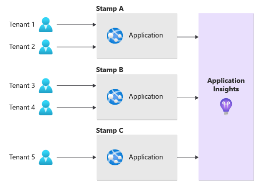
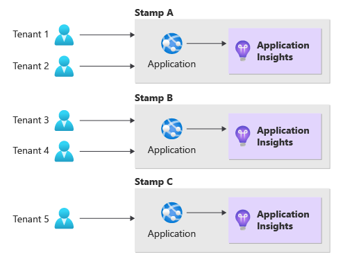

# Azure Application Insights considerations for multitenancy

Application Insights is a service that monitors the performance, availability, and usage of your web applications. It helps you identify and diagnose issues, analyze user behavior, and track key metrics.  In this article, we describe some of the features of Application Insights that are useful when working with multitenanted systems. We link to guidance and examples for how to use Application Insights in a multitenant solution.

> [!TIP]
> Application Insights is designed and optimized for monitoring your solution. It is not meant for capturing every event that happens in a system to be used for auditing or billing purposes. For more information [considerations for measuring consumption in multitenant solutions](/azure/architecture/guide/multitenant/considerations/measure-consumption).

## Isolation models
When working with a multitenant system using Azure Application Insights, you need to make a decision about the level of isolation that you want to use. There are several isolation models you can choose from. Your choice might depend on many questions, such as the following factors:

- How many tenants do you plan to have?
- Do you share your application tier between multiple tenants, or do you deploy separate deployment stamps for each tenant?
- Are you or your customers sensitive about storing data alongside other tenant's data?
- Is the application tier of your solution multitenant but the data tier is single tenant?
- Do telemetry requirements vary between tenants?

The following table summarizes the differences between the main tenancy models for Application Insights:

| Consideration | Global shared Application Insights | Shared Application Insights per region/stamp | Dedicated Application Insights per tenant |
|-|-|-|-|
| **Data isolation** | Low | Low | High |
| **Performance isolation** | Low | Medium | High |
| **Deployment complexity** | Low-medium, depending on the number of tenants | Medium, depending on the number of tenants | High |
| **Operational complexity** | Low |Medium | High |
| **Example scenario** | Large multitenant solution with a shared application tier | Multitenant solution with regional deployments to better serve global customer base | Individual application instances per tenant |

### Global shared Application Insights instance
A single instance of Application Insights can be used to track telemetry for tenants in a multitenant application.  Benefits of this approach include simplified configuration and management of the application given that you have to instrument the application code only once.  Some of the drawbacks of this approach include limits and quotas associated with a single Application Insights instance. Review the [Application Insights limits](/azure/azure-monitor/service-limits#application-insights) to understand whether limits might affect your multitenant application.

In addition, when using a shared Application Insights resource, you may find it more difficult to isolate and filter the data for each tenant, especially if you have a large number of tenants. You may also have security and privacy concerns, as all tenants share the same Log Analytics workspace and instrumentation keys.

In order to address these concerns, you may need to implement extra logic and mechanisms to ensure that data can be filtered by tenant and your operations team, can properly see per-tenant data. Filtering can be accomplished by adding a [custom property](#custom-properties-and-metrics) to capture the tenant ID as part of every telemetry item. The tenant ID can then be used to query the data.

The following diagram illustrates this deployment model:

### Shared Application Insights per stamp
Multitenant solutions often have multiple stamps, which might be deployed in different Azure regions. Stamps can enable you to serve tenants local to that particular region to offer better performance characteristics. A single stamp might serve a single tenant or a subset of your tenants. To learn more about stamps, see [Deployment stamps pattern](../approaches/overview.yml#deployment-stamps-pattern).

You might choose to deploy an Application Insights instance into each stamp, which is shared by all of the tenants using the stamp. This approach provides more flexibility with resource limits given that there are several Application Insights resources to work with across stamps.

The following diagram illustrates this deployment model:

### Dedicated Application Insights resource per tenant
You might consider using a dedicated Application Insights resource for each tenant. This approach gives you more flexibility and control over the tenant's telemetry data, and provides you with the strongest data isolation. You can create different Application Insights resources allowing for configuring tenant specific settings and features. At the same time, it requires you to deploy large number of Application Insights resources, manage tenant specific settings in a tenant catalog, and make application code changes when new tenants are onboarded.  Not that the decision to have a dedicated Application Insights resource per tenant is different from the decision to deploy application tier separately for each tenant.  For example, you can decide to deploy a single application instance in a stamp that is shared by multiple tenants and then have an Application Insights instance for each tenant.

You should consider this approach if you require a high degree of data isolation between your tenants, you need different configuration between tenants, or your needs are above the service limits of a single Application Insights instance.  

You may also have difficulty in aggregating and comparing the data across all tenants, as you need to query multiple Application Insight resources separately. If you follow this approach, consider using [cross-resource queries and Azure Monitor Workbooks](#unify-multiple-application-insights-resources-into-single-view).

The following diagram illustrates this deployment model:

## Features of Application Insights that support multitenancy

### Custom properties and metrics
Application Insights provides a way to enrich the telemetry data with custom properties and metrics. Custom properties are key-value pairs that can be attached to any telemetry item, such as a request or an event. Custom metrics are numerical values that can be tracked over time, such as a queue length or a score. By using custom properties and metrics, customers can add tenant-specific information to the telemetry data, such as tenant ID, tenant name, tenant location, and deployment stamp ID.

There are two ways to add custom properties to your telemetry: using the telemetry client or using telemetry initializers.

#### Telemetry Client
The [telemetry client](/azure/azure-monitor/app/api-custom-events-metrics) is an object that you can use to track any telemetry item. You can access the custom properties of any telemetry item through its `Properties` dictionary. The advantage of using the telemetry client is that you have full control over what custom properties you want to add and when. The disadvantage is that you have to access and modify each telemetry item that you want to enrich with custom properties.
#### Telemetry Initializers
The [telemetry initializer](/azure/azure-monitor/app/api-filtering-sampling?tabs=sdkloaderscript#addmodify-properties-itelemetryinitializer) is used to add additional information to all telemetry, or to modify properties set by the standard telemetry modules.

When you share an Application Insights instance across multiple tenants, the telemetry initializer is often a good place to inject the tenant ID into every telemetry item that can them be used to query and filter for reporting purposes. The advantage of using telemetry initializers is that you can apply custom properties to all or some of the telemetry items in one place without having to write code for each one. The disadvantage is that you have less control over what custom properties you want to add to each telemetry item and you may end up adding unnecessary or redundant data.

By adding custom properties to the telemetry data, using either of the mechanisms, you can use powerful features of Application Insights to monitor and analyze the multitenant application in a more granular and meaningful way. For example:

- They can use Metrics Explorer to create charts and graphs that show the performance and usage of the application for each tenant.
- They can use Analytics to write complex queries that filter, aggregate, and join the telemetry data by tenant-specific properties or metrics.
- They can use Alerts to set up rules that notify them when certain conditions are met or exceeded for a specific tenant.
- They can use Azure Monitor Workbooks to create interactive reports and dashboards that visualize the health and status of the application for each tenant.

### Unify multiple Application Insights resources into single view
There are several ways to unify data from multiple Application Insights resources, depending on your needs and preferences. Here are some of the options.
#### Cross-resource queries

- Using cross-resource queries data can be [queried](/azure/azure-monitor/logs/cross-workspace-query) from multiple Application Insights resources in a single query. The resources can be in same resource group, another resource group, or another subscription. As the number of Application Insights workspaces in a query increase, the query performance may degrade. There's a limit to the number of Application Insights workspaces that can be included in a single query. For more information, see [Query Across Multiple workspaces and apps](/azure/azure-monitor/logs/cross-workspace-query)
#### Azure Monitor workbooks
- [Azure Monitor Workboks](/training/modules/visualize-data-workbooks/) allow you to create interactive reports and dashboards using data from multiple sources, including Application Insights thus providing a way to visualize and analyze data from multiple Application Insights resources in a single view.

## Cost
The main factor that determines the cost of Application Insights is the amount of data that you send to it and how long it's retained. So, the use of dedicated or shared Application Insights instance in a multitenant application doesn't alter the overall cost profile. Review the [Azure Monitor pricing page](https://azure.microsoft.com/pricing/details/monitor/) for more information.
## Latency
The time between the creation of data on the monitored system and its availability for analysis is referred to as [Latency](/azure/azure-monitor/logs/data-ingestion-time). Use of dedicated or shared Application Insights instance in a multitenant application doesn't have any bearing on latency unless the shared instance gets throttled and prevents data from being ingested resulting in increased latency.
## Rate limiting on ingestion
Ingestion rate limiting in Application Insights can be achieved through [sampling](/azure/azure-monitor/app/sampling) based on daily cap on the amount of telemetry data ingested by your service. Sampling helps in preventing Application Insights from throttling telemetry due to ingestion limits. Using fixed-rate sampling, you can determine an optimal sampling rate based on the number of tenants and the daily cap in order to say within the limits.  
## Contributors

*This article is maintained by Microsoft. It was originally written by the following contributors.*
Principal authors:

 * [Raj Nemani](http://linkedin.com/in/rajnemani) | Director, Partner Technology Strategist, GPS-ISV

Other contributors:

* [John Downs](http://linkedin.com/in/john-downs) | Principal Program Manager, MCAPS
* [Arsen Vladimirskiy](http://linkedin.com/in/arsenv) | Principal Customer Engineer, Azure CXP
* [Landon Pierce](http://linkedin.com/in/landon-pierce) | Customer Engineer, Azure CXP
* [Daniel Scott-Raynsford](http://linkedin.com/in/dscottraynsford) | Partner Technology Strategist, OCP

*To see non-public LinkedIn profiles, sign in to LinkedIn.*

## Next steps

- [Training: Monitor Application Performance](/training/modules/monitor-app-performance)
- [What is Application Insights?](/azure/azure-monitor/app/app-insights-overview)

 
## Related resources
- [Application Insights limits](/azure/azure-monitor/service-limits#application-insights)
- [Query Across Multiple workspaces and apps](/azure/azure-monitor/logs/cross-workspace-query)
- [Visualize data combined from multiple data sources by using Azure Workbooks](/training/modules/visualize-data-workbooks)
- [Capture Application Insights custom metrics with .NET and .NET Core](/azure/azure-monitor/app/tutorial-asp-net-custom-metrics)
- [Application Insights API for custom events and metrics](/azure/azure-monitor/app/api-custom-events-metrics)
- [Application Insights telemetry data model](/azure/azure-monitor/app/data-model-complete)
- [Azure Monitor Pricing](https://azure.microsoft.com/pricing/details/monitor/)
- [Log data ingestion time in Azure Monitor](/azure/azure-monitor/logs/data-ingestion-time)
- [Sampling in Application Insights](/azure/azure-monitor/app/sampling)
- [Filtering and preprocess telemetry in the Application SDK](/azure/azure-monitor/app/api-filtering-sampling?tabs=sdkloaderscript)
