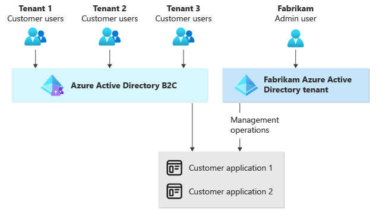
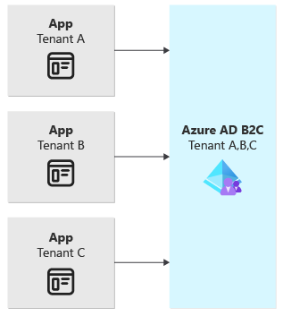
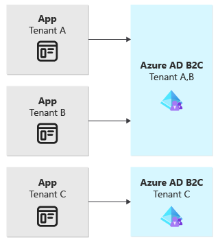
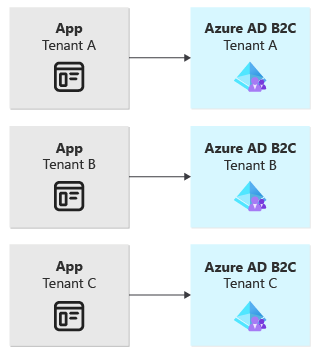

# Azure Active Directory B2C considerations for multitenancy

Azure Active Directory B2C (Azure AD B2C) provides business-to-consumer identity as a service. User identity is typically one of the biggest considerations when designing a multitenant application. Your identity solution serves as the gatekeeper to your application, ensuring your tenants stay within the boundaries that you define for them. In this article, we describe different considerations and approaches for using Azure AD B2C in a multitenant solution.

One of the most common reasons for using Azure AD B2C is to enable [identity federation](/azure/active-directory-b2c/add-identity-provider) for your application. Identity federation is the concept of establishing a trust between two identity providers for the purpose of allowing your users to sign in with a pre-existing account. In the case of Azure AD B2C, you often choose to do this to enable your users to sign in by using their social or enterprise accounts. Federation removes the need for users to create a separate [local account](/azure/active-directory-b2c/identity-provider-local) specific for your application.

If you're new to this topic, we suggest you review the following recommended resources:

- [What is Azure Active Directory B2C?](/azure/active-directory-b2c/overview)
- [Multitenant identity considerations](../considerations/identity.md)
- [Multitenant identity approaches](../approaches/identity.md)
- [Tenancy models](../considerations/tenancy-models.yml)

> [!NOTE]
> In this article, we discuss two similarly named topics: application tenants and Azure AD B2C tenants.
>
> We use the term *application tenant* to refer to **your** tenants, which might be your customers or groups of users.
>
> Azure AD B2C also includes the concept of a tenant to refer to individual directories, and it uses the term *multitenancy* to refer to interactions between multiple Azure AD B2C tenants. Although the terms are the same, the concepts are not. When we refer to an Azure AD B2C tenant in this article, we disambiguate it by using the full term *Azure AD B2C tenant*.

## Identity in multitenant solutions

It is important to understand where Azure AD B2C fits within the broader picture of identity solutions. Azure AD B2C is a customer identity and access management (CIAM) service that is used to manage end-user accounts and access to application(s). [Azure Active Directory](/azure/active-directory/fundamentals/active-directory-whatis) (Azure AD) is an identity and access management (IAM) service that is used to manage internal user accounts and access to application(s).

In many multitenant solutions, it is common to use different types of identity services for different parts of a solution.

For example, your customers would likely need identities of their own to sign in and use the application(s) normally. This would be enabled by using Azure AD B2C. Your internal users also might need to sign in to the application to perform management or other administrative operations. You would likely want them to use their pre-existing enterprise identities for this, which would be enabled by Azure AD. The diagram below illustrates this example:

## Isolation models

When working with Azure AD B2C, you need to decide how you isolate your user accounts between different application tenants.

You need to consider questions like:

- Do you need to federate logins to your customer's identity provider(s)? For example, do you need to enable federation to SAML, Azure Active Directory, social login providers, or other sources?
- Do you, or your tenants, have data residency requirements?
- Does the user need to access more than one application tenant?
- Do you need complex permissions and/or role-based access control (RBAC)?
- Who signs into your application? These are often called your *user personas*.

The following table summarizes the differences between the main tenancy models for Azure AD B2C:

| Consideration | [Shared Azure AD B2C tenant](#shared-azure-ad-b2c-tenant) | [Vertically partitioned Azure AD B2C tenant](#vertically-partitioned-azure-ad-b2c-tenants) | [Azure AD B2C tenant per application tenant](#azure-ad-b2c-tenant-per-application-tenant) |
|---|---|---|---|
| **Data isolation** | Data from each application tenant is stored in the same Azure AD B2C tenant, but only accessible to administrators | Data from each application tenant is stored in several Azure AD B2C tenants, but only accessible to administrators | Data from each application tenant is stored in a dedicated Azure AD B2C tenant, but only accessible to administrators |
| **Deployment complexity** | Low | Medium to high, depending on your partitioning strategy | Very high |
| [**Limits to consider**](/azure/active-directory-b2c/service-limits?pivots=b2c-user-flow#userconsumption-related-limits) | Requests per Azure AD B2C tenant, requests per client IP address | A combination of requests, number of Azure AD B2C tenants per subscription, and number of directories for a single user, depending on your partitioning strategy | Number of Azure AD B2C tenants per subscription, maximum number of directories for a single user |
| **Operational complexity** | Low | Medium to high, depending on your partitioning strategy | Very high |
| **Number of Azure AD B2C tenants required** | 1 | Between 1 and *n*, depending on your partitioning strategy | *n*, where n is equal to the number of application tenants |
| **Example scenario** | You're building a SaaS offering for consumers with low or no data residency requirements, such as a music or video streaming service | You're building a SaaS offering for businesses, such as accounting and record keeping software. You need to support data residency requirements or a large number of custom federated identity providers | You're building a SaaS offering for businesses, such as a government record-keeping software. Your customers mandate a high degree of data isolation from other application tenants |

### Shared Azure AD B2C tenant

Using a single, shared Azure AD B2C tenant is generally the easiest isolation model to manage if your requirements allow for it. There is only one tenant that you must maintain long term and comes with the lowest amount of overhead.

>[!NOTE]
> We recommend using a shared Azure AD B2C tenant for most scenarios.

A shared Azure AD B2C tenant should be considered if the following apply to your scenario:

- You don't have data residency or strict data isolation requirements.
- Your application needs are within the Azure AD B2C [service limits](/azure/active-directory-b2c/service-limits?pivots=b2c-custom-policy#userconsumption-related-limits).
- If you have federated identity providers, you are able to use [home realm discovery](#home-realm-discovery) to automatically select one for a user to sign in with. Or, you are okay with them manually selecting one from a list themselves.
- You have a unified sign-in experience for all application tenants.
- Your end users need access to more than one application tenant under the same account.

The diagram below illustrates the shared Azure AD B2C tenant model:

### Vertically partitioned Azure AD B2C tenants

Provisioning vertically partitioned Azure AD B2C tenants is a strategy designed to minimize the number of Azure AD B2C tenants needed where possible. It is a "middle ground" between the other tenancy models. Vertical partitioning offers greater flexibility in customization between tenants where required, while avoiding the operational overhead of provisioning an Azure AD B2C tenant for every application tenant.

It's important to note that the deployment & maintenance requirements for this tenancy model are still higher than when you use a single Azure AD B2C tenant, but they are lower than if you were to use an Azure AD B2C tenant per application tenant. As such, you will still need to design and implement a deployment and [maintenance](#maintenance) strategy for multiple tenants across your environment.

Vertical partitioning is similar to the [Data Sharding pattern](../../../patterns/sharding.yml). To vertically partition your Azure AD B2C tenants, you need to organize your application tenants into logical groupings, often called a *partitioning strategy*. Your partitioning strategy should be based on a common, stable factor of the application tenant such as region, size, or an application tenant's custom requirements. For example, if your aim is to solve your data residency requirements, you could choose to deploy an Azure AD B2C tenant for each region that contains application tenants. Or, if you group by size, you could choose to have most of your application tenants' identities reside on a single Azure AD B2C tenant, while having your largest application tenants reside on their own dedicated Azure AD B2C tenants.

>[!IMPORTANT]
> Your partitioning strategy should not be based on factors that are volatile or that could change over time, as it is challenging to move users between Azure AD B2C tenants. For example, if you are building a SaaS offering that has multiple SKUs or product tiers, you would not want to partition your users based on the SKU they selected, as that could potentially change if the customer were to upgrade their product.

You should consider provisioning your Azure AD B2C tenants using a vertically partitioned strategy if the following considerations apply to your scenario:

- You have data residency requirements, or you need to separate your users by geography.
- You have a large number of federated identity providers and cannot use [home realm discovery](#home-realm-discovery) to automatically select one for a user to sign in with
- Your application is, or can be, aware of multitenancy and knows which Azure AD B2C tenant your users will need to sign into
- You're concerned about your larger application tenants reaching the [Azure AD B2C limits](/azure/active-directory-b2c/service-limits?pivots=b2c-user-flow).
- You have a long-term strategy planned for deploying and [maintaining](#maintenance) a medium to large number of Azure AD B2C tenants.
- You have a strategy planned for sharding your application tenants between one or more Azure subscriptions to work within the limit on the number of Azure AD B2C tenants that can be deployed within an Azure subscription.

The diagram below illustrates the vertically partitioned Azure AD B2C tenant model:

### Azure AD B2C tenant per application tenant

Provisioning an Azure AD B2C tenant for each application tenant allows you to customize many factors for each tenant. However, this approach comes at the cost of significantly increased overhead. You must consider how you plan for and manage this type of deployment and upkeep long term. You will need to develop a deployment and [maintenance](#maintenance) strategy for a potentially large number of Azure AD B2C tenants.

Additionally, there are several service limits that you must keep in mind. Azure subscriptions enable you to deploy a [limited number](/azure/active-directory-b2c/service-limits?pivots=b2c-user-flow#azure-ad-b2c-configuration-limits) of Azure AD B2C tenants. If you need to deploy more than the limit allows, you need to consider an appropriate [subscription design pattern](../approaches/resource-organization.yml#bin-packing) to allow you to balance your Azure AD B2C tenants across multiple subscriptions. There are other [Azure AD limits](/azure/active-directory/enterprise-users/directory-service-limits-restrictions) that apply as well, such as how many directories a single user can create and how many directories they can belong to.

> [!WARNING]
> Because of the complexity involved in this approach, we strongly recommend that you consider the other isolation models first. This option is included in this article for the sake of completeness, but it's not the right approach for most use cases.
>
> A common misconception is to assume that, because you use the [Deployment Stamps pattern](../../../patterns/deployment-stamp.yml), you need to include identity services within each stamp. This is not necessarily true, and often another isolation model can be used instead. Please proceed with a high level of diligence and clear business justification if you use this isolation model, as the deployment & maintenance overhead is *significant*.

You should only consider provisioning an Azure AD B2C tenant for every application tenant if the following statements apply to your scenario:

- You have strict data isolation requirements between application tenants.
- You have a long-term strategy planned for deploying and [maintaining](#maintenance) a large number of Azure AD B2C tenants.
- You have a strategy for sharding your customers between one or more Azure subscriptions to work within the Azure AD B2C tenant limit per subscription.
- Your application is, or can be, multitenancy-aware, and knows which Azure AD B2C tenant your users will need to sign into
- You need to perform custom configuration for *every* application tenant.
- Your end users don't need access to more than one application tenant by using the same sign in account.

The diagram below illustrates the Azure AD B2C tenant per application tenant model:

## Identity federation

Each unique federated identity provider must be [configured](/azure/active-directory-b2c/user-flow-overview) by using either a user flow or in a custom policy. Typically, during sign-in, the user would select which identity provider they wish to authenticate against. If you're using a shared tenant isolation model or you have a large number of federated identity providers, you should consider using [home realm discovery](#home-realm-discovery) to automatically select an identity provider during sign-in.

Additionally, you can also use identity federation as a tool for managing multiple Azure AD B2C tenants by federating the Azure AD B2C tenants with each other. This allows your application to trust a single Azure AD B2C tenant, and avoids it being aware that your customers are divided between *n* number of Azure AD B2C tenants. This approach is most commonly used in the vertically partitioned isolation model when your users are partitioned by region and has many considerations itself. Refer to the documentation on [global identity solutions](/azure/active-directory-b2c/azure-ad-b2c-global-identity-solutions) for an overview of this approach.

### Home realm discovery

Home realm discovery is the process of automatically selecting a federated identity provider for a user's sign-in event. By automatically selecting the user's identity provider, you avoid prompting the user to manually select a provider.

Home realm discovery is important when you use a shared Azure AD B2C tenant and also enable your customers to bring their own federated identity provider. You likely want to avoid a user having to select from a list of identity providers, because it adds extra complexity to the sign-in process. Also, a user might accidentally select an incorrect provider, which then causes their sign-in attempt to fail.

You can configure home realm discovery based on many different factors. The most common approach is to use the user's email address domain suffix to decide which identity provider they should be signed in with. For example, `user@contoso.com` includes a domain suffix of `contoso.com`, which can be matched to the Contoso federated identity provider.

For more information on the concept, see the Azure AD documentation for [home realm discovery](/azure/active-directory/manage-apps/home-realm-discovery-policy), and see the Azure AD B2C samples GitHub repository for an [example](https://github.com/azure-ad-b2c/samples/tree/master/policies/default-home-realm-discovery) of how to build it in Azure AD B2C.

## Data residency

When provisioning an Azure AD B2C tenant, you select a region for your tenant to be deployed to for [data residency purposes](/azure/active-directory-b2c/data-residency). This selection is important, because this specifies the region that your customer data resides in while at rest. If you have any specific data residency requirements for a subset of your customers, consider using the vertically partitioned strategy.

## Authorization

For a strong identity solution, you not only have to consider *authentication*, but *authorization* as well. There are several approaches in which you can build out an authorization strategy for your application using the Microsoft identity platform. The [AppRoles sample](https://github.com/azure-ad-b2c/api-connector-samples/tree/main/Authorization-AppRoles) demonstrates how to use Azure AD B2C's [application roles](/azure/active-directory/develop/howto-add-app-roles-in-azure-ad-apps) to implement authorization in your application. It also discusses alternative authorization approaches you can take.

There is no single approach to authorization, and you should consider the needs of your application and your customers when deciding on an approach.

## Maintenance

When planning a multitenant deployment of Azure AD B2C, it's important to think about the long-term maintenance of your Azure AD B2C resources. An Azure AD B2C tenant is a resource that you must create, maintain, operate, and secure in a similar fashion to your organizational Azure AD tenant. This list is not exhaustive, but you should consider maintenance of elements including the following:  

- **Tenant governance.** Who will be maintaining the Azure AD B2C tenant? What elevated roles will they need? How will you configure your conditional access and MFA policies for these administrators? How will you monitor the Azure AD B2C tenant long term?
- [**User journey configuration**](/azure/active-directory-b2c/user-flow-overview). How do you deploy changes to your Azure AD B2C tenant(s)? How do you test changes to your user flows or custom policies before deploying them?
- [**Federated identity providers**](#identity-federation). Do you need to add or remove identity providers over time? If you're allowing each of your customers to bring their own identity provider, how do you manage that at scale?
- **App registrations.** Many Azure AD app registrations use a [client secret](/azure/active-directory/develop/quickstart-register-app#add-a-client-secret) or [certificate](/azure/active-directory/develop/quickstart-register-app#add-a-certificate) for authentication. How do you rotate these when necessary?
- [**Policy keys**](/azure/active-directory-b2c/policy-keys-overview?pivots=b2c-custom-policy). If you use custom policies, how do you rotate the policy keys when necessary?
- **User credentials.** How do you manage user information and credentials? What happens if one of your users is locked out or forgets their password and requires administrator intervention?

Remember that these questions must be considered for *every* Azure AD B2C tenant that you deploy. You should also consider how your processes change when you have multiple Azure AD B2C tenants to maintain. For example, deploying custom policy changes to *one* Azure AD B2C tenant manually is easy, but deploying them to *five* manually becomes time-consuming and risky.

### Deployments and DevOps

A well-defined DevOps process helps to minimize the amount of overhead involved in maintaining your Azure AD B2C tenants. It's a good idea to implement a DevOps practice early in your development process. Ideally, you should aim to automate all or most of your maintenance tasks, including deploying changes to your custom policies or user flows. You should also aim to create multiple Azure AD B2C tenants to progressively test changes in lower environments before deploying them to your production tenant(s). Your DevOps pipelines might perform these maintenance activities. You can use the Microsoft Graph API to [programmatically manage your Azure AD B2C tenant(s)](/azure/active-directory-b2c/microsoft-graph-operations).

For more information on automated deployments and management of Azure AD B2C, see the following resources:

- [Azure AD B2C operational best practices](/azure/active-directory-b2c/best-practices#operations)
- [Deploy custom policies with Azure Pipelines](/azure/active-directory-b2c/deploy-custom-policies-devops)
- [Deploy custom policies with GitHub Actions](/azure/active-directory-b2c/deploy-custom-policies-github-action)
- [Custom policy DevOps pipeline sample](https://github.com/azure-ad-b2c/samples/tree/master/policies/devops-pipeline)
- Graph API references:
  - [Custom policy reference](/graph/api/resources/trustframeworkpolicy?view=graph-rest-beta&preserve-view=true)
  - [User flow reference](/graph/api/resources/b2cidentityuserflow?view=graph-rest-beta&preserve-view=true)
  - [App registration reference](/graph/api/resources/application?view=graph-rest-beta&preserve-view=true)
  - [Policy keys reference](/graph/api/resources/trustframeworkkeyset?view=graph-rest-beta&preserve-view=true)

> [!IMPORTANT]
> Some of the endpoints used to manage Azure AD B2C programmatically are not generally available. APIs under the `/beta` version in Microsoft Graph are subject to change at any time, and are subject to prerelease terms of service.

## Compare Azure AD B2B to Azure AD B2C

[Azure AD B2B collaboration](/azure/active-directory/external-identities/what-is-b2b) is a feature within Azure AD External Identities that allows you to invite guest users into your *organizational* Azure AD tenant for collaboration purposes. Typically, you use B2B collaboration when you need to grant an external user, such as a vendor, access to resources within your Azure AD tenant.

Azure AD B2C is also grouped within Azure AD External Identities, but provides a different set of features. It's specifically intended for the customers of your product to use. These users are managed inside a separate Azure AD B2C tenant, which is distinct from your organizational Azure AD tenant.

Depending on your user personas and scenarios, you might need to use Azure AD B2B, Azure AD B2C, or even both at the same time. For example, if your application needs to authenticate multiple types of users, such as staff within your organization, users that work for a vendor, and customers, all within the same app, you could use both Azure AD B2B and Azure AD B2C to achieve this requirement.

Here are some additional resources to review for more information on this subject:

- [Use Azure AD or Azure AD B2C](../approaches/identity.md#use-azure-ad-or-azure-ad-b2c)
- [Comparing External Identities feature sets](/azure/active-directory/external-identities/external-identities-overview#comparing-external-identities-feature-sets)
- [Woodgrove Demo](https://aka.ms/CIAMdemo) - An example application that uses Azure AD B2B and Azure AD B2C.

## Contributors

*This article is maintained by Microsoft. It was originally written by the following contributors.*

Principal author:

- [Landon Pierce](https://www.linkedin.com/in/landon-pierce/) | Customer Engineer, FastTrack for Azure

Other contributors:

- [Michael Bazarewsky](https://www.linkedin.com/in/mikebaz/) | Senior Customer Engineer, FastTrack for Azure
- [John Downs](https://www.linkedin.com/in/john-downs) | Principal Customer Engineer, FastTrack for Azure
- [Jelle Druyts](https://www.linkedin.com/in/jelle-druyts-0b76823/) | Principal Customer Engineer, FastTrack for Azure
- [Simran Jeet Kaur](https://www.linkedin.com/in/sjkaur/) | Customer Engineer, FastTrack for Azure
- [LaBrina Loving](https://www.linkedin.com/in/chixcancode/) | Principal Customer Engineering Manager, FastTrack for Azure
- [Arsen Vladimirsky](https://www.linkedin.com/in/arsenv/) | Principal Customer Engineer, FastTrack for Azure

## Next steps and other resources

- [Azure AD B2C custom policy samples](https://github.com/azure-ad-b2c/samples)
- [Microsoft Authentication Library (MSAL)](/azure/active-directory/develop/msal-overview)
- [Tutorial: Create an Azure AD B2C tenant](/azure/active-directory-b2c/tutorial-create-tenant)
- [Azure AD B2C Authentication protocols](/azure/active-directory-b2c/protocols-overview)
- [Azure AD B2C limitations](https://github.com/AzureAD/microsoft-identity-web/wiki/b2c-limitations)
