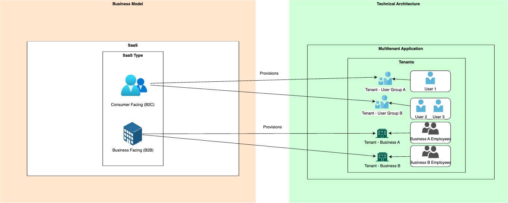
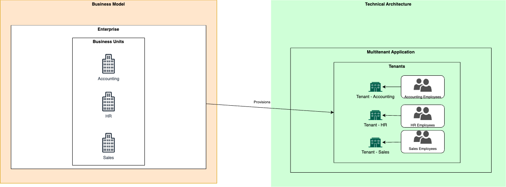

# SaaS and multitenant solution architecture

Software-as-a-Service (SaaS) is a business model that enables an organization to deliver its software to customers quickly and efficiently. Many independent software vendors (ISVs) are migrating away from providing software that a customer has to install and manage themselves to a SaaS model due to the greater customer experience and lower overhead that it provides. This series of articles provides guidance and resources for organizations that build software as a service (SaaS), including startups. It also provides extensive guidance about architecting multitenant solutions on Azure.

## Key concepts

The key concepts found in this article are *SaaS*, *startups*, and *multitenancy*. These terms are related, and often mistakenly used interchangeably, but it is important to understand that they are distinct. SaaS and startup are business concepts, and multitenancy is an architecture concept.

**SaaS is a business model.** An organization can choose to provide their software product as a service to their customers. Commonly, SaaS products are sold to businesses (business-to-business, or B2B), or to consumers (business-to-consumer, or B2C). SaaS products are distinct from products that customers install and manage themselves. Many SaaS solutions use a multitenant architecture, but some don't. SaaS solutions might also use different multitenancy models or approaches.

**Startups are businesses in an early stage of their lifecycle.** Many software startups build SaaS solutions, but some might provide software in other ways instead. Startups often have specific concerns, including rapid innovation, finding a product and market fit, and anticipating scale and growth.

**Multitenancy is a way of architecting a solution to share components between multiple customers, or *tenants*.** Multitenant architectures are frequently used in SaaS solutions, but there are also some places where they're used outside of SaaS, such as in enterprises who build a platform for multiple business units to share. Multitenancy doesn't imply that every component in a solution is shared. Rather, it implies that at least *some* components of a solution are reused across multiple tenants. How you [define a tenant](../multitenant/considerations/tenancy-models.yml#define-a-tenant) and pick a [tenancy model](../multitenant/considerations/tenancy-models.yml#common-tenancy-models) will heavily depend on if your business model is B2C SaaS, B2B SaaS, or you are an enterprise.

This diagram illustrates the differences between these concepts for an organization with a SaaS business model:

This diagram illustrates the concept of multitenancy as it related to an enterprise business model:

You can see that the main difference between the two diagrams is the business model itself, which ultimately influences how you define a tenant in the context of your business. The design choices that you make for the underlying multitenant architecture will also be influenced by your business model, as well as your choice in defining a tenant, but the principals of multitenancy always remain the same.

## Next steps

- [Plan your own journey to SaaS](plan-journey-saas.md)
- [Understand how startups architect their solutions](../startups/startup-architecture.md)
- [Learn about multitenant architectural approaches](../multitenant/overview.md)
