# Azure mainframe and midrange architecture concepts and patterns

Mainframe and midrange  hardware is composed of a family of systems from various vendors (all with a history and goal of high performance, high throughput, and sometimes high availability). These systems were often _scale-up_ and monolithic, meaning they were a single, large frame with multiple processing units, shared memory, and shared storage.

On the application side, programs were often written in one of two flavors: either transactional or batch. In both cases, there were a variety of programming languages that were used, including COBOL, PL/I, Natural, Fortran, REXX, and so on.  Despite the age and complexity of these systems, there are many migration pathways to Azure.

On the data side, data is usually stored in files and in databases. Mainframe and midrange databases commonly come in a variety of possible structures, such as relational, hierarchical, and network, among others. There are different types of file organizational systems, where some of them can be indexed and can act as a key-value stores. Further, data encoding in mainframes can be different from the encoding usually handled in non-mainframe systems. Therefore, data migrations should be handled with upfront planning. There are many options for migrating to the Azure data platform.

## Migrating legacy systems to Azure

In many cases, mainframe, midrange, and other server-based workloads can be replicated in Azure with little to no loss of functionality. Sometimes users do not notice changes in their underlying systems. In other situations, there are options for refactoring and re-engineering the legacy solution into an architecture that is in alignment with the cloud. This is done while still maintaining the same or very similar functionality. The architectures in this content set (plus the additional white papers and other resources provided below) will help guide you through this process.

## Mainframe and midrange concepts

In our mainframe architectures, we use the following terms.

### Mainframes

_Mainframes_ were designed as scale-up servers to run high-volume online transactions and batch processing in the late 1950s. As such, mainframes have software for online transaction forms (sometimes called green screens) and high-performance I/0 systems, for processing the batch runs. Mainframes have a reputation for high reliability and availability, in addition to their ability to run online and batch jobs.

#### Mainframe storage

Part of demystifying mainframes involves decoding various overlapping terms. For example, central storage, real memory, real storage, and main storage generally all refer to storage that is attached directly to the mainframe processor.  Mainframe hardware includes processors and many other devices, such as direct-access storage devices (DASDs), magnetic tape drives, and several types of user consoles. Tapes and DASDs are used for system functions and by user programs.

_Types of physical storage:_
* **Central storage**. Located directly on the mainframe processor, it's also known as _processor storage_ or _real storage_. 
* **Auxiliary storage**. Located separately from the mainframe, it includes storage on DASDs, which is also known as _paging storage_.

#### MIPS

The measurement of millions of instructions per second (MIPS) provides a constant value of the number of cycles per second, for a given machine. MIPS are used to measure the overall compute power of a mainframe. Mainframe vendors charge customers, based on MIPS usage. Customers can increase mainframe capacity to meet specific requirements. IBM maintains a [processor capacity index](https://www-01.ibm.com/servers/resourcelink/lib03060.nsf/pages/lsprITRzOSv2r1?OpenDocument), which shows the relative capacity across different mainframes.

The table below shows typical MIPS thresholds across small, medium, and large enterprise organizations (SORGs, MORGs, and LORGs).

|Customer size |Typical MIPS usage |
|--------------|-------------------|
|SORG          |Less than 500 MIPS |
|MORG          |500 MIPS to 5,000 MIPS|
|LORG          |More than 5,000 MIPS|

#### Mainframe data

Mainframe data is stored and organized in a variety of ways, from relational and hierarchical databases to high throughput file systems. Some of the common data systems are z/OS Db2 for relational data and IMS DB for hierarchical data. For high throughput file storage, you might see VSAM (IBM Virtual Storage Access Method). The following table provides a mapping of some of the more common mainframe data systems, and their possible migration targets into Azure.

| Data source	|Target platform in Azure|
|---------------|------------------------|
|z/OS Db2 & Db2 LUW |Azure SQL DB, SQL Server on Azure VMs, Db2 LUW on Azure VMs, Oracle on Azure VMs, Azure Database for PostgreSQL|
|IMS DB	            |Azure SQL DB, SQL Server on Azure VMs, Db2 LUW on Azure VMs, Oracle on Azure VMs, Azure Cosmos DB|
|Virtual Storage Access Method (VSAM), Indexed Sequential Access Method (ISAM), other flat files |	Azure SQL DB, SQL Server on Azure VMs, Db2 LUW on Azure VMs, Oracle on Azure VMs, Azure Cosmos DB|
|Generation Date Groups (GDGs)	|Files on Azure using extensions in the naming conventions to provide similar functionality to GDGs|

### Midrange systems, Unix variants, and other legacy systems

Midrange systems and midrange computers are loosely defined terms for a computer system that is more powerful than a general-purpose personal computer, but less powerful than a full-size mainframe computer. In most instances, a midrange computer is employed as a network server, when there are a small to medium number of client systems. The computers generally have multiple processors, a large amount of random access memory (RAM), and large hard drives. Additionally, they usually contain hardware that allows for advanced networking, and ports for connecting to more business-oriented peripherals (such as large-scale data storage devices).

Common systems in this category include AS/400 and the IBM i and p series. Unisys also has a collection of midrange systems.

#### Unix operating system

The Unix operating system was one of the first enterprise-grade operating systems. Unix is the base operating system for Ubuntu, Solaris, and operating systems that follow POSIX standards. Unix was developed in the 1970s by Ken Thompson, Dennis Ritchie, and others at AT&T Laboratories. It was originally meant for programmers who are developing software, rather than non-programmers. It was distributed to government organizations and academic institutions, both of which led Unix to being ported to a wider variety of variations and forks, with different specialized functions. Unix and its variants (such as AIX, HP-UX, and Tru64) are commonly found running on legacy systems, such as IBM mainframes, AS/400 systems, Sun Sparc, and DEC hardware-based systems.

#### Other systems

Other legacy systems include the family of systems from Digital Equipment Corporation (DEC), such as the DEC VAX, DEC Alpha, and DEC PDP. The DEC systems initially ran the VAX VMS operating system, then eventually they moved to Unix variants, such as Tru64. Other systems include ones that are based on the PA-RISC architecture, such as the HP-3000 and HP-9000 systems.

#### Midrange data and storage

Midrange data is stored and organized in variety of ways, from relational and hierarchical databases, to high throughput file systems. Some of the common data systems are Db2 for i (for relational data), and IMS DB for hierarchical data. The following table provides a mapping of some of the more common mainframe data systems and the possible migration targets into Azure.

|Data source             |Target platform in Azure |
|------------------------|-------------------------|
|Db2 for i   |Azure SQL DB, SQL Server on Azure VMs, Azure Database for PostgreSQL, Db2 LUW on Azure VMs, Oracle on Azure VMs|
|IMS DB      |Azure SQL DB, SQL Server on Azure VMs, Db2 LUW on Azure VMs, Oracle on Azure VMs, Azure Cosmos DB|

#### Endianness

Consider the following details about endianness:

- RISC and x86 processors differ in _endianness_, a term used to describe how a system stores bytes in computer memory.  
- RISC-based computers are known as big endian systems, because they store the most significant (“big”) value first—that is, in the lowest storage address.  
- Most Linux computers are based on the x86 processor, which are little endian systems, meaning they store the least significant (“little”) value) first. 

The following figure visually shows you the difference between big endian and little endian.

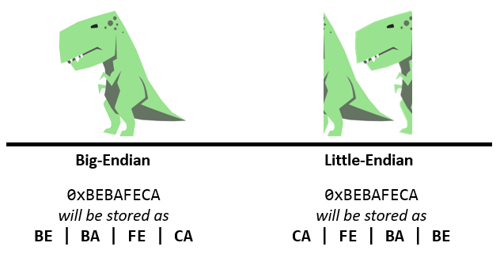

## High-level architectural types

### Rehost

Often referred to as a lift-and-shift migration, this option doesn't require code changes. You can use it to quickly migrate your existing applications to Azure. Each application is migrated as is, to reap the benefits of the cloud (without the risk and cost that are associated with code changes).

#### Rehost architectures

<ul class="grid">

[!INCLUDE [Migrate IBM mainframe applications to Azure with TmaxSoft OpenFrame](../../includes/cards/migrate-mainframe-apps-with-tmaxsoft-openframe.md)]

</ul>

| | |
|-|-|
|Stromasys Charon-SSP Solaris emulator on Azure VMs  |Migrate IBM mainframe applications to Azure with TmaxSoft OpenFrame |
|Unisys ClearPath Forward mainframe rehost to Azure using Unisys virtualization  |Using LzLabs Software Defined Mainframe (SDM) in an Azure VM deployment |

### Refactor

Refactoring requires minimal changes to applications. This often enables the application architecture to leverage Azure platform as a service (PaaS) and to leverage additional cloud offerings. For example, you could migrate compute components of existing applications to Azure App Service or to Azure Kubernetes Service (AKS).  You could also refactor relational and nonrelational databases into various options, such as Azure SQL Managed Instance, Azure Database for MySQL, Azure Database for PostgreSQL, and Azure Cosmos DB.

#### Refactor architectures

|Example | |
|-|-|
|IBM z/OS mainframe migration with Asysco AMT [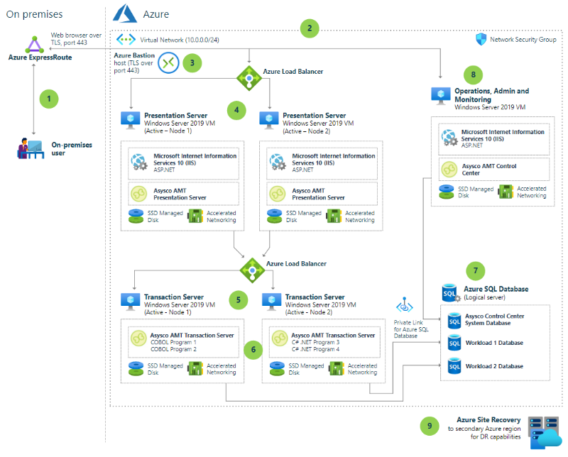](../example-scenario/mainframe/asysco-zos-migration.yml)|Micro Focus Enterprise Server on Azure VMs [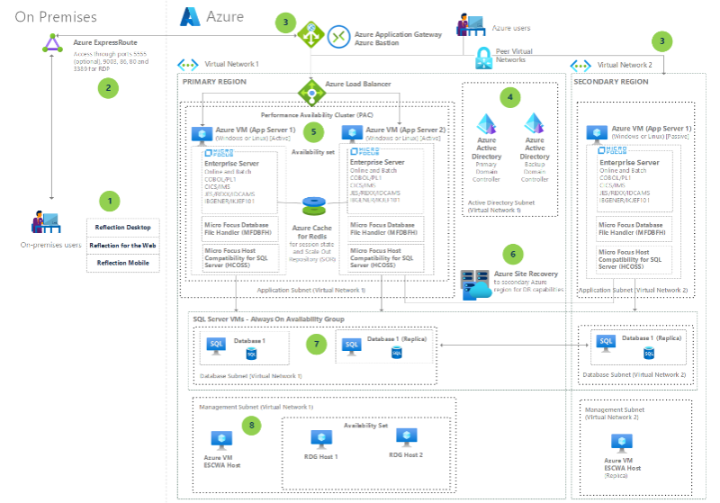](../example-scenario/mainframe/micro-focus-server.yml)|
|Refactor IBM z/OS mainframe Coupling Facility (CF) to Azure [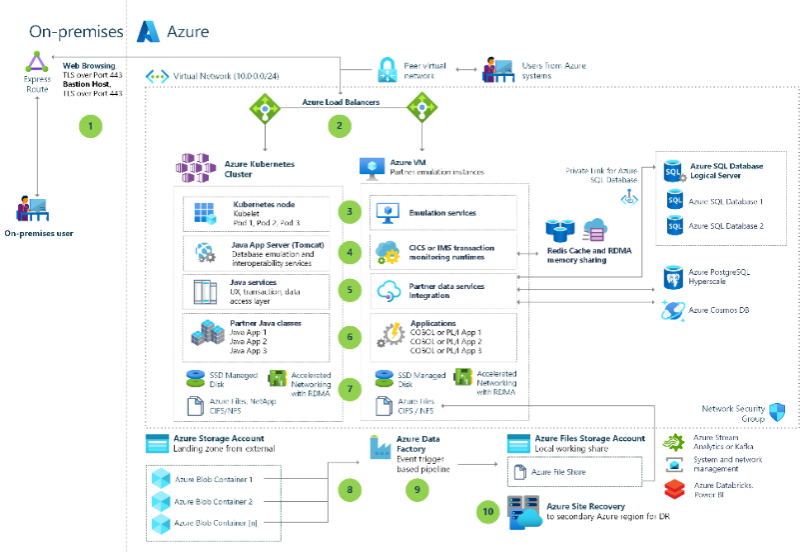](/azure/architecture/reference-architectures/zos/refactor-zos-coupling-facility)|Unisys Dorado mainframe migration to Azure with Astadia & Micro Focus |
|Unisys mainframe migration with Asysco |IBM System i to Azure using Infinite i [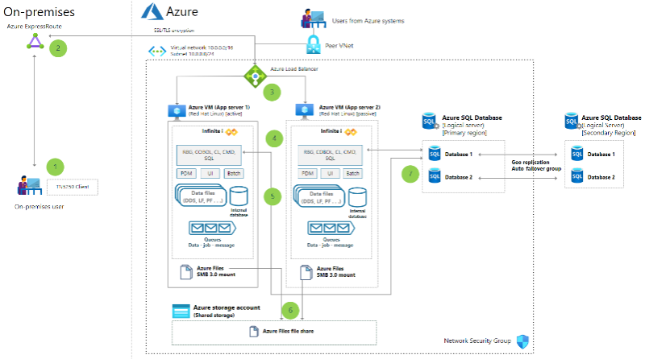](../example-scenario/mainframe/ibm-system-i-azure-infinite-i.yml)|
|Refactor mainframe applications to Azure with Raincode compilers | |

### Re-engineer

Re-engineering for migration focuses on modifying and extending application functionality and the code base to optimize the application architecture for cloud scalability.  For example, you could break down a monolithic application into a group of microservices that work together and scale easily.  You could also rearchitect relational and nonrelational databases to a fully managed database solution, such as SQL Managed Instance, Azure Database for MySQL, Azure Database for PostgreSQL, and Azure Cosmos DB.

#### Re-engineer architectures

| | |
|-|-|
|High-volume batch transaction processing |Integrate IBM mainframe and midrange message queues with Azure [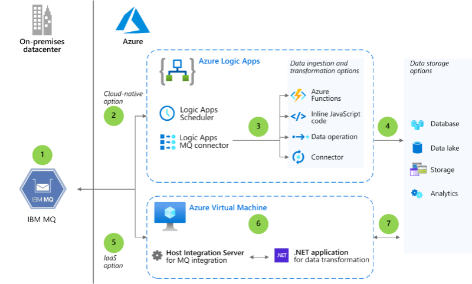](../example-scenario/mainframe/integrate-ibm-message-queues-azure.yml)|

### Dedicated hardware

Another pattern for migrations into Azure (for legacy systems) is what is known as _dedicated hardware_. This pattern is where legacy hardware (such as IBM Power Systems) runs inside the Azure datacenter, with an Azure managed-service wrapping around the hardware, which enables easy cloud management and automation. Further, this hardware is available to connect to and use with other Azure IaaS and PaaS services.

#### Dedicated hardware architectures

| | |
|-|-|
|Migrate AIX workloads to Skytap on Azure [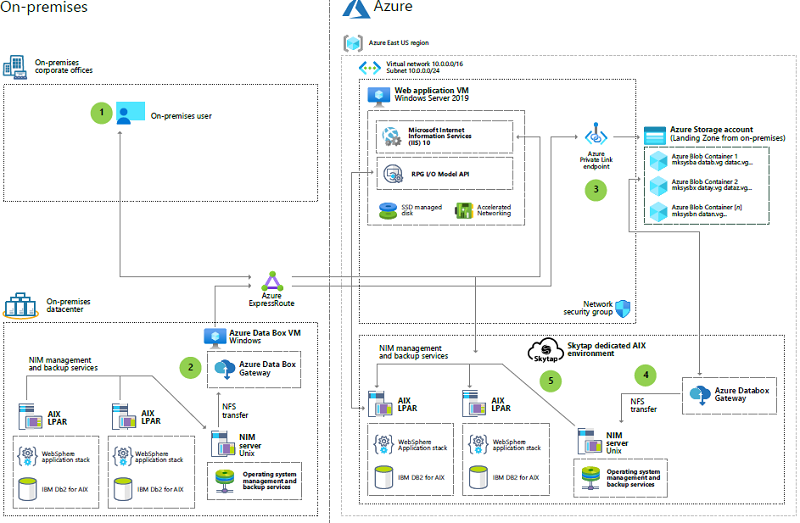](../example-scenario/mainframe/migrate-aix-workloads-to-skytap.yml)|Migrate IBM i series applications to Skytap on Azure [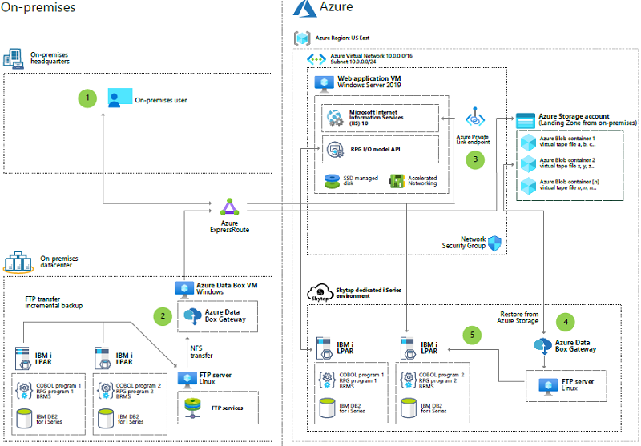](../example-scenario/mainframe/migrate-ibm-i-series-applications.yml)|

### Data movement and migration

A key part of legacy migrations and transformations to Azure is consideration for data. This can include not only data movement, but also data replication and synchronization.

### Data movement and migration architectures

<ul class="grid">

[!INCLUDE [Modernize mainframe and midrange data](../../includes/cards/modernize-mainframe-data-to-azure.md)]

</ul>

| | |
|-|-|
|Modernize mainframe & midrange data [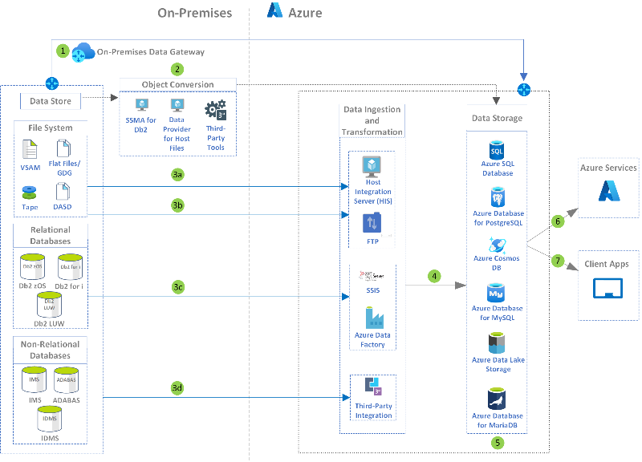](../reference-architectures/migration/modernize-mainframe-data-to-azure.yml)|Replicate and sync mainframe data in Azure [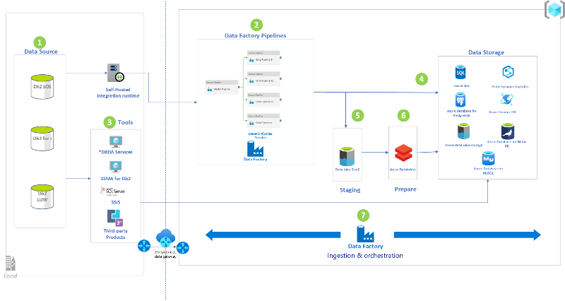](../reference-architectures/migration/sync-mainframe-data-with-azure.yml)|
|Mainframe access to Azure databases [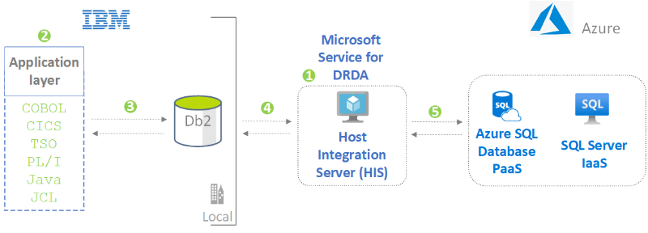](../solution-ideas/articles/mainframe-access-azure-databases.yml)|Mainframe file replication and sync on Azure [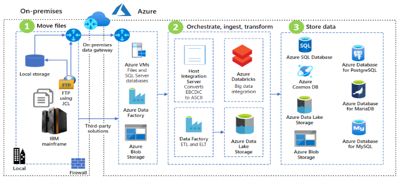](../solution-ideas/articles/mainframe-azure-file-replication.yml)|

## Next steps

- For more information, please contact [legacy2azure@microsoft.com](mailto:legacy2azure@microsoft.com).
- See the [Microsoft Azure Well-Architected Framework](../framework/index.md).

## Related resources

The white papers, blogs, webinars, and other resources are available to help you on your journey, to understand the pathways to migrate legacy systems into Azure:

### Whitepapers

- [Stromasys Charon-SSP Solaris Emulator: Azure Setup Guide](https://azure.microsoft.com/resources/stromasys-charon-ssp-solaris-emulator-azure-setup-guide)
- [Stromasys legacy server emulation on Azure: Running applications designed for SPARC, Alpha, VAX, PDP-11, and HP 3000](https://azure.microsoft.com/resources/stromasys-legacy-server-emulation-on-azure-running-applications-designed-for-sparc-alpha-vax-pdp-11-and-hp-3000)
- [Deploy Db2 pureScale on Azure (Whitepaper)](https://azure.microsoft.com/resources/stromasys-legacy-server-emulation-on-azure-running-applications-designed-for-sparc-alpha-vax-pdp-11-and-hp-3000)
- [Install IBM DB2 pureScale on Azure (Azure Docs)](/azure/virtual-machines/linux/ibm-db2-purescale-azure?toc=/azure/virtual-machines/workloads/mainframe-rehosting/toc.json)
- [Demystifying mainframe to Azure migration](https://azure.microsoft.com/resources/demystifying-mainframe-to-azure-migration)
- [Microsoft Azure Government cloud for mainframe applications](https://azure.microsoft.com/resources/microsoft-azure-government-cloud-for-mainframe-applications)
- [Set up Micro Focus Enterprise Server 4.0 and Enterprise Developer 4.0 in Azure](https://techcommunity.microsoft.com/t5/azure-global/set-up-micro-focus-enterprise-server-4-0-and-enterprise/ba-p/306502)
- [Set up IBM Z Development and Test Environment 12.0 in Azure](https://techcommunity.microsoft.com/t5/azure-global/set-up-ibm-z-development-and-test-environment-12-0-in-azure/ba-p/306506)
- [Move mainframe compute and storage to Azure](https://azure.microsoft.com/resources/move-mainframe-compute-and-storage-to-azure)
- [E-Book: Install TmaxSoft OpenFrame on Azure](https://azure.microsoft.com/resources/install-tmaxsoft-openframe-on-azure)

### Webinars

- [Angelbeat - Retail Industry Legacy Webinar](https://youtu.be/UXgcz94d_1s)
- [Mainframe Transformation to Azure](https://www.youtube.com/watch?v=30um4RI1c_M&list=PLW5Fjy7MTRY74fcCN5Z4S9VvgFuQZunf5&index=2)
- [Mainframe Transformation: Azure is the New Mainframe](https://www.astadia.com/videos/mainframe-modernization-to-microsoft-azure-with-bob-ellsworth-live-stream)
- [ClearPath MCP Software Series For Azure](https://www.youtube.com/watch?v=TPe8fBCgQ7k&feature=youtu.be)
- [Leverage the Power of Azure with Steve Read](https://www.astadia.com/podcast/leverage-the-power-of-azure-with-steve-read)
- [Carahsoft - Monolithic Mainframe to Azure Gov Cloud The USAF Journey](https://www.carahsoft.com/learn/event/27813-Monolithic-Mainframe-to-Azure-Gov-Cloud--The-USAF-Journey)
- [Carahsoft - Topics in Government Mainframe Transformation to Azure Gov Cloud](https://www.carahsoft.com/learn/event/27405-Topics-in-Government-Mainframe-Transformation-to-Azure-Gov-Cloud)
- [Skytap on Azure Webinar](https://info.microsoft.com/ww-ondemand-migrate-traditional-workloads-with-skytap-on-azure.html)
- [Bridge to Application Modernization: Virtualized SPARC/PA-RISK/DEC to Azure ](https://whitepapers.theregister.com/paper/view/11086/legacy-server-emulation-on-azure)

### Blog posts

- [Running Micro Focus Enterprise Server 4.0 in a Docker Container in Azure](https://techcommunity.microsoft.com/t5/azure-global/running-micro-focus-enterprise-server-4-0-in-a-docker-container/ba-p/358622)
- [Deploy Micro Focus Enterprise Server 4.0 to AKS](https://techcommunity.microsoft.com/t5/azure-global/deploy-micro-focus-enterprise-server-4-0-to-aks/ba-p/513042)
- [Migrating iSeries (AS/400) Legacy Applications to Azure](https://techcommunity.microsoft.com/t5/azure-global/migrating-iseries-as-400-legacy-applications-to-azure/ba-p/874758)
- [Migrating iSeries (AS/400) Legacy Applications to Azure with Infinite](https://techcommunity.microsoft.com/t5/azure-global/migrating-iseries-as-400-legacy-applications-to-azure-with/ba-p/874726)
- [Migrating AIX Workloads to Azure: Approaches and Best Practices](https://techcommunity.microsoft.com/t5/azure-global/migrating-aix-workloads-to-azure-approaches-and-best-practices/ba-p/1085983)
- [Using Containers for Mainframe Modernization](https://techcommunity.microsoft.com/t5/azure-global/using-containers-for-mainframe-modernization/ba-p/775841)
- [Deploying NTT Data UniKix in Azure, Part 1 Deploying the VM](https://techcommunity.microsoft.com/t5/azure-global/deploying-ntt-data-unikix-in-azure-part-1-deploying-the-vm/ba-p/775840)
- [MIPS Equivalent Sizing for IBM CICS COBOL Applications Migrated to Microsoft Azure](https://techcommunity.microsoft.com/t5/azure-global/mips-equivalent-sizing-for-ibm-cics-cobol-applications-migrated/ba-p/731665)
- [Set up Micro Focus Enterprise Server 4.0 and Enterprise Developer 4.0 in Azure](https://techcommunity.microsoft.com/t5/azure-global/set-up-micro-focus-enterprise-server-4-0-and-enterprise/ba-p/306502)
- [Set up IBM Z Development and Test Environment 12.0 in Azure](https://techcommunity.microsoft.com/t5/azure-global/set-up-ibm-z-development-and-test-environment-12-0-in-azure/ba-p/306506)

### Customer stories
Different industries are migrating from legacy mainframe and midrange systems in innovative and inspiring ways. Following are a number of customer case studies and success stories:

- [Mainframe to Azure: A Real World Modernization Case Study (GEICO and AIS)](https://www.ais.com/mainframe-to-azure-a-real-world-modernization-case-study)
- [Jefferson County, Alabama](https://www.jccal.org/Default.asp?ID=2096&pg=Mainframe%20Migration)
- [Customer Technical Story: Actuarial Services Company - DEC Alpha to Azure using Stromasys](https://customers.microsoft.com/story/786886-legacy-alpha-application-gets-a-new-life-as-saas-on-microsoft-azure)
- [TRASMEDITERRANEA ACCIONA: FULL STEAM AHEAD - Freight company moves to the cloud with Visual COBOL](https://www.microfocus.com/media/success-story/trasmediterranea-acciona_tcm6-210848.pdf)
- [Astadia & USAF Complete Mission-Critical Mainframe-to-Cloud Migration | Business Wire](https://www.businesswire.com/news/home/20210504005086/en/Astadia-USAF-Complete-Mission-Critical-Mainframe-to-Cloud-Migration)
- [United States Air Force | Case Study (astadia.com)](https://www.astadia.com/case-studies/united-states-air-force)
