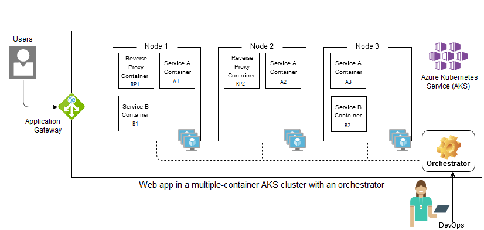

# Container orchestration for microservices

Microservices architectures typically package and deploy each microservice instance inside a single container. Many instances of the microservices might be running, each in a separate container.  Containers are lightweight and short-lived, making them easy to create and destroy, but difficult to coordinate and communicate between.

This article discusses the challenges of running a containerized microservices architecture at production scale, and how container orchestration can help. The article presents several Azure container orchestration options.

## Containerized microservices architecture

In this simple containerized Azure Kubernetes Service (AKS) cluster:

- One Microservice A instance is running in Node 1, another instance in Node 2, and a third instance in Node 3.
- One instance of Microservice B is running in Node 1, and another instance in Node 3.
- Containerized [reverse proxy servers](https://www.magalix.com/blog/implemeting-a-reverse-proxy-server-in-kubernetes-using-the-sidecar-pattern) are running in Nodes 1 and 2 to distribute traffic.

To manage the cluster, a DevOps team has to:

- Run multiple container instances in each node.
- Load balance traffic between the instances.
- Manage communication between dependent instances in separate nodes.
- Maintain the desired AKS cluster state.

With container orchestration, the DevOps team can represent the cluster's desired state as a configuration. A container orchestration engine enforces the desired configuration and automates all the management tasks.

Consider containerizing a simple three-tier web application:

- A container hosts the front-end component.
- Another container hosts the middle tier or REST API layer.
- The middle tier layer communicates with a globally distributed database.

Running these containers on a single development machine might not be too hard. However, running the application in high availability mode at scale in a production cluster quickly becomes challenging. Container orchestration is crucial for large and dynamic production environments.

## Advantages of container orchestration

The following example shows how container orchestration can help manage cluster deployment, networking, and scaling.

The container orchestrator:

- Automatically scales the number of microservice instances, based on traffic or resource utilization. In the example, the orchestrator automatically adds another Microservice A instance in response to increased traffic.

- Manages the containers to reflect the configured desired state. In the example, Microservice B is configured to have two instances. One instance has become unhealthy, so the orchestrator maintains the desired state by creating another instance.

- Wraps the containers for each microservice in a simple service layer. The service layer:
  
  - Abstracts out complexities like IP address, port, and number of instances.
  - Load balances traffic between microservice instances.
  - Supports easy communication between dependent microservice instances.

Container orchestrators also provide flexibility and traffic control to:

- Release new versions or roll back to old versions of microservices or sets of microservices, without downtime.
- Enable side by side testing of different microservice versions.

## Choose an Azure container orchestrator

Here are some options for implementing microservices container orchestration in Azure:

- [Azure Kubernetes Service (AKS)](https://azure.microsoft.com/services/kubernetes-service/) is a fully managed [Kubernetes](https://kubernetes.io/) container orchestration service in Azure that simplifies deployment and management of containerized applications. AKS provides elastic provisioning, fast end-to-end deployment, and advanced identity and access management.

- [Azure Service Fabric](https://azure.microsoft.com/services/service-fabric/) is a container orchestrator for deploying and managing microservices across a cluster of machines. The lightweight Service Fabric runtime supports building stateless and stateful microservices.
  
  A key Service Fabric differentiator is its robust support for building stateful services.  You can use the built-in stateful services programming model, or run containerized stateful services written in any language or code.

- [Azure Container Instances (ACI)](https://azure.microsoft.com/services/container-instances/) is the quickest and simplest way to run a container in Azure. With ACI, you don't have to manage virtual machines or adapt higher-level services.
  
  For simple orchestration scenarios, you can use [Docker Compose](https://docs.docker.com/compose/) to define and run a multi-container application locally. Then, deploy the Docker containers as an ACI container group in a managed, serverless Azure environment. For full container orchestration scenarios, ACI can integrate with AKS to create virtual nodes for AKS orchestration.

- [Azure Spring Cloud](https://azure.microsoft.com/services/spring-cloud/) is an enterprise-ready, fully managed service for [Spring Boot](https://spring.io/projects/spring-boot) apps. With Spring Cloud, you can focus on building and running apps without having to manage infrastructure. Spring Cloud comes with built-in lifecycle and orchestration management, ease of monitoring, and full integration with Azure.

- [Azure Red Hat OpenShift (ARO)](https://azure.microsoft.com/services/openshift/) supports deployment of fully managed [OpenShift](https://www.openshift.com/) clusters on Azure. Running Kubernetes production containers requires integration with frameworks and tools like image registries, storage management, monitoring, and DevOps. ARO extends Kubernetes by combining these components into a single container platform as a service (PaaS).

## Next steps

- [Microservices architecture on Azure Kubernetes Service (AKS)](/azure/architecture/reference-architectures/containers/aks-microservices/aks-microservices)
- [Advanced Azure Kubernetes Service (AKS) microservices architecture](/azure/architecture/reference-architectures/containers/aks-microservices/aks-microservices-advanced)
- [Microservices with AKS and Azure DevOps](/azure/architecture/solution-ideas/articles/microservices-with-aks)
- [Use API gateways in microservices](gateway.md)
- [Monitor a microservices architecture in AKS](../logging-monitoring.md)
- [Microservices architecture on Azure Service Fabric](/azure/architecture/reference-architectures/microservices/service-fabric)
- [Azure Spring Cloud reference architecture](/azure/spring-cloud/reference-architecture)

## Related resources

- [Build microservices on Azure](/azure/architecture/microservices/)
- [Design a microservices architecture](index.md)
- [Design patterns for microservices](patterns.md)
- [Microservices architectural style](/azure/architecture/guide/architecture-styles/microservices)
- [Azure Kubernetes Service solution journey](/azure/architecture/reference-architectures/containers/aks-start-here)

