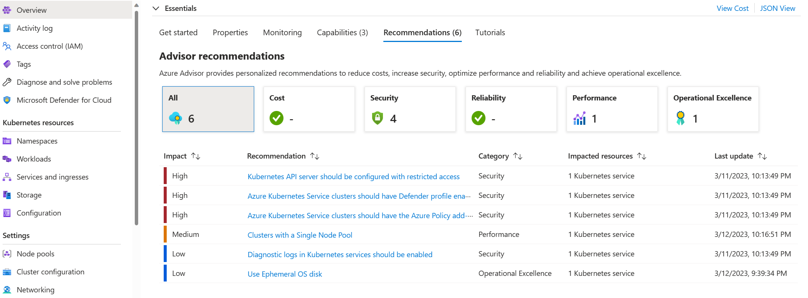
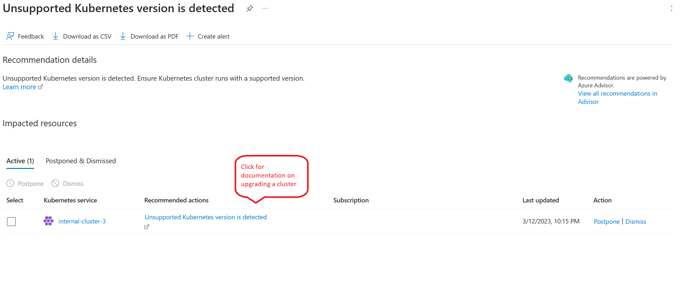
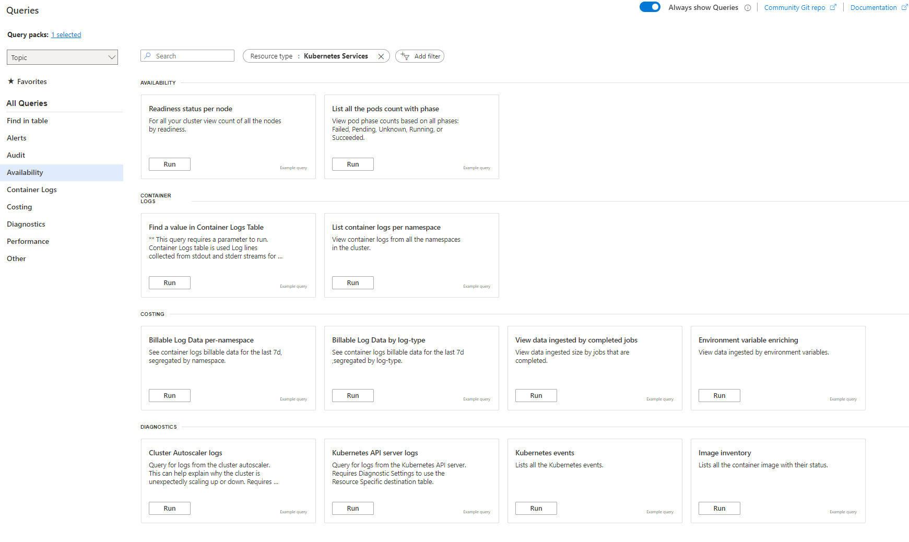

# Check AKS cluster health

Start by checking the health of the overall cluster and networking.

_This article is part of a series. Read the introduction [here](aks-triage-practices.md)._

## Tools

To diagnose and solve problems in your AKS (Azure Kubernetes Service) cluster, you can utilize the following tools and features within the Azure portal:

- **AKS Diagnose and Solve Problems**: In the Azure portal, go to your AKS cluster resource and select [Diagnose and solve problems](/azure/aks/aks-diagnostics). This intelligent tool offers a self-diagnostic experience that helps identify and resolve issues within your cluster, without any additional cost.
- **Resource Health**: In the Azure portal, navigate to your AKS cluster resource and choose [Resource Health](/azure/service-health/resource-health-overview). This tool assists in diagnosing and obtaining support for service problems that may impact your Azure resources. It provides information on your resources' current and past health status.
- **Azure Advisor**: In the Azure portal, go to your AKS cluster resource, select the `Overview` tab, and click on the `Recommendations` section. Alternatively, you can click on the `Advisor Recommendations` link in the left navigation panel. [Azure Advisor](/azure/advisor/advisor-overview)  acts as a personalized cloud consultant, guiding you to follow best practices for optimizing your Azure deployments. It analyzes your resource configuration and usage telemetry, then suggests solutions to enhance cost-effectiveness, performance, reliability, and security of your Azure resources.
- **Log Analytics Workspace**: In the Azure portal, navigate to your AKS cluster resource and choose the `Monitoring` tab. From there, click on the `Logs` blade located in the left navigation panel to access the cluster logs and metrics stored in the [Azure Log Analytics](/azure/azure-monitor/logs/log-analytics-overview) workspace. This feature allows you to monitor and analyze your cluster's logs and metrics for better insights and troubleshooting.

By utilizing these tools and features, you can effectively diagnose and resolve issues, optimize your AKS cluster deployment, and monitor the health and performance of your Azure resources.

[AKS Diagnose and Solve Problems](/azure/aks/aks-diagnostics) provides a comprehensive suite of tools to aid in the identification and resolution of various issues related to your cluster. Depending on the issue you're experiencing, you can check the description on each category tile and select the most relevant one to diagnose your problem. Based on the outcome, you may follow the detailed instructions or refer to the documentation links to resolve the issue effectively. 

You can use the following tiles in [AKS Diagnose and Solve Problems](/azure/aks/aks-diagnostics) to check the cluster health:

- **Cluster and Control Plane availability and performance**: This tile helps to check if there are any service availability or throttling issues affecting the health of the cluster.
- **Connectivity issues**: This tile helps to verify if there are errors with cluster DNS resolution, or if the outbound communication route has connectivity issues.

[Resource Health](/azure/service-health/resource-health-overview) helps you identify and get support for cluster issues and service problems that could impact your cluster's health. By adding a resource alert, you can easily monitor the health of your cluster. This feature provides a report on the current and past health of your cluster, and below are the health statuses:

- **Available**. This status means that there are no events detected that affects the health of the cluster. If the cluster has recovered from unplanned downtime within the last 24 hours, you see a `Recently resolved` notification.
- **Unavailable**. This status indicates that the service has detected an ongoing platform or nonplatform event that affects the health of the cluster.
- **Unknown**. When Resource Health hasn't received any information about the resource for over 10 minutes, this status will appear. This usually happens when virtual machines have been deallocated. Although this status is not a definitive indication of the resource's state, it can be a useful data point for troubleshooting.
- **Degraded**. This status means that your cluster has detected a loss in performance, but it's still available for use.

To learn more about this feature, see [Azure Resource Health overview](/azure/service-health/resource-health-overview).

**Azure Advisor** offers actionable recommendations to help you optimize your AKS clusters for reliability, security, operational excellence and performance. By clicking on a recommendation, you can access detailed documentation to optimize your cluster. This empowers you to proactively take steps to improve your cluster's performance and avoid potential issues.

 
 

To learn more about this feature, see [Azure Advisor overview](/azure/advisor/advisor-overview).

[Azure Log Analytics](/azure/azure-monitor/logs/log-analytics-overview) offers insights into the cluster's health. To access the [Azure Log Analytics](/azure/aks/monitor-aks) workspace, navigate to your Azure Kubernetes Service cluster and select `Logs` under the `Monitoring` section in the left navigation panel.

In the `Logs` view, you can choose pre-defined queries in the following categories to analyze cluster health:

Here are some examples of built-in queries that you can use to query logs and metrics collected in the Log Analytics workspace:

- **Availability**
  - Readiness status per node: View the count of all nodes in the cluster by readiness status.
  - List all the pods count with phase: View the count of all pods by phase: phase: Failed, Pending, Unknown, Running, or Succeeded.
- **Containers**
  - Find a value in Container Logs Table: This query will find rows in the ContainerLogs table where LogEntry has a specified string parameter.
  - List container logs per namespace: View container logs from all the namespaces in the cluster.
- **Diagnostics**
  - Cluster Autoscaler logs: Query for logs from the cluster autoscaler. This can help explain why the cluster is unexpectedly scaling up or down.
  - Kubernetes API server logs: Query for logs from the Kubernetes API server.
  - Image inventory: Lists all the container image with their status.
  - Prometheus disk read per second per node: View Prometheus disk read metrics from the default kubernetes namespace as timechart.
  - Instances Avg CPU usage growth from last week: Shows the average CPU growth by instance in the last week by descending order.

## Contributors

*This article is maintained by Microsoft. It was originally written by the following contributors.*

Principal authors:

- [Francis Simy Nazareth](https://www.linkedin.com/in/francis-simy-nazereth-971440a) | Senior Technical Specialist
- [Paolo Salvatori](https://www.linkedin.com/in/paolo-salvatori) | Principal Customer Engineer

Other contributors:

- [Rong Zhang](https://www.linkedin.com/in/rong-zhang-7335561a) | Senior Product Manager

*To see non-public LinkedIn profiles, sign in to LinkedIn.*

## Next steps

> [!div class="nextstepaction"]
> [Examine the node and pod health](aks-triage-node-health.md)
