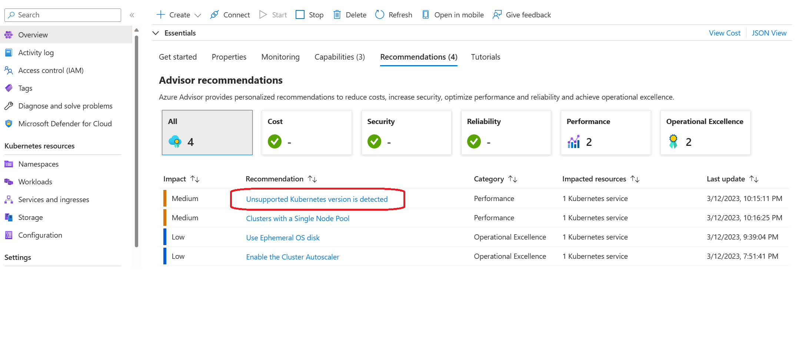

# Check AKS cluster health

Start by checking the health of the overall cluster and networking.

_This article is part of a series. Read the introduction [here](aks-triage-practices.md)._

**Tools:**

- **AKS Diagnose and Solve Problems**. In the Azure portal, navigate to your AKS cluster resource and select **Diagnose and solve problems**.
- **Resource Health**. In the Azure portal, navigate to your AKS cluster resource and select **Resource Health**.
- **Azure Advisor**. In the Azure portal, navigate to your AKS cluster resource and select the **Overview** tab, then click on **Recommendations**, or on the **Advisor Recommendations** blade on the left navigation panel.
- **Log Analytics Workspace**. In Azure portal, navigate to your AKS cluster resource and select the **Monitoring** tab, then click on **Logs** blade on the left navigation panel. 

**AKS Diagnose and Solve Problems** presents a comprehensive suite of tools to aid in the identification and resolution of various issues related to your cluster. Depending on the issue you're experiencing, you can check the description on each category tile and select the most relevant one to diagnose your problem. Based on the outcome, you may follow the detailed instructions or refer to the documentation links to resolve the issue effectively. 

**Example scenario 1:** I observed that my application is getting disconnected or experiencing intermittent connection issues. In response, I click **Connectivity Issues** tile to investigate the potential causes. 

I received a diagnostic alert indicating that the disconnection may be related to my *Cluster DNS*. To gather more information, I clicked on *View details*. 

Based on the diagnostic result, it appears that the issue may be related to known DNS issues or VNET configuration. Thankfully, I can use the documentation links provided to address the issue and resolve the problem.

Furthermore, if the recommended documentation based on the diagnostic results doesn't resolve the issue, you can return to the previous step in AKS Diagnose and Solve Problems and refer to extra documentation.

**Example Scenario 2:** My cluster seems to be in good health. All nodes are ready, and my application runs without any issues. However, I'm curious about the best practices I can follow to prevent potential problems. So, I click on the **Best Practices** tile. tile. After reviewing the recommendations, I discovered that although my cluster appears healthy at the moment, there are still some things I can do to avoid latency or throttling issues in the future. 

To learn more about this feature, see [Azure Kubernetes Service Diagnose and Solve Problems overview](/azure/aks/concepts-diagnostics).

**Resource Health** helps you identify and get support for cluster issues and service problems that could impact your cluster's health. By adding a resource alert, you can easily monitor the health of your cluster. This feature provides a report on the current and past health of your cluster, and below are the health statuses:

- **Available**. This status means that there are no events detected that affects the health of the cluster. If the cluster has recovered from unplanned downtime within the last 24 hours, you see a "Recently resolved" notification.
- **Unavailable**. This status indicates that the service has detected an ongoing platform or nonplatform event that affects the health of the cluster.
- **Unknown**. When Resource Health hasn't received any information about the resource for over 10 minutes, this status will appear. This usually happens when virtual machines have been deallocated. Although this status is not a definitive indication of the resource's state, it can be a useful data point for troubleshooting.
- **Degraded**. This status means that your cluster has detected a loss in performance, but it's still available for use.

To learn more about this feature, see [Azure Resource Health overview](/azure/service-health/resource-health-overview).

**Azure Advisor** offers actionable recommendations to help you optimize your AKS clusters for reliability, security, operational excellence and performance. By clicking on a recommendation, you can access detailed documentation to optimize your cluster. This empowers you to proactively take steps to improve your cluster's performance and avoid potential issues.

 
 

To learn more about this feature, see [Azure Advisor overview](/azure/advisor/advisor-overview).

## Next steps

> [!div class="nextstepaction"]
> [Examine the node and pod health](aks-triage-node-health.md)
