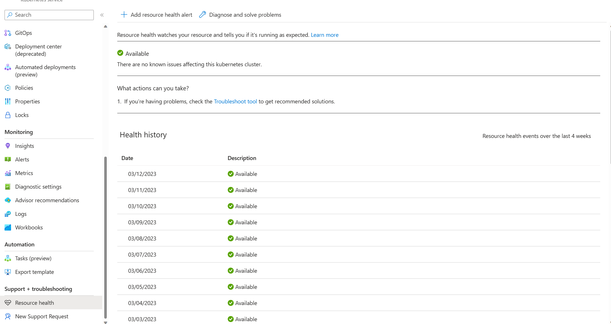

# Check the AKS cluster health

Start by checking the health of the overall cluster and networking.

_This article is part of a series. Read the introduction [here](aks-triage-practices.md)._

**Tools:**

- **AKS Diagnose and Solve Problems**. In Azure portal, navigate to the AKS cluster resource. Select **Diagnose and solve problems**.
-  **Resource Health**. In Azure Portal, navigate to the AKS cluster resource. Select **Resource Health**.
- **Azure Advisor**. In Azure Portal, navigate to the AKS cluster resource, under the **Overview** tab, select **Recommendations**. Or select **Advisor Recommendations** tab.

**AKS Diagnose and Solve Problems** presents a comprehensive suite of tools to aid in the identification and resolution of a variety of issues related to your cluster. Based on the issue you are experiencing, you can check the description on each category tile and select the most relevant to help diagnose your issue. Based on the outcome, you may follow the detailed instructions or peruse the documentation links to effectively resolve the issue at hand. 

**Example scenario 1:** I observed that my application is getting disconnected or experiencing intermittent connection issues. In response, I click **Connectivity Issues** tile to investigate the potential causes. 

I received a diagnostic alert indicating that the disconnection may be related to my *Cluster DNS*. To gather more information, I clicked on *View details*. 

Based on the diagnostic result, it appears that the issue may be related to known DNS issues or VNET configuration. Thankfully, I can use the documentation links provided to address the issue and resolve the problem.

Furthermore, if the recommended documentation based on the diagnostic results does not resolve the issue, you can return to the previous step in AKS Diagnose and Solve Problems and refer to additional documentation.

**Example Scenario 2:** My cluster seems to be in good health. All nodes are ready, and my application runs without any issues. However, I am curious about the best practices I can follow to prevent potential problems. So, I click on the **Best Practices** tile. After reviewing the recommendations, I discovered that even though my cluster appears healthy at the moment, there are still some things I can do to avoid latency or throttling issues in the future. 

To learn more about this feature, see [Azure Kubernetes Service Diagnose and Solve Problems overview](/azure/aks/concepts-diagnostics).

**Resource Health** helps you identify and get support for cluster issues and service problems that could be impacting your cluster's health. By adding a resource alert, you can easily monitor the health of your cluster. This feature provides a report on the current and past health of your cluster. Below are the health statuses:

- **Available**. *Available* means that there are no events detected that affect the health of the cluster. In cases where the cluster recovered from unplanned downtime during the last 24 hours, you'll see a "Recently resolved" notification.
- **Unavailable**. *Unavailable* means that the service detected an ongoing platform or non-platform event that affects the health of the cluster.
- **Unknown**. *Unknown* means that Resource Health hasn't received information about the resource for more than 10 minutes. This commonly occurs when virtual machines have been deallocated. Although this status isn't a definitive indication of the state of the resource, it can be an important data point for troubleshooting.
- **Degraded**. *Degraded* means that your cluster detected a loss in performance, although it's still available for use. 

To learn more about this feature, see [Azure Resource Health overview](/azure/service-health/resource-health-overview).

**Azure Advisor** offers actionable recommendations to help you optimize your AKS clusters for reliability, security, operational excellence and performance. By simply clicking on a recommendation, you can access detailed documentation to optimize your cluster. This empowers you to proactively take steps to improve your cluster's performance and avoid potential issues.

 
 

To learn more about this feature, see [Azure Advisor overview](/azure/advisor/advisor-overview).

## Next steps

> [!div class="nextstepaction"]
> [Examine the node and pod health](aks-triage-node-health.md)
