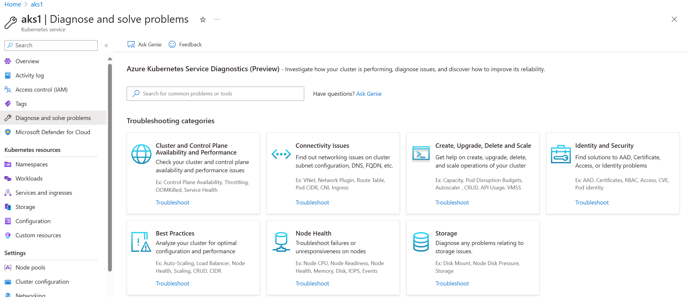

# Check AKS cluster health

Start by checking the health of the overall cluster and networking.

_This article is part of a series. Read the introduction [here](aks-triage-practices.md)._

**Tools:**

- **AKS Diagnose and Solve Problems**. In the Azure portal, navigate to your AKS cluster resource and select [Diagnose and solve problems]/azure/aks/aks-diagnostics). This tool provides an intelligent, self-diagnostic experience that helps you identify and resolve problems in your cluster at no additional cost.
- **Resource Health**. In the Azure portal, navigate to your AKS cluster resource and select [Resource Health](/azure/service-health/resource-health-overview). This tool helps you diagnose and get support for service problems that affect your Azure resources. It reports on the current and past health of your resources.
- **Azure Advisor**. In the Azure portal, navigate to your AKS cluster resource and select the **Overview** tab, then click on **Recommendations**, or on the **Advisor Recommendations** blade on the left navigation panel. [Azure Advisor](/azure/advisor/advisor-overview) is a personalized cloud consultant that helps you follow best practices to optimize your Azure deployments. It analyzes your resource configuration and usage telemetry and then recommends solutions that can help you improve the cost-effectiveness, performance, reliability, and security of your Azure resources.
- **Log Analytics Workspace**. In the Azure portal, navigate to your AKS cluster resource and select the **Monitoring** tab, then click on the **Logs** blade on the left navigation panel to access the cluster logs and metrics stored in the [Azure Log Analytics](/azure/azure-monitor/logs/log-analytics-overview) workspace.

**[AKS Diagnose and Solve Problems](/aks/aks-diagnostics)** presents a comprehensive suite of tools to aid in the identification and resolution of various issues related to your cluster. Depending on the issue you're experiencing, you can check the description on each category tile and select the most relevant one to diagnose your problem. Based on the outcome, you may follow the detailed instructions or refer to the documentation links to resolve the issue effectively. 

To check the cluster health, the following tiles in [AKS Diagnose and Solve Problems](/aks/aks-diagnostics) could be useful: 
- Cluster and Control Plane availability and performance: This tile helps to check if there are any service availability or throttling issues affecting the health of the cluster.
- Connectivity issues: This tile helps to verify if there are errors with cluster DNS resolution, or if the outbound communication route has connectivity issues. 

**Resource Health** helps you identify and get support for cluster issues and service problems that could impact your cluster's health. By adding a resource alert, you can easily monitor the health of your cluster. This feature provides a report on the current and past health of your cluster, and below are the health statuses:

- **Available**. This status means that there are no events detected that affects the health of the cluster. If the cluster has recovered from unplanned downtime within the last 24 hours, you see a "Recently resolved" notification.
- **Unavailable**. This status indicates that the service has detected an ongoing platform or nonplatform event that affects the health of the cluster.
- **Unknown**. When Resource Health hasn't received any information about the resource for over 10 minutes, this status will appear. This usually happens when virtual machines have been deallocated. Although this status is not a definitive indication of the resource's state, it can be a useful data point for troubleshooting.
- **Degraded**. This status means that your cluster has detected a loss in performance, but it's still available for use.

To learn more about this feature, see [Azure Resource Health overview](/azure/service-health/resource-health-overview).

**Azure Advisor** offers actionable recommendations to help you optimize your AKS clusters for reliability, security, operational excellence and performance. By clicking on a recommendation, you can access detailed documentation to optimize your cluster. This empowers you to proactively take steps to improve your cluster's performance and avoid potential issues.

 
 

To learn more about this feature, see [Azure Advisor overview](/azure/advisor/advisor-overview).

**Log Analytics** offers insights into the cluster's health. To acces log analytics workspace, navigate to your Azure Kubernetes Service cluster and select "Logs". You may be prompted to configure Azure Application insights / Managed prometheus / managed grafana if none of these resources are already configured. 

In the logs view, pre-defined queries in the following categories may be useful to analyze cluster health. 
- Availability (to run queries such as readiness status per node)
- Diagnostics (to view Kubernetes API server logs, Kubernetes events etc.)
  
## Next steps

> [!div class="nextstepaction"]
> [Examine the node and pod health](aks-triage-node-health.md)
