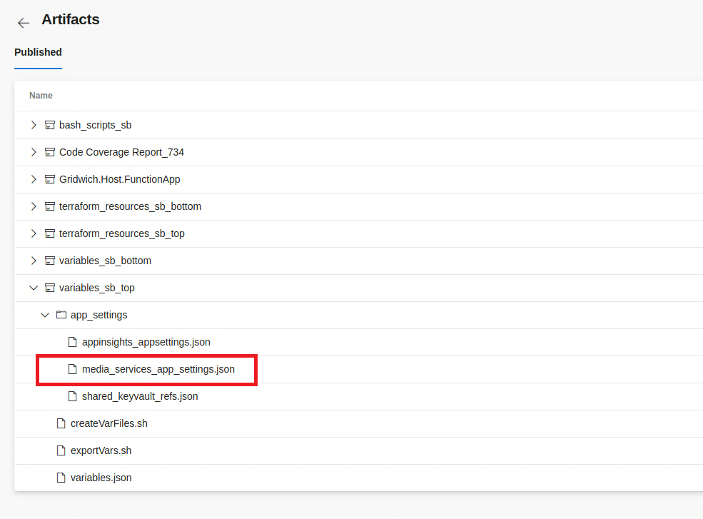
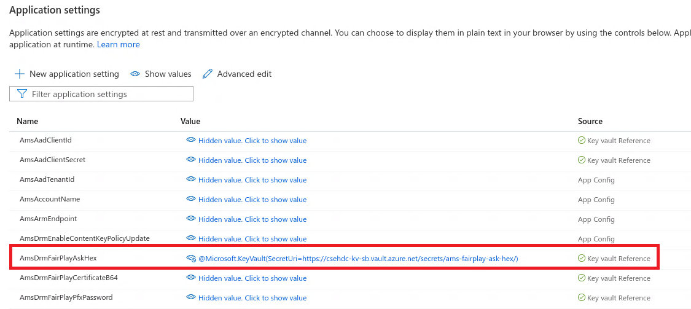

# Pipeline Variable Group to Terraform variables flow

## Overview

The purpose of this document is to provide an overview of how Azure DevOps Variable Group variables flow from the Azure DevOps Pipelines all the way into the various Terraform module, to Azure KeyVault secrets & finally, to appsettings as a Key vault secret reference.

As a walkthrough example, this document will do a deep dive into how the `amsDrmFairPlayAskHex` variable, located in the `gridwich-cicd-variables.global` variable group flows througout the CI/CD process.

## Prerequisites

- Basic knowledge of [Terraform](/azure/developer/terraform/overview)
- Basic knowledge of [Azure DevOps Pipelines](/services/devops/)

## amsDrmFairPlayAskHex Flow

The *amsDrmFairPlayAskHex* Azure DevOps Pipeline variable is one of the values used to interact with Azure Media Services FairPlay DRM.  The value is set in the *gridwich-cicd-variables.global* Variable Group & passed to Terraform, so the value can be set in the Shared KeyVault & ultimately referenced as a Key vault reference secret in the Function App appsettings.

1. Create the variable in the gridwich-cicd-variables.global Variable Group

    

1. The variable will be automatically stored as a CI/CD Server Environment Variable as it is referenced in the `variables.yml` file (see [`infrastructure/azure-pipelines/variables.yml`](https://github.com/mspnp/gridwich/infrastructure/azure-pipelines/variables.yml)), which is used as a template in each ci_cd_{environment}_release.yml pipeline.

1. The `deploy-to-env-stages-template.yml` template (see [`infrastructure/azure-pipelines/templates/stages/deploy-to-env-stages-template.yml`](https://github.com/mspnp/gridwich/infrastructure/azure-pipelines/templates/stages/deploy-to-env-stages-template.yml)) is the way the CI/CD Server Environment Variable is passed to Terraform as a variable using the *TerraformArguments* property:

    ```yaml
    stages:
    - template: terraform-stages-template.yml
        parameters:
        applyDependsOn:
        - BuildFunctionsArtifact
        environmentName: ${{ parameters.environmentName }}
        environmentValue: ${{ parameters.environmentValue }}
        applicationName: ${{ parameters.applicationName }}
        serviceConnection: ${{ parameters.serviceConnection }}
        stageSuffix: top
        stageSuffixDisplayName: Top
        TerraformArguments: >-
            -var amsDrm_FairPlay_Ask_Hex="$(amsDrmFairPlayAskHex)"
             . . .
    ```

    **Note:** This happens for both the top & bottom sandwhich.

1. We have created a variable in the main module `variables.tf` file (see [`infrastructure/terraform/variables.tf`](https://github.com/mspnp/gridwich/infrastructure/terraform/variables.tf)), that will contain the value of the *amsDrmFairPlayAskHex* CI/CD Environment Variable:

    ```yaml
    variable "amsDrm_FairPlay_Ask_Hex" {
    type        = string
    description = "The FairPlay Ask key in Hex format."
    }
    ```

1. Now that the value has been set in Terraform, we can pass the value to the *shared* Terraform module:

    ```terraform
    module "shared" {
        source = "./shared"
        amsDrm_FairPlay_Ask_Hex = var.amsDrm_FairPlay_Ask_Hex
        . . .
    }
    ```

1. In the shared terraform module `main.tf` (see [`infrastructure/terraform/shared/main.tf`](https://github.com/mspnp/gridwich/infrastructure/terraform/shared/main.tf)), we set the `amsDrm_FairPlay_Ask_Hex` variable as a secret in the shared Keyvault:

    ```terraform
    resource "azurerm_key_vault_secret" "ams_fairplay_ask_hex" {
        name         = "ams-fairplay-ask-hex"
        value        = var.amsDrm_FairPlay_Ask_Hex
        key_vault_id = azurerm_key_vault.shared_key_vault.id

        lifecycle {
            ignore_changes = [
            value,
            tags
            ]
        }
    }
    ```

1. Now that the secret has been set in the Shared KeyVault, we call the *mediaservices* module in the `main.tf` file (see [`infrastructure/terraform/main.tf`](https://github.com/mspnp/gridwich/infrastructure/terraform/main.tf)) to generate `media_services_app_settings.json` file artifact that is used by the CI/CD process to set the Function App appsettings for Azure Media Services:

    In main module - [`main.tf`](/infrastructure/terraform/main.tf):

    ```terraform
        module "mediaservices" {
          source = "./mediaservices"
          . . .
        }
    ```

    In mediaservices module - `main.tf` (see [`infrastructure/terraform/mediaservices/main.tf`](https://github.com/mspnp/gridwich/infrastructure/terraform/mediaservices/main.tf)):

    ```terraform
        locals {
        media_services_app_settings = [
            . . .,
            {
            name        = "AmsDrmFairPlayAskHex"
            value       = format("@Microsoft.KeyVault(SecretUri=https://%s.vault.azure.net/secrets/%s/)", var.key_vault_name, "ams-fairplay-ask-hex")
            slotSetting = false
            },
            . . .
        ]
        }

        resource "local_file" "media_services_app_settings_json" {
        sensitive_content = jsonencode(local.media_services_app_settings)
        filename          = "./app_settings/media_services_app_settings.json"
        }
    ```

    Sample entry in the `media_services_app_settings.json` file:

    ```json
        [
            . . .,
            {"name":"AmsDrmFairPlayAskHex","slotSetting":false,"value":"@Microsoft.KeyVault(SecretUri=https://gridwich-kv-sb.vault.azure.net/secrets/ams-fairplay-ask-hex/)"},
            . . .
        ]
    ```

1. Now that the *media_services_app_settings.json* has been created *(other similar json files are created as well)*, the `functions-deploy-steps-template.yml` template (see [`infrastructure/azure-pipelines/templates/steps/functions-deploy-steps-template.yml`](https://github.com/mspnp/gridwich/infrastructure/azure-pipelines/templates/steps/functions-deploy-steps-template.yml)) loops through each generated *settings* file and uses the Azure CLI to set the Function App appsettings:

```yaml
    - task: AzureCLI@1
    displayName: 'Update app settings with terraform values'
    inputs:
        azureSubscription: ${{ parameters.serviceConnection }}
        scriptLocation: inlineScript
        inlineScript: |
        set -eu
        for filename in $(Pipeline.Workspace)/variables_${{ parameters.environment }}_top/app_settings/*.json ; do
            echo "Applying settings from $(basename ${filename}) into ${{parameters.functionAppName}}/source-slot with rg ${{parameters.functionAppResourceGroup}}"
            az functionapp config appsettings set -g "${{parameters.functionAppResourceGroup}}" -s "source-slot" -n "${{parameters.functionAppName}}" --settings @"$(echo ${filename})" > /dev/null
            echo "Settings applied for $(basename ${filename})"
        done
        addSpnToEnvironment: true
```

Published *media_services_app_settings.json* artifact in a Azure DevOps Pipeline:



Output from the *Deploy Functions* Azure Pipeline Job:


AmsDrmFairPlayAskHex Key vault secret reference set in the Function App appsettings:


