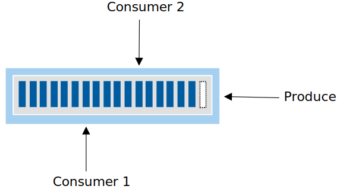
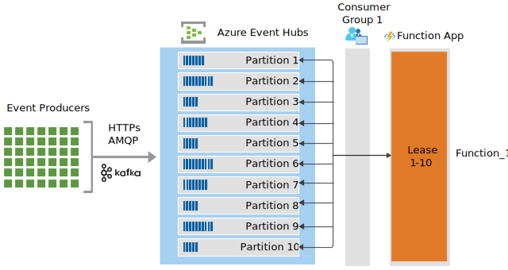
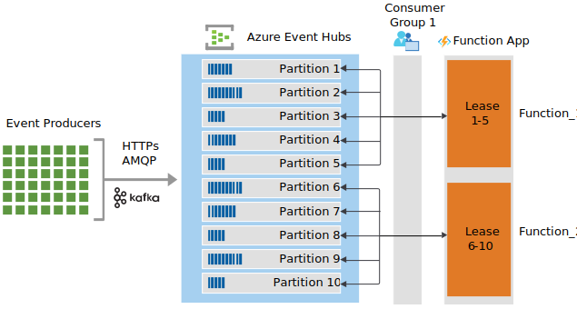

<!---content for event-hubs-functions.yml--->
Solutions that use Azure Event Hubs together with Azure Functions benefit from a [serverless](https://azure.microsoft.com/solutions/serverless/) architecture that is scalable, cost-effective, and capable of processing large volumes of data in near real time. As much as these services work seamlessly together, there are many features, settings, and intricacies that add complexity to their relationship. This article provides guidance on how to effectively take advantage of this integration by highlighting key considerations and techniques for performance, resiliency, security, observability, and scale.

## Event Hubs core concepts

[Azure Event Hubs](https://azure.microsoft.com/services/event-hubs/) is a highly scalable event processing service that can receive millions of events per second. Before diving into the patterns and best practices for Azure Functions integration, it's best to understanding the fundamental components of Event Hubs.

The following diagram shows the Event Hubs stream processing architecture:

### Events

An event is a notification or state change that is represented as a fact that happened in the past. Events are immutable and persisted in an **event hub**, also referred to as a *topic* in [Kafka](https://kafka.apache.org/). An event hub is comprised of one or more
[partitions](/azure/event-hubs/event-hubs-features#partitions).

### Partitions

When a partition isn't specified by the sender, received events are distributed across partitions in the event hub. Each event is written in exactly one partition and isn't multi-cast across partitions. Each partition works as a log where records are written in an append-only pattern. The analogy of a *commit log* is frequently used to describe the nature of how events are added to the end of a sequence in a partition.

When more than one partition is used, it allows for parallel logs to be used from within the same event hub. This behavior provides multiple degrees of parallelism and enhances throughput for consumers.

### Consumers and consumer groups

A partition can be consumed by more than one consumer, each reading from and managing their own offsets.

Event Hubs has the concept of [consumers groups](/azure/event-hubs/event-hubs-features#consumer-groups), which enables multiple consuming applications to each have a separate view of the event stream and read the stream independently at their own pace and with their own offsets.

To learn more, see [Deep dive on Event Hubs concepts and features](/azure/event-hubs/event-hubs-features).

## Consuming events with Azure Functions

Azure Functions supports [trigger](/azure/azure-functions/functions-bindings-event-hubs-trigger) and [output](/azure/azure-functions/functions-bindings-event-hubs-output) bindings for Event Hubs. This section covers how Azure Functions responds to events sent to an event hub event stream using triggers.

Each instance of an Event Hubs triggered function is backed by a single [EventProcessorHost] instance. The trigger (powered by Event Hubs) ensures that only one  [EventProcessorHost] instance can get a lease on a given partition.

For example, consider an event hub with the following characteristics:

- 10 partitions.
- 1,000 events distributed evenly all partitions, with a varying number of messages in each partition.

When your function is first enabled, there's only one instance of the function. Let's call the first function instance `Function_1`. `Function_1` has a single instance of  [EventProcessorHost] that holds a lease on all 10 partitions. This instance is reading events from partitions 1-10. From this point forward, one of the following happens:

- **New function instances are not needed**: `Function_1` can process all 1,000 events before the Functions scaling logic take effect. In this case, all 1,000 messages are processed by `Function_1`.

    

- **An additional function instance is added**: event-based scaling or other automated or manual logic might determine that `Function_1` has more messages than it can process and then creates a new function app instance (`Function_2`). This new function also has an associated instance of  [EventProcessorHost]. As the underlying event hub detects that a new host instance is trying read messages, it load balances the partitions across the host instances. For example, partitions 1-5 may be assigned to `Function_1` and partitions 6-10 to `Function_2`.

    

- **N more function instances are added**: event-based scaling or other automated or manual logic determines that both `Function_1` and `Function_2` have more messages than they can process, new Function\_N function app instances are created. Instances are created to the point where N is equal to or greater than the number of event hub partitions. In our example, Event Hubs again load balances the partitions, in this case across the instances `Function_1`...`Function_10`.

    

As scaling occurs, N instances can be a number greater than the number of event hub partitions. This situation might occur while event-driven scaling stabilizes instance counts, or because other automated or manual logic created more instances than partitions. In this case, [EventProcessorHost] instances will only obtain locks on partitions as they become available from other instances, as at any given time only one function instance from the same consumer group can access/read from the partitions it has locks on.

When all function execution completes (with or without errors), checkpoints are added to the associated storage account. When check-pointing succeeds, all 1,000 messages are never retrieved again.

Dynamic, event-based scaling is possible with Consumption and Premium Azure plans. Kubernetes hosted function apps can also take advantage of the [KEDA scaler for Event Hubs](https://keda.sh/docs/2.2/scalers/azure-event-hub/). Event-based scaling currently isn't possible when the function app is hosted in a Dedicated (App Service) plan, which requires you to determine the right number of instances based on your workload.

To learn more, see [Azure Event Hubs bindings for Azure Functions](/azure/azure-functions/functions-bindings-event-hubs) and [Azure Event Hubs trigger for Azure Functions](/azure/azure-functions/functions-bindings-event-hubs-trigger).

## Contributors

*This article is maintained by Microsoft. It was originally written by the following contributors.* 

Principal author:

 - [David Barkol](https://www.linkedin.com/in/davidbarkol/) | Principal Solution Specialist GBB
 
*To see non-public LinkedIn profiles, sign in to LinkedIn.*

## Next steps

> [!div class="nextstepaction"]
> [Performance and scale](./performance-scale.yml)

## Related resources

- [Monitoring serverless event processing](../guide/monitoring-serverless-event-processing.md) provides guidance on monitoring serverless event-driven architectures.
- [Serverless event processing](../../reference-architectures/serverless/event-processing.yml) is a reference architecture detailing a typical architecture of this type, with code samples and discussion of important considerations.

[EventProcessorHost]: /dotnet/api/microsoft.servicebus.messaging.eventprocessorhost
