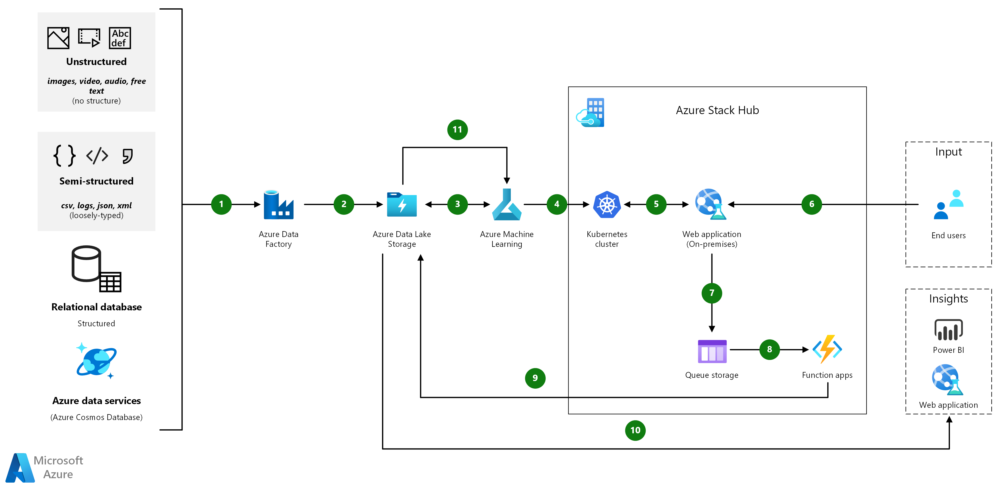

# AI at the Edge with Azure Stack

[!INCLUDE [header_file](../header.md)]

With the Azure AI tools and cloud platform, the next generation of AI-enabled hybrid applications can run where your data lives. With Azure Stack, bring a trained AI model to the edge and integrate it with your applications for low-latency intelligence, with no tool or process changes for local applications.

## Architecture

*Download an [SVG](../media/ai-at-the-edge.svg) of this architecture.*

## Data Flow

1. Data scientists train a model using Azure Machine Learning workbench and an HDInsight cluster. The model is containerized and put into an Azure Container Registry.
1. The model is deployed to a Kubernetes cluster on Azure Stack.
1. End users provide data that's scored against the model.
1. Insights and anomalies from scoring are placed into a queue.
1. A function sends compliant data and anomalies to Azure Storage.
1. Globally relevant and compliant insights are available in the global app.
1. Data from edge scoring is used to improve the model.

## Components

* [Machine Learning Studio](https://azure.microsoft.com/services/machine-learning-studio): Easily build, deploy, and manage predictive analytics solutions
* [HDInsight](https://azure.microsoft.com/services/hdinsight): Provision cloud Hadoop, Spark, R Server, HBase, and Storm clusters
* [Container Registry](https://azure.microsoft.com/services/container-registry): Store and manage container images across all types of Azure deployments
* [Azure Kubernetes Service (AKS)](https://azure.microsoft.com/services/kubernetes-service): Simplify the deployment, management, and operations of Kubernetes
* [Storage](https://azure.microsoft.com/services/storage): Durable, highly available, and massively scalable cloud storage
* [Azure Stack](https://azure.microsoft.com/overview/azure-stack): Build and run innovative hybrid applications across cloud boundaries

## Next steps

* [Machine Learning Studio documentation](https://docs.microsoft.com/azure/machine-learning/service)
* [HDInsight documentation](https://docs.microsoft.com/azure/hdinsight)
* [Container Registry documentation](https://docs.microsoft.com/azure/container-registry)
* [Azure Kubernetes Service (AKS) documentation](https://docs.microsoft.com/azure/aks)
* [Storage documentation](https://docs.microsoft.com/azure/storage)
* [Azure Stack documentation](https://docs.microsoft.com/azure/azure-stack/user/azure-stack-solution-machine-learning)
