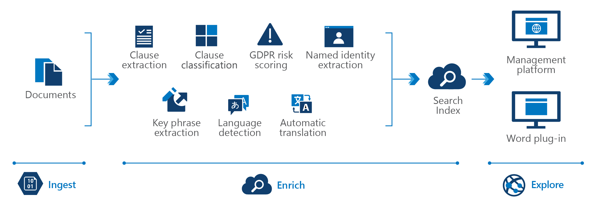

<!-- cSpell:ignore pracjain -->

[!INCLUDE [header_file](../../../includes/sol-idea-header.md)]

In the ever-changing world of regulations, organizations face the challenge of staying on top of audits and compliance. Mistakes in contracts and record-keeping can have serious financial ramifications. At the enterprise level, teams of lawyers might not be enough to catch everything. Knowledge mining can provide helpful assistance for organizations looking to stay above board.

For most organizations, the legal department faces the challenge of reviewing thousands of pages of documentation. Developers could use knowledge mining to help attorneys quickly identify entities of importance from discovery documents and flag important ideas across documents

## Data Flow

There are three steps:

Ingest, Enrich and Exploration. First, the unstructured and structured data is ingested then enrichment of this data with AI to extract information and find and finally explore the newly structured data via search, existing business applications or analytics solutions.

1. The user can ingest different types of content like affidavits, meeting minutes, operating agreements, non-disclosure agreements, privacy policies, terms of use, memorandums of understanding, licensing agreements, letters of intent, power of attorney, deeds, discovery documentation,company bylaws, operating agreements, bank statements, legal agreements, balance sheets, income statements, cash flow statements, company disclosures, SEC documents, annual reports, transcripts from shareholder meetings
2. This content is enriched by using key phrase extraction, language detection, language translation,entity extraction (organizations and people) and custom models to identify certain regulatory obligations and custom models to identify specific legal terms and clauses
3. And finally, the user can index data in a searchable internal application or use the data for a searchable web application for financial risks

## Components

Key technologies used to implement tools for technical content review and research

- [Azure Cognitive Search](/azure/search/)
- [Microsoft Text Analytics API](https://azure.microsoft.com/services/cognitive-services/text-analytics/)
- [Microsoft Translator Text API](https://azure.microsoft.com/services/cognitive-services/translator-text-api/)
- [Web API custom skill interface](/azure/search/cognitive-search-custom-skill-interface)

## Next Steps

Using the [knowledge mining solution accelerator](/samples/azure-samples/azure-search-knowledge-mining/azure-search-knowledge-mining/) to build an initial knowledge mining prototype with Azure Cognitive Search.

Building custom skills with Microsoft's [Custom Web API](/azure/search/cognitive-search-custom-skill-interface)
