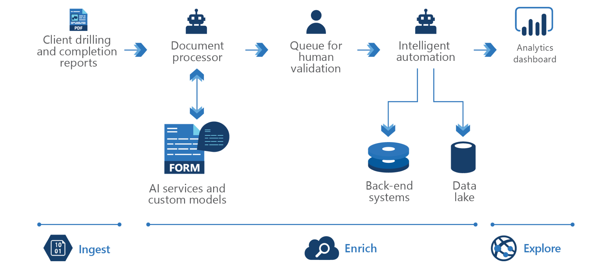

# Business Process Management

This architecture demonstrates how to use Knowledge Mining for business process management.

When organizations task employees with the review and research of technical data, it can be tedious to read page after page of dense text. Knowledge mining helps employees quickly review these materials. In industries where bidding competition is fierce, or when the diagnosis of a problem must be quick or in near real-time, companies can use knowledge mining to avoid costly mistakes.

## Data Flow

There are three steps: Ingest, Enrich and Exploration. First, the unstructured and structured data is ingested then enrichment of this data with AI to extract information and find and finally explore the newly structured data via search, existing business applications or analytics solutions.

1. The user can ingest different types of content like SOWs, requests for proposal, invoice archives, sales team correspondence, W2 forms, receipts, healthcare claim forms, bank statements, legal agreements, balance sheets, income statements, cash flow statements, company disclosures, SEC documents, annual reports
2. This content is enriched by using optical character recognition, forms recognition, layout understanding, table extraction, key-value pair extraction
3. And finally, the user can automatically populate data from invoices into ELP systems or databases or compile enriched documents in the knowledge store and project them into tabular or object stores, then surface trends in an analytics dashboard, such as frequent issues, popular products, and much more

## Components

Key technologies used to implement tools for technical content review and research

- [Azure Cognitive Search](https://docs.microsoft.com/azure/search/)
- [Microsoft Form Recognizer](https://azure.microsoft.com/services/cognitive-services/form-recognizer/)
- [Web API custom skill interface](https://docs.microsoft.com/azure/search/cognitive-search-custom-skill-interface)

## Next Steps

Using the [knowledge mining solution accelerator](/samples/azure-samples/azure-search-knowledge-mining/azure-search-knowledge-mining/) to build an initial knowledge mining prototype with Azure Cognitive Search.

Building custom skills with Microsoft's [Custom Web API](https://docs.microsoft.com/en-us/azure/search/cognitive-search-custom-skill-interface)
