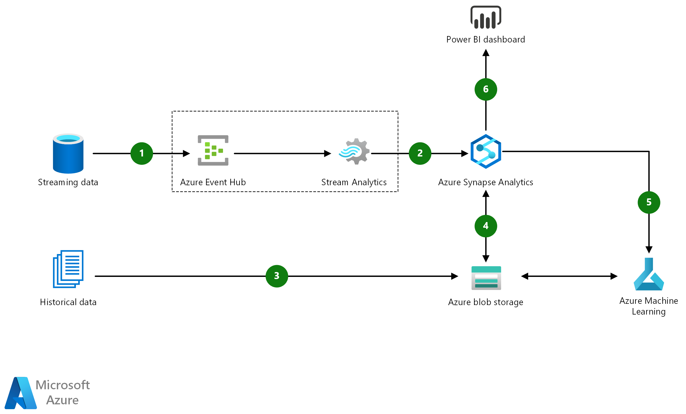

[!INCLUDE [header_file](../../../includes/sol-idea-header.md)]

Customer Churn Prediction uses Cortana Intelligence Suite components to predict churn probability, and it helps find patterns in existing data that are associated with the predicted churn rate.

## Architecture

*Download an [SVG](../media/customer-churn-prediction.svg) of this architecture.*

### Data flow

1. You can use Azure Event Hub to stream all live data into Azure. Utilize Stream Analytics to perform real-time analytics and ingest data into Azure Synapse to combine existing and historical data to create dashboards and reports.

2. Ingest historical data at scale into Azure Blob Storage to combine with streamed data for ad-hoc insights and experimentation using Azure Machine learning.

3. Utilize Power BI to build operational reports and dashboards on top of Azure Synapse to derive insights and report on business data for users consumption.

4. Use Azure Machine Learning to build models to predict churn probability, data patterns to deliver high intelligent insights and analytics on collected data. These models can be used further to build Power BI reports and analytical dashboards to empower business in the decision making.

## Components

* [Azure Event Hubs](/azure/event-hubs/event-hubs-about) is an event ingestion service that is capable of processing millions of events per second. Data sent to event hub can be transformed and stored using any real-time analytics provider.
* [Azure Stream Analytics](/azure/stream-analytics/stream-analytics-introduction) Is a real-time analytics that is design to analyze and process high volume of fast streaming data. Relationships and patterns identified in the data can be used to trigger actions and initiate workflows such as creating alerts, feeding information to a reporting tool, or storing transformed data for later use.
* [Azure Blob Storage](https://azure.microsoft.com/en-us/services/storage/blobs/) is cloud service for storing large amount of unstructured data such as text, binary data, audio, and documents more-easily and cost-effectively. Azure blob storage allows for a quick access to data scientist to experiment and build AI models.
* [Azure Synapse Analytics](https://azure.microsoft.com/en-us/services/synapse-analytics/) is the fast and reliable data warehouse with limitless analytics that brings together data integration, enterprise data warehousing, and big data analytics. It gives you the freedom to query data on your terms, using either serverless or dedicated resources and serve data for immediate BI and machine learning needs.
* [Azure Machine Learning](/azure/machine-learning/) Can be used for any machine learning supervised and unsupervised whether you prefer to write Python of R code. You can build, train, and track machine learning models in Azure Machine Leaning Workspace.
* [Power BI](https://powerbi.microsoft.com/en-us/) is a suite of tools to empower organizations by delivering powerful insights. Power BI connects to various data sources, simplify data prep and model creation from disparate sources. Enhance team collaboration across the organization to produce analytical reports and dashboard to support the business decisions and publish them to the web and mobile devices for users to consume.

## Description

For more details on how this solution is built, visit the solution guide in [GitHub](https://github.com/Azure/cortana-intelligence-churn-prediction-solution).

Keeping existing customers is five times cheaper than the cost of attaining new ones. For this reason, marketing executives often find themselves trying to estimate the likelihood of customer churn and finding the necessary actions to minimize the churn rate.

Customer Churn Prediction uses Azure Machine Learning to predict churn probability and helps find patterns in existing data associated with the predicted churn rate. This information empowers businesses with actionable intelligence to improve customer retention and profit margins.

The objective of this guide is to demonstrate predictive data pipelines for retailers to predict customer churn. Retailers can use these predictions to prevent customer churn by using their domain knowledge and proper marketing strategies to address at-risk customers. The guide also shows how customer churn models can be retrained to use more data as it becomes available.

## What's under the hood

The end-to-end solution is implemented in the cloud, using Microsoft Azure. The solution is composed of several Azure components, including data ingest, data storage, data movement, advanced analytics, and visualization. The advanced analytics are implemented in Azure Machine Learning, where one can use Python or R language to build data science models (or reuse existing in-house or third-party libraries). With data ingest, the solution can make predictions based on data that being transferred to Azure from an on-premises environment.

## Solution dashboard

The snapshot below shows an example Power BI dashboard that gives insights into the predicted churn rates across the customer base.

## Next steps

* [Get Started with Azure Event Hubs](/azure/event-hubs/event-hubs-about)
* [Get Started with Azure Stream Analytics](/azure/stream-analytics/stream-analytics-introduction)
* [Get Started with Azure Synapse Analytics](/azure/synapse-analytics/)
* [Get Started with Azure Blob Storage](/azure/storage/blobs/storage-blobs-introduction)
* [Get Started with Azure Machine Learning](/azure/machine-learning/)
* [Get Started with Power BI documentation](/power-bi/)

## Related resources

### Architecture guides

* [Artificial intelligence (AI)](../../data-guide/big-data/ai-overview.md)
* [Compare the machine learning products and technologies from Microsoft](../../data-guide/technology-choices/data-science-and-machine-learning.md)
* [Machine learning at scale](../../data-guide/big-data/machine-learning-at-scale.md)
* [Machine learning operations (MLOps) framework](../../example-scenario/mlops/mlops-technical-paper.yml)

### Reference architectures

* [Batch scoring for deep learning models](../../reference-architectures/ai/batch-scoring-deep-learning.yml)
* [Batch scoring of Python models on Azure](../../reference-architectures/ai/batch-scoring-python.yml)
* [Batch scoring of Python models on Azure](../../reference-architectures/ai/speech-to-text-transcription-pipeline.yml)
* [Movie recommendations on Azure](../../example-scenario/ai/movie-recommendations-with-machine-learning.yml)