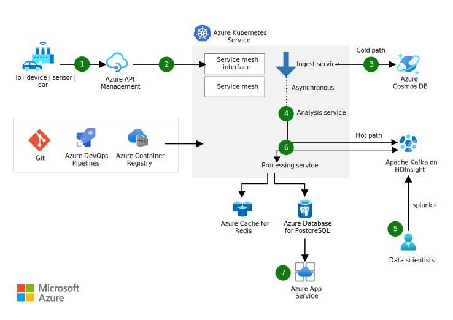

[!INCLUDE [header_file](../../../includes/sol-idea-header.md)]

This article presents a solution for using Azure Kubernetes Service (AKS) to quickly process and analyze a large volume of streaming data from devices.

*Apache®, [Apache Kafka](https://kafka.apache.org/), and [Apache Spark](https://spark.apache.org) are either registered trademarks or trademarks of the Apache Software Foundation in the United States and/or other countries. No endorsement by The Apache Software Foundation is implied by the use of these marks. Splunk is a registered trademark of Cisco.*

## Architecture

*Download a [Visio file](https://arch-center.azureedge.net/data-streaming-scenario.vsdx) of this architecture.*

### Dataflow

1. Sensors generate data and stream it to Azure API Management.
1. An AKS cluster runs microservices that are deployed as containers behind a service mesh. The containers are built by using a DevOps process. The container images are stored in Azure Container Registry.
1. An ingest service in AKS stores data in Azure Cosmos DB.
1. Asynchronously, an analysis service in AKS receives the data and streams it to Apache Kafka on Azure HDInsight.
1. Data scientists use [machine learning models on Azure HDInsights](/azure/hdinsight/spark/apache-spark-run-machine-learning-automl) and the Splunk platform to analyze the data.
1. A processing service in AKS processes the data and stores the results in Azure Database for PostgreSQL. The service also caches the data in Azure Cache for Redis.
1. A web app that runs in Azure App Service creates visualizations of the results.

### Components

- [Apache Kafka](https://kafka.apache.org) is a distributed event streaming platform designed for high-throughput, low-latency data feeds. In this architecture, it receives real-time data from AKS microservices and streams it to Azure HDInsight for large-scale analytics.

- [App Service](/azure/well-architected/service-guides/app-service-web-apps) is a fully managed platform for building and hosting web applications. In this architecture, it runs a web app that visualizes processed results from the PostgreSQL database.

- [API Management](/azure/well-architected/service-guides/azure-api-management) is a gateway for publishing, securing, and analyzing APIs. In this architecture, it receives incoming data from sensors and routes it to the AKS cluster for processing.

- [Azure Cache for Redis](/en-us/azure/azure-cache-for-redis) is an in-memory data store that supports fast data access. In this architecture, it temporarily stores processed data from AKS microservices to accelerate access and reduce latency.

- [Azure Cosmos DB](/azure/well-architected/service-guides/cosmos-db) is a globally distributed NoSQL database service. In this architecture, it stores ingested data from AKS microservices. It supports scalable and elastic storage to ensure fast access to high-volume streaming data.

- [Azure Database for PostgreSQL](/azure/well-architected/service-guides/postgresql) is a managed relational database service based on PostgreSQL. In this architecture, it stores processed results from AKS microservices for downstream reporting and visualization.

- [Azure HDInsight](/azure/hdinsight/hdinsight-overview) is a cloud-based service for big data analytics using open-source frameworks. In this architecture, it runs Apache Spark jobs to analyze streamed data from Kafka and supports machine learning workloads.

- [AKS](/azure/well-architected/service-guides/azure-kubernetes-service) is a managed Kubernetes container orchestration service. In this architecture, it hosts containerized microservices that ingest, process, and route streaming data from sensors to various storage and analytics layers.

- [Azure Pipelines](/azure/devops/pipelines/overview) is a continuous integration and continuous delivery (CI/CD) service within Azure DevOps. In this architecture, it builds and deploys containerized microservices to AKS to enable automated and repeatable delivery workflows.

- [Container Registry](/en-us/azure/container-registry/container-registry-intro) is a managed Docker container registry service. In this architecture, it stores container images used to deploy microservices in the AKS cluster.

- [Splunk](https://www.splunk.com) is a data analytics and visualization platform for machine-generated data. In this architecture, it analyzes real-time data from Azure HDInsight and creates visual dashboards for business intelligence.

## Scenario details

This solution is a good fit for a scenario that involves millions of data points, where data sources include Internet of Things (IoT) devices, sensors, and vehicles. In such a situation, processing the large volume of data is one challenge. Quickly analyzing the data is another demanding task, as organizations seek to gain insight into complex scenarios.

Containerized microservices in AKS form a key part of the solution. These self-contained services ingest and process the real-time data stream. They also scale as needed. The containers' portability makes it possible for the services to run in different environments and process data from multiple sources. To develop and deploy the microservices, DevOps and continuous integration/continuous delivery (CI/CD) are used. These approaches shorten the development cycle.

To store the ingested data, the solution uses Azure Cosmos DB. This database elastically scales throughput and storage, which makes it a good choice for large volumes of data.

The solution also uses Apache Kafka. This low-latency streaming platform handles real-time data feeds at extremely high speeds.

Another key solution component is Azure HDInsight, which is a managed cloud service that enables you to efficiently process massive amounts of data using the most popular open source frameworks. Azure HDInsight simplifies running big data frameworks in large volume and velocity while using Apache Spark in Azure. Splunk helps in the data analysis process. Splunk creates visualizations from real-time data and provides business intelligence.

### Potential use cases

This solution benefits the following areas:

- Vehicle safety, especially in the automotive industry
- Customer service in retail and other industries
- Healthcare cloud solutions
- Financial technology solutions in the finance industry

## Next steps

Product documentation:

- [About Azure Cache for Redis](/azure/azure-cache-for-redis/cache-overview)
- [What is Azure API Management?](/azure/api-management/api-management-key-concepts)
- [App Service overview](/azure/app-service/overview)
- [Azure Kubernetes Service](/azure/aks/intro-kubernetes)
- [Introduction to Azure Container Registry](/azure/container-registry/container-registry-intro)
- [Welcome to Azure Cosmos DB](/azure/cosmos-db/introduction)
- [What is Azure Database for PostgreSQL?](/azure/postgresql/overview)
- [What is Azure HDInsight?](/azure/hdinsight/hdinsight-overview)
- [What is Azure Pipelines?](/azure/devops/pipelines/get-started/what-is-azure-pipelines)

Microsoft training modules:

- [Build and store container images with Azure Container Registry](/training/modules/build-and-store-container-images)
- [Configure Azure App Service plans](/training/modules/configure-app-service-plans)
- [Work with Azure Cosmos DB](/training/modules/work-with-cosmos-db)
- [Create and connect to an Azure Database for PostgreSQL](/training/modules/create-connect-to-postgres)
- [Develop for Azure Cache for Redis](/training/modules/develop-for-azure-cache-for-redis)
- [Explore API Management](/training/modules/explore-api-management)
- [Introduction to Azure HDInsight](/training/modules/intro-to-azure-hdinsight)

## Related resource

- [Azure Kubernetes Service (AKS) architecture design](../../reference-architectures/containers/aks-start-here.md)
