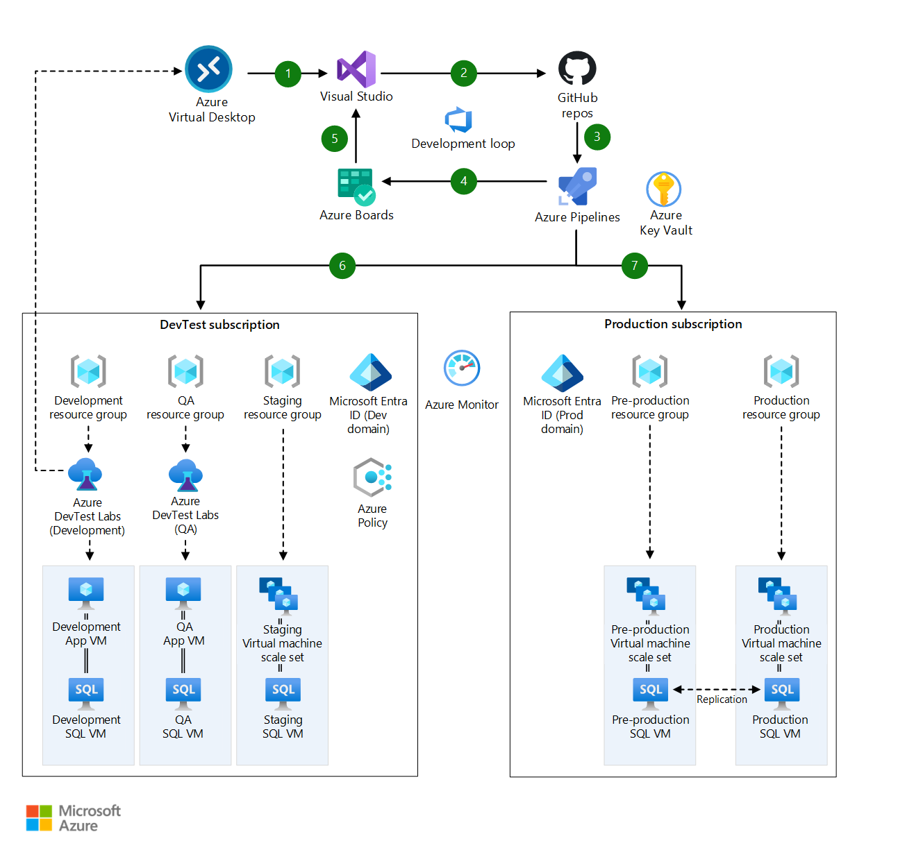

# DevTest and DevOps for IaaS

*Infrastructure as a service (IaaS)* is a form of cloud computing that provides virtualized computing resources over the internet. *Development testing (DevTest)* is a software development approach that integrates testing early in the development phase. Azure provides tools and strategies for rapid software iteration and development in a number of different scenarios. Azure services run in a high-availability environment, patched and supported, allowing developers to focus on solutions instead of the environments they run in.

This solution shows the configuration of DevTest operations in an IaaS application, reducing the cost and overhead of development and test environments, while facilitating faster development through automated virtual machine (VM) and VM image integration and deployment. Using Azure DevOps with DevTest environments gives power and focus to development teams.

## Architecture

1. Instead of manually configuring development environments, developers can use [Windows Virtual Desktop](https://azure.microsoft.com/services/virtual-desktop) images, pre-configured with the libraries, tools, and runtimes needed for their projects. Adding a developer to an [Azure DevTest Subscription](https://azure.microsoft.com/pricing/dev-test) makes the appropriate Windows Virtual Desktop image available to them from the DevTest environment.
2. Source code is available in [GitHub](https://azure.microsoft.com/products/github/) repos, which integrate seamlessly with [Azure DevOps](https://azure.microsoft.com/services/devops/). The [Visual Studio](https://visualstudio.microsoft.com/) development environment combines GitHub source code editing with features like work item and pull request tracking.
3. [Azure Pipelines](/azure/devops/pipelines/get-started/pipelines-get-started) triggers automated *continuous integration (CI)* builds from GitHub repos. Azure Pipelines automatically delivers the builds to the DevTest environments, reaching quality assurance (QA) testing quickly with low developer overhead.
4. [Azure Boards](https://azure.microsoft.com/services/devops/boards/) connect back to the GitHub repos, letting developers track both code and tasks in one location. Automated testing can also generate bugs automatically for any build or release failures, feeding the results back into the development cycle.
5. Azure Boards work items can surface from automated testing, manual QA testing, and new features added by stakeholders. Developers create feature branches and associate them with work items to track development through the application lifecycle, creating more iterations of the development loop.
6. Azure Pipelines allows for *continuous deployment (CD)* to a DevTest Lab, an environment for developers and testers to rapidly provision VMs within a managed environment. Developers can deploy VMs quickly as needed within the lab, while staying within resource and cost parameters set by managers and administrators.
   Testers can operate within their own DevTest Lab environment, pulling ready-for-test images into the test team's Labs separately from the development team. The ability of developers and testers to work in parallel via DevTest Labs contributes to rapid iteration of ready-to-release image versions.
7. As the developed VM images reach a release state, Azure Pipelines triggers Releases, which generalize the targeted images for destinations like *virtual machine scale sets*, and promote them out of DevTest and into a Production environment.
   *User Acceptance Testing (UAT)* validates a staged VM or virtual machine scale set before deployment to Production.
   Approvals are usually required for releases to these higher-cost, client-facing destinations. Production remains isolated and protected from inadvertent or unapproved deployments. With the flexibility of low-cost Labs, developers have all the environments necessary for rapid iterative progress.

## Components
- [Azure DevTest Labs](https://azure.microsoft.com/services/devtest-lab/) provides labs that have all the necessary tools and software to create environments. Developers can efficiently self-manage VMs and resources without waiting for approvals. DevTest Labs let you control cost and regulate resources per lab. Users can be allowed a quota of VMs, granting them permission and flexibility to operate their sandboxes without breaking the bank.
- [Azure VM Image Builder](/azure/virtual-machines/windows/image-builder-overview) service lets developers customize VM images from baseline images. The service facilitates the creation and patching of images and is available to be called as an Azure Pipelines task.
- [Shared Image Gallery](/azure/virtual-machines/windows/shared-image-galleries) acts as a VM image repository for IaaS solutions. VM Image Builder can build directly into a Shared Image Gallery, facilitating an Azure Pipelines CI/CD process of versioning the VM-based application.
- [Azure Pipelines](https://azure.microsoft.com/services/devops/pipelines/) doesn't only deploy the VM application images. Pipelines can also deploy the VM resources themselves through [Azure Resource Manager (ARM) templates](/azure/azure-resource-manager/templates/overview). This [infrastructure-as-code](/azure/devops/learn/what-is-infrastructure-as-code) can be source controlled and configured for CI/CD, ensuring that the infrastructure remains up-to-date.
- Azure Pipelines uses [Azure Key Vault](/azure/devops/pipelines/release/azure-key-vault) to securely consume secrets like credentials and connections strings required for release and deployment configurations. For more information, see [DevSecOps in Azure](/azure/architecture/solution-ideas/articles/devsecops-in-azure).
- An [Azure Active Directory](/azure/active-directory/fundamentals/active-directory-whatis) can be configured per subscription to create a distinct separation of concerns between Azure users. A production subscription might require a smaller cross-section of access to meet certain compliance requirements.
- [Azure Policy](/azure/governance/policy/concepts/recommended-policies) governs resources to meet organizational standards and compliance. In a DevTest role, Azure Policy can regulate and limit numbers and costs of VMs in the subscription. Auditing can provide insight and tracking over the usage of the DevTest VMs.
- [Azure Monitor](/azure/devtest-labs/security-baseline) can be implemented across subscriptions to monitor VMs in both Production and DevTest environments. Azure Monitor can collect log data from VM operating systems as well as crash dump files, and aggregate them to be viewed in [Azure Security Center](/azure/security-center/security-center-enable-data-collection).

## Alternatives
- In a situation where VM Image Builder and a Shared Image Gallery may not work, you can set up an [image factory](/azure/devtest-labs/image-factory-create) to build VM images from the CI/CD pipeline and distribute them automatically to any Azure DevTest Labs registered to those images. For more information, see [Run an image factory from Azure DevOps](/azure/devtest-labs/image-factory-set-up-devops-lab).

## Next steps
- [DevSecOps in Azure](/azure/architecture/solution-ideas/articles/devsecops-in-azure)
- [DevTest and DevOps for PaaS solutions](dev-test-paas.md)
- [DevTest and DevOps for microservices](dev-test-microservice.md)
- [Set up Azure DevOps](https://www.visualstudio.com/docs/setup-admin/get-started)
- [Create a lab in Azure DevTest Labs](/azure/lab-services/tutorial-create-custom-lab)
- [Create your first Windows virtual machine in the Azure portal](/azure/virtual-machines/windows/quick-create-portal)
