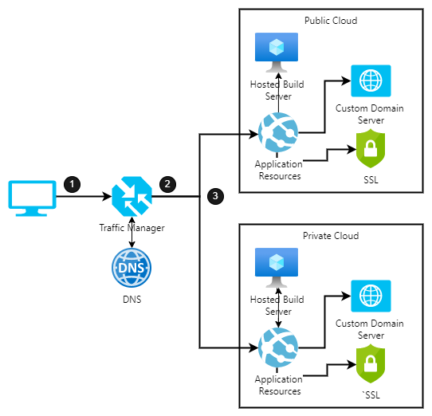

[!INCLUDE [header_file](../../../includes/sol-idea-header.md)]

This architecture illustrates how to extend an app located in a local cloud with public cloud resources. The solution is triggered by an increase or decrease in demand, and respectively adds or removes resources in the cloud. These resources provide redundancy, rapid availability, and geo-compliant routing.

## Potential use cases

When an app can't increase capacity to meet unexpected increases in demand. The app can only service a fixed number of users and this lack of scalability potentially results in users not reaching the app during peak usage times.

Global enterprises require secure, reliable, and available cloud-based apps. Meeting increases in demand and using the right infrastructure to support that demand is critical. Businesses struggle to balance costs and maintenance with business data security, storage, and real-time availability.

However, sometimes is not economically feasible for the business to maintain the capacity required in their on-premises environment to handle spikes in demand for the app. With this solution, you can use the elasticity of the public cloud with your on-premises solution.  

Use this solution:

- When you need to increase your app capacity with unexpected demands or periodic demands in demand.
- When you don't want to invest in resources that will only be used during peaks. Pay for what you use.

This solution isn't recommended when:

- Your business has local regulations that require that the originating connection to come from an onsite call.
- Your network experiences regular bottlenecks that would restrict the performance of the scaling.
- Your environment is disconnected from the internet and can't reach the public cloud.

## Architecture

  
_Download an [Visio file](https://arch-center.azureedge.net/hybrid-cross-cloud-scaling.vsdx) of this architecture._

### Data flow

1. The client sends a request to the cloud application.
1. Traffic Manager uses DNS to direct the client requests to the appropriate service endpoint based on a traffic-routing method. Traffic Manager also provides health monitoring for every endpoint.
1. The instance of the cloud application chosen by Traffic Manager process the request.

### Components

- [Traffic Manager](https://azure.microsoft.com/services/traffic-manager/): Azure Traffic Manager is a DNS-based traffic load balancer.
- **Domain Name System (DNS)**: The Domain Name System, or DNS, is responsible for translating (or resolving) a website or service name to its IP address.
- **Hosted build server**: An environment for hosting your build pipeline.
- **Public IP addresses**: Public IP addresses are used to route the incoming traffic through traffic manager to the public cloud app resources endpoint.
- **App resources**: The app resources need to be able to scale in and scale out, like [Azure Virtual Machine Scale Sets](https://azure.microsoft.com/services/virtual-machine-scale-sets/) and [Azure Container Instances](https://azure.microsoft.com/services/container-instances).

### Alternatives

For web applications, you can use [Azure Front Door](https://azure.microsoft.com/services/frontdoor/). It works at Layer 7 (HTTP/HTTPS layer)
and can keep traffic on the best path to your app, improve service scale, reduce latency, and increase throughput for your global users with edge load balancing, SSL offload, and application acceleration.

## Considerations

### Reliability

Ensure locally deployed apps are configured for high-availability through on-premises hardware configuration and software deployment. Follow [Resiliency and Dependencies](/azure/architecture/framework/resiliency/design-resiliency) and [Best Practices](https://docs.microsoft.com/azure/architecture/framework/resiliency/design-best-practices) to improve the solution resiliency.

### Security

There are many aspects to consider when securing a cross-cloud solution. See [Security documentation](https://docs.microsoft.com/azure/architecture/framework/security/) in the Azure Well Architected Framework for comprehensive security implementation guidance.

### Operational excellence

The operational excellence pillar of the Azure Well Architected Framework covers the operations processes that keep an application running in production. See [Operational excellence documentation](/azure/architecture/framework/devops) for comprehensive guidance, and [Hybrid availability and performance monitoring](../../hybrid/hybrid-containers.yml) for monitoring guidance in hybrid scenarios.

### Performance efficiency

The key component of cross-cloud scaling is the ability to deliver on-demand scaling. Scaling must happen between public and local cloud infrastructure and provide a consistent, reliable service per the demand. See [Performance efficiency](https://docs.microsoft.com/azure/architecture/framework/scalability/) to learn more about implementing scalability in Azure.

## Next steps

- See the [Azure Traffic Manager documentation](https://docs.microsoft.com/azure/traffic-manager/traffic-manager-overview) to learn more about how this DNS-based traffic load balancer works.
- See [Hybrid application design considerations](https://docs.microsoft.com/hybrid/app-solutions/overview-app-design-considerations) to learn more about best practices and to get answers for any additional questions.
- See the [Azure Stack family of products and solutions](https://docs.microsoft.com/azure-stack) to learn more about the entire portfolio of Azure Stack products and solutions.
- When you're ready to test the solution example, continue with the [Cross-cloud scaling solution deployment guide](/azure/architecture/hybrid/deployments/solution-deployment-guide-cross-cloud-scaling). The deployment guide provides step-by-step instructions for deploying and testing its components. You learn how to create a cross-cloud solution to provide a manually triggered process for switching from an Azure Stack Hub hosted web app to an Azure hosted web app. You also learn how to use autoscaling via traffic manager, ensuring flexible and scalable cloud utility when under load.

## Related resources

- [Hybrid architecture design](../../hybrid/hybrid-start-here.md)
- [Run containers in a hybrid environment](../../hybrid/hybrid-containers.yml)
- [Extend an on-premises network using VPN](../../reference-architectures/hybrid-networking/vpn.yml)
- [Hybrid availability and performance monitoring](../../hybrid/hybrid-containers.yml)
