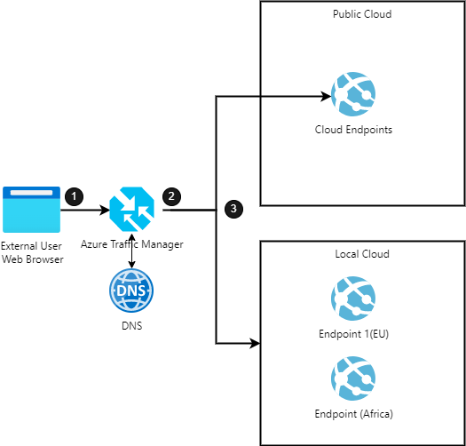

[!INCLUDE [header_file](../../../includes/sol-idea-header.md)]

This architecture illustrates geographic traffic routing, or geo-distributed apps. The solution lets traffic be directed to specific endpoints based on various metrics. Creating a Traffic Manager with geographic-based routing and endpoint configuration routes traffic to endpoints based on regional requirements, corporate and international regulation, and data needs.

## Potential use cases

Organizations with wide-reaching geographies strive to securely and accurately distribute and enable access to data while ensuring required levels of security, compliance and performance per user, location, and device across borders.

When to use this architecture:

* My organization has international branches requiring custom regional security and distribution policies.
* Each of my organization's offices pulls employee, business, and facility data, requiring reporting activity per local regulations and time zone.
* High-scale requirements can be met by horizontally scaling out apps, with multiple app deployments being made within a single region and across regions to handle extreme load requirements.
* The apps must be highly available and responsive to client requests even in single-region outages.

## Architecture

  
_Download an [Visio file](https://arch-center.azureedge.net/hybrid-geo-distributed.vsdx) of this architecture._

### Data flow

1. The client sends a request to the cloud application.
1. Traffic Manager uses DNS to direct the client requests to the appropriate service endpoint based on a traffic-routing method. Traffic Manager also provides health monitoring for every endpoint.
1. The instance of the cloud application selected by Traffic Manager process the request.

### Components

* [Traffic Manager](https://azure.microsoft.com/services/traffic-manager/): Azure Traffic Manager is a DNS-based traffic load balancer.
* **Domain Name System (DNS)**: The Domain Name System, or DNS, is responsible for translating (or resolving) a website or service name to its IP address.
* **Cloud Endpoint**: Public IP addresses are used to route the incoming traffic through traffic manager to the public cloud app resources endpoint.
* **Local endpoint**: Public IP addresses are used to route the incoming traffic through traffic manager to the public cloud app resources endpoint.

### Alternatives

For web applications, you can use [Azure Front Door](https://azure.microsoft.com/services/frontdoor/). It works at Layer 7 (HTTP/HTTPS layer) and can keep traffic on the best path to your app, improve service scale, reduce latency, and increase throughput for your global users with edge load balancing, SSL offload, and application acceleration.

## Considerations

### Reliability

Ensure locally deployed apps are configured for high-availability through on-premises hardware configuration and software deployment. Follow [Resiliency and Dependencies](/azure/architecture/framework/resiliency/design-resiliency) and [Best Practices](https://docs.microsoft.com/azure/architecture/framework/resiliency/design-best-practices) to improve the solution resiliency.

### Security

There are many aspects to consider when securing a cross-cloud solution. See [Security documentation](https://docs.microsoft.com/azure/architecture/framework/security/) in the Azure Well Architected Framework for comprehensive security implementation guidance.

### Operational excellence

The operational excellence pillar of the Azure Well Architected Framework covers the operations processes that keep an application running in production. See [Operational excellence documentation](azure/architecture/framework/devops) for comprehensive guidance, and [Hybrid availability and performance monitoring](../../hybrid/hybrid-containers.yml) for monitoring guidance in hybrid scenarios.

### Performance efficiency

The key component of cross-cloud scaling is the ability to deliver on-demand scaling. Scaling must happen between public and local cloud infrastructure and provide a consistent, reliable service per the demand. See [Performance efficiency](https://docs.microsoft.com/azure/architecture/framework/scalability/) to learn more about implementing scalability in Azure.

## Next steps

To learn more about topics introduced in this article:

* See the [Azure Traffic Manager documentation](https://docs.microsoft.com/azure/traffic-manager/traffic-manager-overview) to learn more about how this DNS-based traffic load balancer works.
* See [Hybrid app design considerations](https://docs.microsoft.com/hybrid/app-solutions/overview-app-design-considerations) to learn more about best practices and to get answers for any additional questions.
* See the [Azure Stack family of products and solutions](https://docs.microsoft.com/azure-stack) to learn more about the entire portfolio of products and solutions.
* When you're ready to test the solution example, continue with the [Geo-distributed app solution deployment guide](/azure/architecture/hybrid/deployments/solution-deployment-guide-geo-distributed). The deployment guide provides step-by-step instructions for deploying and testing its components. You learn how to direct traffic to specific endpoints, based on various metrics using the geo-distributed app pattern. Creating a Traffic Manager profile with geographic-based routing and endpoint configuration ensures information is routed to endpoints based on regional requirements, corporate and international regulation, and your data needs.

## Related resources

* [Highly available multi-region web application](../../reference-architectures/app-service-web-app/multi-region.yml)
* [Architecting Azure applications for resiliency and availability](/azure/architecture/reliability/architect.md)
* [Hybrid architecture design](../../hybrid/hybrid-start-here.md)
* [Extend an on-premises network using VPN](../../reference-architectures/hybrid-networking/vpn.yml)
* [Hybrid availability and performance monitoring](../../hybrid/hybrid-containers.yml)
