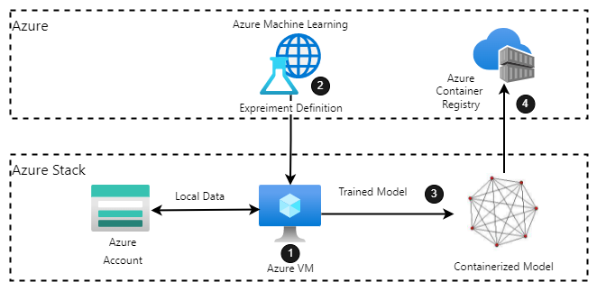

[!INCLUDE [header_file](../../../includes/sol-idea-header.md)]

Generate portable machine learning (ML) models from data that only exists on-premises.

## Potential use cases

Many organizations would like to unlock insights from their on-premises or legacy data using tools that their data scientists understand. Azure Machine Learning provides cloud-native tooling to train, tune, and deploy ML and deep learning models.

However, some data is too large send to the cloud or can't be sent to the cloud for regulatory reasons. Using this solution, data scientists can use Azure Machine Learning to train models using on-premises data and compute.

The training at the edge solution uses a virtual machine (VM) running on Azure Stack Hub. The VM is registered as a compute target in Azure ML, letting it access data only available on-premises. In this case, the data is stored in Azure Stack Hub's blob storage.

Once the model is trained, it's registered with Azure ML, containerized, and added to an Azure Container Registry for deployment. For this iteration of the pattern, the Azure Stack Hub training VM must be reachable over the public internet.

## Architecture

  
_Download a [Visio file](https://arch-center.azureedge.net/hybrid-train-ml-model-at-edge.vsdx) of this architecture._

### Data flow

1. The Azure Stack Hub VM is deployed and registered as a compute target with Azure ML.
1. An experiment is created in Azure ML that uses the Azure Stack Hub VM as a compute target.
1. Once the model is trained, it's registered and containerized.
1. The model can now be deployed to locations that are either on-premises or in the cloud.

### Components

#### Azure

* [Azure Machine Learning](https://docs.microsoft.com/azure/machine-learning/) orchestrates the training of the ML model.
* Azure ML packages the model into a container and stores it in an [Azure Container Registry](https://docs.microsoft.com/azure/container-registry/) for deployment.Azure Stream Analytics.

#### [Azure Stack Hub](https://docs.microsoft.com/azure-stack/operator/azure-stack-overview)

* [App Service](https://docs.microsoft.com/azure-stack/operator/azure-stack-app-service-overview). The App Service resource provider (RP) provides a base for edge components, including hosting and management features for web apps/APIs and Functions.
* An Azure Stack Hub VM running Ubuntu with Docker is used to train the ML model.
* [Blob Storage](https://docs.microsoft.com/azure-stack/user/azure-stack-storage-overview). Images captured from the AI Dev Kit are uploaded to Azure Stack Hub's blob storage

### Alternatives

TBD    

## Considerations

### Reliability

Ensure that the training scripts and Azure Stack Hub VM have access to the on-premises data used for training.

### Security

This pattern lets Azure ML access possible sensitive data on-premises. Ensure the account used to SSH into Azure Stack Hub VM has a strong password and training scripts don't preserve or upload data to the cloud.

### Operational excellence

Ensure that models and experiments are appropriately registered, versioned, and tagged to avoid confusion during model deployment.

### Performance efficiency

To enable this solution to scale, you'll need to create an appropriately sized VM on Azure Stack Hub for training.

## Next Steps

To learn more about topics introduced in this article:

* See the [Azure Machine Learning](https://docs.microsoft.com/azure/machine-learning/) documentation for an overview of ML and related topics.
* See [Azure Container Registry](https://docs.microsoft.com/azure/container-registry/) to learn how to build, store, and manage images for container deployments.
* Refer to[App Service](https://docs.microsoft.com/azure-stack/operator/azure-stack-app-service-overview) on Azure Stack Hub to learn more about the resource provider and how to deploy.
* See [Hybrid application design considerations](https://docs.microsoft.com/hybrid/app-solutions/overview-app-design-considerations) to learn more about best practices and to get any additional questions answered.
* See the [Azure Stack](https://docs.microsoft.com/azure-stack/) family of products and solutions to learn more about the entire portfolio of products and solutions.

When you're ready to test the solution example, continue with the Train ML model at the edge deployment guide. The deployment guide provides step-by-step instructions for deploying and testing its components.

## Related resources

