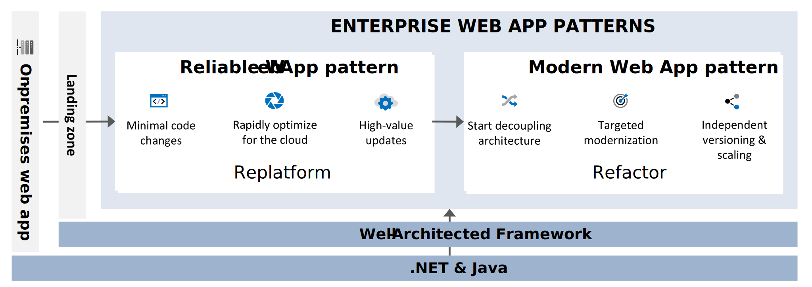

# Enterprise web app patterns

Enterprise web app patterns provide a structured approach to guide developers and architects through the cloud journey, with a specific focus on web apps. There are two phases, called web app patterns. Each pattern represents a common business goal and a step toward a more advanced web application. The web app patterns provide prescriptive architecture, code, and configuration guidance that align with the principles of the [Azure Well-Architected Framework](/azure/well-architected/pillars).

These patterns serve as a roadmap to help you transform legacy web apps into cloud-optimized solutions that deliver more business value. The guidance provided by the enterprise web app patterns is instrumental to ensuring a smooth and successful transition throughout the cloud journey. This diagram illustrates the stages of the enterprise web app patterns:

## Reliable Web App pattern

The Reliable Web App pattern is designed for organizations that are transitioning their on-premises web applications to the cloud. This pattern provides detailed prescriptive guidance on how to modify your web application's architecture and code base to help ensure success in the cloud.

Instead of undertaking a time-consuming rebuilding process, this pattern enables a swift adoption of the cloud. It does this by emphasizing the crucial changes that need to be made, rather than all possible changes. The focus is on updates that provide high value and require minimal code changes. This focus allows you to quickly replatform your application.

This pattern assumes that your organization has an established [landing zone](/azure/cloud-adoption-framework/ready/landing-zone/) for your web app, which provides a solid foundation for cloud deployment.

>[!div class="nextstepaction"]
>[Reliable Web App pattern for .NET](./reliable-web-app/dotnet/guidance.yml)

>[!div class="nextstepaction"]
>[Reliable Web App pattern for Java](./reliable-web-app/java/guidance.yml)

## Modern Web App pattern

The Modern Web App pattern is designed for organizations that already have a web application in the cloud and want to make strategic modernizations to enhance performance and optimize costs. This pattern provides prescriptive guidance for targeted modernization of cloud-based web applications.

The focus of this pattern is on refactoring areas of high demand by gradually decoupling them into standalone services. This decoupling enables independent versioning and scaling. This strategy doesn't just optimize performance in a cost-efficient way. It also serves as a transitional step between monolithic and microservices architectures.

By facilitating independent development and flexible deployments, this pattern accelerates development cycles and boosts the overall performance of the application.

>[!div class="nextstepaction"]
>[Modern Web App pattern for .NET](./modern-web-app/dotnet/guidance.yml)

>[!div class="nextstepaction"]
>[Modern Web App pattern for Java](./modern-web-app/java/guidance.yml)
